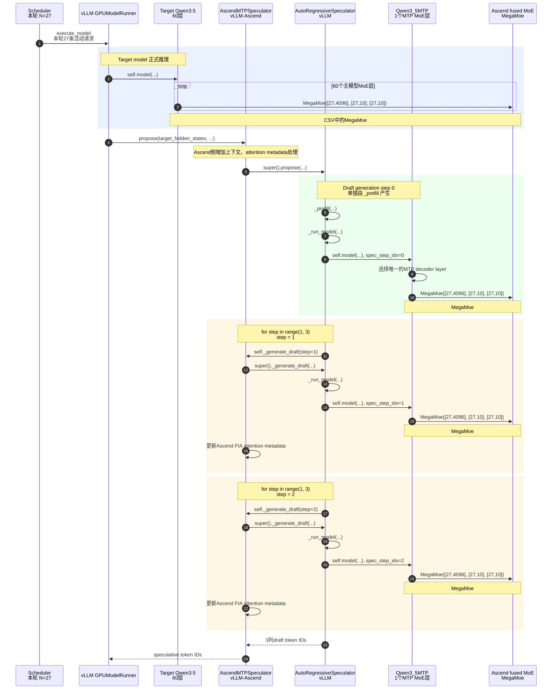

# Decode 节点使用 MegaMoe 分析

## 问题

你上面的代码是不是只考虑了 vLLM？如果考虑到 vLLM-Ascend，会不会有所不同？请考虑之后，把三个 MTP draft generation step 分三次调用 MegaMoe 的事实，结合代码画个图给我看。

## 回答

是的，上一次解释的“第一步 `_prefill` + 后两步循环”的主体逻辑主要来自上游 vLLM。把当前机器上实际使用的 vLLM-Ascend 代码也接进来后，针对这次 `--enforce-eager`、`num_speculative_tokens=3` 的运行，结论仍然是：

> 3 个 MTP draft token 是 3 次独立的 MTP model forward；每次 forward 经过 1 个 MTP MoE 层，因此分别调用一次 MegaMoe。

也就是：

```text
draft token 0 → 第 1 次 MTP forward → MegaMoe #61
draft token 1 → 第 2 次 MTP forward → MegaMoe #62
draft token 2 → 第 3 次 MTP forward → MegaMoe #63
```

但需要修正一个容易产生歧义的说法：

- 并不是一个 `for step in range(3)` 循环直接执行三次。
- 第 1 个 draft token 由 `_prefill()` 单独产生。
- 后两个 draft token 才由 `for step in range(1, 3)` 循环产生。
- vLLM-Ascend 在 eager 模式下没有把它们合并成一次 `[3N, H]` 的 MegaMoe 调用。

当前代码版本是：

- vLLM：`b2f685834a6456197e7033966fdef52a23f1abcd`
- vLLM-Ascend：`360ddd3eef991f71ee812d335f67703b6e9a9641e`

### 1. 结合 vLLM-Ascend 后的完整调用图



### 2. vLLM-Ascend 有没有自己实现另一套 MTP 循环？

没有。当前版本的 Ascend MTP 类直接继承上游实现：

```python
class AscendMTPSpeculator(
        AscendAutoRegressiveSpeculator,
        MTPSpeculator,
):
    pass
```

位置：

```text
vllm_ascend/worker/v2/spec_decode/mtp/speculator.py:20-27
```

这里的 `pass` 很关键：Qwen3.5 MTP 并没有一套 Ascend 专属的“把三个 step 拼到一起”的 generation loop。真正的多步控制逻辑仍然来自上游 vLLM 的 `AutoRegressiveSpeculator`。

Ascend 父类的 `propose()` 会做一些 Ascend 环境准备，随后调用：

```python
return super().propose(...)
```

位置：

```text
vllm_ascend/worker/v2/spec_decode/autoregressive/speculator.py:209-274
```

其中真正交给上游的代码在：

```text
vllm_ascend/worker/v2/spec_decode/autoregressive/speculator.py:257-274
```

因此主干关系是：

```text
AscendMTPSpeculator.propose
    → AscendAutoRegressiveSpeculator.propose
        → super().propose
            → vLLM AutoRegressiveSpeculator.propose
```

### 3. 三个 MTP step 是怎么拆成三次 forward 的？

上游 `propose()` 先单独生成第一个 draft token：

```python
draft_token_ids = self._prefill(...)
```

位置：

```text
vllm/v1/worker/gpu/spec_decode/autoregressive/speculator.py:300-318
```

而 `_prefill()` 内部调用 `_run_model()`：

```text
vllm/v1/worker/gpu/spec_decode/autoregressive/speculator.py:430-451
```

所以第一个 draft step 是：

```text
_prefill
  → _run_model
    → MTP model forward
      → MTP MoE
        → MegaMoe #61
```

随后，如果 `num_speculative_steps > 1`，代码准备 decode 输入：

```text
vllm/v1/worker/gpu/spec_decode/autoregressive/speculator.py:320-345
```

这里代码明确说明：后续每个 generation step，每个请求只输入一个 token。然后进入 `_multi_step_decode()`：

```text
vllm/v1/worker/gpu/spec_decode/autoregressive/speculator.py:352-365
```

其核心循环是：

```python
for step in range(1, self.num_speculative_steps):
    ...
    self._generate_draft(...)
```

位置：

```text
vllm/v1/worker/gpu/spec_decode/autoregressive/speculator.py:469-517
```

本次：

```python
self.num_speculative_steps = 3
```

所以循环只取：

```python
range(1, 3) == [1, 2]
```

完整展开就是：

```text
step 0：_prefill()                    → MegaMoe #61
step 1：_generate_draft(step=1)      → MegaMoe #62
step 2：_generate_draft(step=2)      → MegaMoe #63
```

`_generate_draft()` 内部每次都会调用一次 `_run_model()`：

```text
vllm/v1/worker/gpu/spec_decode/autoregressive/speculator.py:608-660
```

具体的 `_run_model()` 调用位于：

```text
vllm/v1/worker/gpu/spec_decode/autoregressive/speculator.py:621-628
```

eager 模式下，最终执行：

```python
model_output = self.model(**model_inputs)
```

位置：

```text
vllm/v1/worker/gpu/spec_decode/autoregressive/speculator.py:370-428
```

其中 eager raw model 调用集中在：

```text
vllm/v1/worker/gpu/spec_decode/autoregressive/speculator.py:405-420
```

因此，从 Python 调度层面看，确实是三次不同的 `self.model(...)`。

### 4. Ascend 的 `_generate_draft()` 会不会把多步融合？

不会。Ascend override 的主体也是委托给上游：

```python
result = super()._generate_draft(...)
```

随后只更新 Ascend FIA attention metadata。

位置：

```text
vllm_ascend/worker/v2/spec_decode/autoregressive/speculator.py:373-394
```

所以单个 draft step 的调用关系是：

```text
vLLM 多步循环
  → self._generate_draft(...)
    → 动态分派到 Ascend override
      → super()._generate_draft(...)
        → vLLM _run_model()
          → Qwen3_5MTP.forward()
```

Ascend override 并没有把 step 1 和 step 2 合并成一个模型调用。

同样，Ascend `_run_model()` 也只是调用上游实现：

```text
vllm_ascend/worker/v2/spec_decode/autoregressive/speculator.py:352-371
```

### 5. 每次 MTP forward 为什么恰好只有一次 MegaMoe？

模型配置里：

```json
"mtp_num_hidden_layers": 1
```

vLLM 根据这个值设置：

```python
self.num_mtp_layers = config.mtp_num_hidden_layers
```

位置：

```text
vllm/model_executor/models/qwen3_5_mtp.py:81-82
```

然后构造一个只包含 1 个 decoder layer 的 `ModuleList`：

```text
vllm/model_executor/models/qwen3_5_mtp.py:118-125
```

每次 MTP forward 根据：

```python
current_step_idx = spec_step_idx % self.num_mtp_layers
```

选择当前 MTP 层：

```text
vllm/model_executor/models/qwen3_5_mtp.py:146-179
```

因为：

```text
num_mtp_layers = 1
```

所以：

```text
0 % 1 = 0
1 % 1 = 0
2 % 1 = 0
```

三个 draft step 都重复执行同一个 MTP decoder layer，但它们是三个不同时刻的 forward，不是三个物理 MTP layer。

这个 decoder layer 是 MoE 层。Qwen3.5 根据模型类型选择 `Qwen3NextSparseMoeBlock`：

```text
vllm/model_executor/models/qwen3_5.py:164-170
```

Sparse MoE block 随后调用 experts：

```text
vllm/model_executor/models/qwen3_next.py:185-200
```

### 6. 从上游 MoE 到 Ascend MegaMoe 的最后一段

到了 experts 这一层，才真正进入 vLLM-Ascend 的实现。

W8A8 MXFP8 quant method 准备 fused MoE 输入，并调用：

```python
moe_comm_method.fused_experts(...)
```

位置：

```text
vllm_ascend/quantization/methods/w8a8/w8a8_mxfp8.py:290-324
```

接着 vLLM-Ascend 在 `_apply_cann_mega_moe()` 中读取 token 数：

```python
num_tokens = hidden_states.shape[0]
```

位置：

```text
vllm_ascend/ops/fused_moe/moe_comm_method.py:376-464
```

其中 `num_tokens` 在：

```text
vllm_ascend/ops/fused_moe/moe_comm_method.py:385
```

最终调用：

```python
self.mega_moe(
    hidden_states,
    topk_ids,
    topk_weights,
    ...
)
```

位置：

```text
vllm_ascend/ops/fused_moe/moe_comm_method.py:443-458
```

因此，一次 MTP forward 对应的最后一段是：

```text
Qwen3_5MTP.forward
  → 唯一的 MTP decoder layer
    → Qwen3NextSparseMoeBlock
      → Ascend quant method
        → fused_experts
          → _apply_cann_mega_moe
            → MegaMoe
```

这条链路会被 draft step 0、1、2 各走一遍。

### 7. 为什么三次都是 27，而不是一次 81？

后续 MTP decode step 的输入组织原则是：

```text
每个请求，每个 draft generation step，只处理一个 token
```

本轮有 27 个活动请求，所以每一步的 token batch 是：

```text
step 0：27 requests × 1 token/request = 27 tokens
step 1：27 requests × 1 token/request = 27 tokens
step 2：27 requests × 1 token/request = 27 tokens
```

于是设备侧看到：

```text
MegaMoe #61：[27,4096]; [27,10]; [27,10]
MegaMoe #62：[27,4096]; [27,10]; [27,10]
MegaMoe #63：[27,4096]; [27,10]; [27,10]
```

而不是：

```text
MegaMoe：[81,4096]; [81,10]; [81,10]
```

因为 draft token 存在严格的自回归依赖：

```text
draft 0 的输出
    ↓ 作为下一步输入
draft 1 的输出
    ↓ 作为下一步输入
draft 2
```

在普通 eager 执行里，step 1 必须等 step 0 采样完成，step 2 必须等 step 1 采样完成，不能简单沿 token 维拼成一个 `[3×27, 4096]` 的单次 MegaMoe。

### 8. Profile 中第 187 行仍然不是 MTP MegaMoe

这一点考虑 vLLM-Ascend 后也不变。

本轮调用序列是：

```text
主模型60个MoE层：
    MegaMoe #1
    MegaMoe #2   ← kernel_details.csv 第187行
    ...
    MegaMoe #60

MTP三个generation step：
    MegaMoe #61  ← draft 0
    MegaMoe #62  ← draft 1
    MegaMoe #63  ← draft 2
```

因此，第 187 行的：

```text
27,4096; 27,10; 27,10
```

只能说明主模型该 MoE 层本次收到 27 个 token，不能仅凭这一行说它是某个 MTP step。证明“三个 MTP step 分三次调用 MegaMoe”的直接证据是主模型 60 次之后连续出现的 #61、#62、#63。

### 9. Ascend FULL graph 模式的例外怎么理解？

vLLM-Ascend 在下面位置对 `_multi_step_decode()` 做了特殊处理：

```text
vllm_ascend/worker/v2/spec_decode/autoregressive/speculator.py:396-416
```

如果是 FULL graph 模式，Ascend 可以从 Python 侧只 replay 一次完整图，因为捕获的图里包含所有 speculative steps。

但这不等于把三个 MegaMoe 数学上合并成一个 `[81,H]` 的 MegaMoe：

```text
一次 Python graph replay
    ├── 图内 step 0 MegaMoe
    ├── 图内 step 1 MegaMoe
    └── 图内 step 2 MegaMoe
```

而本次启动明确使用了：

```text
--enforce-eager
speculative-config.enforce_eager=true
```

Ascend 代码会把 graph mode 设置为 `NONE`：

```text
vllm_ascend/worker/v2/spec_decode/autoregressive/speculator.py:197-200
```

所以本次实际运行不是“一次 full-graph replay”，而是三个独立的 Python MTP model forward，各自落下一次 MegaMoe。

## 最终结论

> vLLM 决定了“第一个 `_prefill`、后两个 `_generate_draft`”的三步自回归调度；vLLM-Ascend 在本次 eager 模式下包裹这些调用、维护 NPU attention metadata，并把每一步的 MoE experts 落到 CANN MegaMoe。因此三个 MTP draft generation step 最终表现为三次独立的 `[27,4096]` MegaMoe，而不是一次 `[81,4096]` MegaMoe。
