# A5 路径 mega_moe 算子实现原理笔记

> 本笔记聚焦 **A5（Ascend 950PR / 950DT）路径**下 mega_moe 算子的实现过程，结合
> `C:\Code\cann\ops-transformer\torch_extension\cann_ops_transformer\docs\zh\mega_moe.md` 与
> `C:\Code\cann\ops-transformer` 下的代码讲解。
>
> 与同目录 `mega_moe笔记.md`（哨兵 token / vLLM 集成向）互补，本文聚焦**算子内核实现**。

## 目录

1. [问题与总述](#问题与总述)
2. [先定位 A5 路径](#0-先定位a5-路径在哪)
3. [整体架构与调用链](#1-整体架构与调用链)
4. [端到端数据流总览](#2-端到端数据流总览)
5. [peermem 对称窗口（A5 通信底座）](#3-peermem-对称窗口a5-通信底座)
6. [核角色划分（1 Block = 1C2V）](#4-核角色划分1-个-block--1c2v)
7. [五个阶段逐步拆解](#5-五个阶段逐步拆解)
8. [Wave 流水编排（通信与计算重叠的核心）](#6-wave-流水编排通信与计算重叠的核心)
9. [三种 A5 场景的数据类型流对照](#7-三种-a5-场景的数据类型流对照)
10. [一张图串起某 token 的一生](#8-一张图串起某-token-的一生)
11. [小结（A5 实现的本质）](#9-小结a5-实现的本质)
12. [专题：阶段② 路由 mask 广播详解](#10-专题阶段-路由-mask-广播详解)
13. [专题：AIV 数量与 topK / decode 搬运](#11-专题aiv-数量与-topk--decode-搬运)
14. [专题：阶段③ Dispatch 详解](#12-专题阶段-dispatch-详解)
15. [专题：MegaMoeA4W4Wave 流程 / tile 划分 / AIV 数量](#13-专题megamoea4w4wave-流程--tile-划分--aiv-数量)
16. [专题：Qwen3.5-397B 带共享专家的 MoE 计算过程](#14-专题qwen35-397b-带共享专家的-moe-计算过程)
17. [专题：阶段④ GMM1 + SwiGLU + 再量化 详解](#15-专题阶段-gmm1--swiglu--再量化-详解)
18. [专题：阶段⑤ GMM2 + Combine 详解](#16-专题阶段-gmm2--combine-详解)
19. [专题：阶段⑥ Unpermute 详解](#17-专题阶段-unpermute-详解)

---

## 问题与总述

**原问题：**

> 请你结合文件 `C:\Code\cann\ops-transformer\torch_extension\cann_ops_transformer\docs\zh\mega_moe.md`
> 以及 `C:\Code\cann\ops-transformer` 文件夹下的代码，详细解释一下 A5 路径下 mega moe 算子的实现过程是怎么样的。需要图文结合说明。

**回答：**

Mega MoE 算子将 MoE 层专家 FFN 的完整计算流程及前后数据通信
（**Dispatch + Linear1 + SwiGLU + Linear2 + Combine**）融合为单个算子，实现通信与计算掩盖。
本文从「接口 → 编译分派 → 阶段流水 → 三种量化场景」的层次，图文结合讲清 A5 上的实现。

---

## 0. 先定位 A5 路径在哪

代码里架构分层是 `arch22`（A2/A3）和 `arch35`（A5/950）。A5 的 mega_moe 全部落在：

- Kernel 主体：`mc2/mega_moe/op_kernel/arch35/`
- Host tiling：`mc2/mega_moe/op_host/op_tiling/arch35/mega_moe_tiling.cpp`
- 内核入口：`op_kernel/arch35/mega_moe_apt.cpp`
- 三个阶段编排：`op_kernel/arch35/stage/*`
- 通信窗口：`op_kernel/arch35/common/mega_moe_peermem.h`
- 内存布局：`op_kernel/arch35/common/mega_moe_workspace.h`

A5 与 A2/A3 最本质的区别：

| | A2/A3（arch22） | A5（arch35） |
|---|---|---|
| 通信协议 | kfc / HCCL | **UB Memory / MTE（peermem 对称窗口直写）** |
| 支持量化场景 | A16W16、A8W8-INT、A8W4-INT | **A8W8-FP、A8W4-FP、A4W4-FP** |
| 量化方式 | 逐 token INT8 / MSD INT4 | **MX 逐组量化（group=32，E8M0 scale）** |
| 权重布局 | 逐专家二维 TensorList | 逐专家二维 / 三维堆叠两种 |
| token 数 | 各卡 `num_tokens` 一致 | **各卡 token 数可以不同（按 `num_max_tokens_per_rank` 上界）** |
| buffer | 用户算 `ccl_buffer_size` | **接口自动算并申请** |

---

## 1. 整体架构与调用链

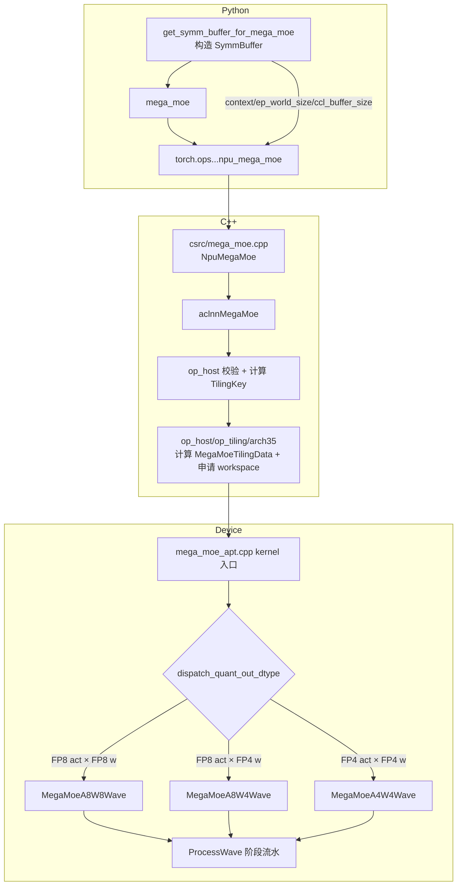
### 1.1 Python 侧 `SymmBuffer` 干了什么（`torch_extension/mega_moe.py`）

`get_symm_buffer_for_mega_moe` 其实就做三件事：

1. 通过 `_get_mega_moe_ccl_buffer_size`（C++ 里 `GetMegaMoeCclBufferSize`，A5 分支 `CalcHalfBufferSizeMBA5`）按 peermem 窗口公式算出通信 buffer 大小；
2. 用 `CommContextManager`（950 上 `backend="channel"`）创建 EP 通信域上下文 `context`；
3. 把 `context / ep_world_size / ccl_buffer_size / num_max_tokens_per_rank / dispatch_quant_mode / ...` 打包进 `SymmBuffer`。

调用 `mega_moe` 时，这些元数据通过 `torch.ops.cann_ops_transformer.npu_mega_moe(...)` 透传给 C++，再进 `aclnnMegaMoe`。

### 1.2 内核入口与模板分派（`mega_moe_apt.cpp`）

`__global__ void mega_moe(...)` 从 `tilingGM` 读 `MegaMoeTilingData`，按 TilingKey 里的 `CommModeType` / `DispatchQuantOutType` 选择具体实现：

```cpp
if constexpr (CommModeType == TILINGKEY_TPL_MTE) {   // A5 走 MTE
    if constexpr (DispatchQuantMode == DISPATCH_QUANT_MODE_MXFP) {  // A5 恒为 4
        ...
        MegaMoeImpl::MegaMoeMteWave<...> op;   // 再按 dtype 落到三个 Wave 之一
        op.Init(...); op.Process();
    }
}
```

`MegaMoeMteWave` 通过模板特化映射到三个场景：

| 组合 | 实例化的类 | 说明 |
|---|---|---|
| FP8 激活 × FP8 权重 | `MegaMoeA8W8Wave` | A8W8-FP |
| FP8 E4M3 × FP4 E2M1 | `MegaMoeA8W4Wave` | A8W4-FP |
| FP4 E2M1 × FP4 E2M1 | `MegaMoeA4W4Wave` | A4W4-FP |

三种 Wave 共享基类 `MegaMoe`（在 `mega_moe_arch35.h`）里的阶段边界，只重写 `ProcessMoeExpertStages` 编排方式。

---

## 2. 端到端数据流总览

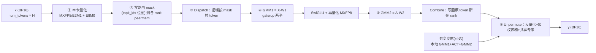

**关键点**：Dispatch 与 Combine 不是显式的 send/recv，而是通过 **peermem 对称窗口直写**——每个 rank 直接往「目标 rank 的 HBM 窗口」里写数据，用软件 flag/counter 同步。这样才把通信和计算重叠起来。

---

## 3. peermem 对称窗口（A5 通信底座）

`mega_moe_peermem.h` 是 host/device 共用的唯一布局来源。每个 rank 把自己的 `epHcclBuffer[rank]` 当窗口，窗口布局对所有 rank **逐字节一致**：

```text
rankSyncInWorldPtr (base)
│
├─ [0 .. 60KB)                rankSyncInWorld  跨卡软同步区
├─ [60KB .. +maskRecvSize)    maskRecv         (localExpert, srcRank) 的 mask 槽
│                              每个槽 = mask 位图 + 末尾 32B count
├─ [.. +quantTokenScaleSize)  quantTokenScale  本卡量化后的 token 记录
│                              每 token = Align256(量化数据) + E8M0 scale (+ 可选 topk 权重)
└─ [.. +combineSendSize)      combineSend      按 (token, topk) 展开的专家结果区
```

关键函数：

- `CalcDispatchMaskAlignSizeBy`：路由数按 256B 对齐后，每路由 1 bit → mask 字节数。
- `CalcQuantTokenScaleBytes`：单 token 量化记录字节（量化数据 + E8M0 scale，prefetch 时再拼 topk 权重）。
- `CalcCombineTokenBytes`：combine 单 token 记录字节（量化 combine 时是 FP8 数据 + scale）。
- `CalcPeermemLeastSize`：`60KB + maskRecv + quantTokenScale + combineSend`，与 C++ `CalcHalfBufferSizeMBA5` 一一对应。

`PeermemInfo` 构造函数在 device 侧把这些偏移按同样顺序装配成指针，kernel 里 `winRankAddr_[i] = mc2Context_->epHcclBuffer[i]`，从而可以 `winRankAddr[dstRank] + offset` 直接访问任意 rank 的窗口。

---

## 4. 核角色划分（1 个 Block = 1C2V）

A5 上每个 block 是「1 个 Cube（AIC）+ 2 个 Vector（AIV0 / AIV1）」：

| 核 | 职责 |
|---|---|
| **AIC（Cube）** | GMM1 / GMM2 的矩阵乘（MMAD） |
| **AIV0** | GMM1 权重 prologue（FP4→FP8 解包）+ 非 prefetch 时消费 AIC tile 做 SwiGLU/量化 |
| **AIV1** | Dispatch 计数/搬运、Combine 发送、部分 epilogue、Unpermute |

同步靠 `SetFlag/WaitFlag`（核内/核间事件）+ GM 里的 `AtomicAdd` 计数器 + `WaitUntilGmFlagEquals` 轮询实现，例如：

- `flagDispatchToGmm1Ptr`：Dispatch 就绪 → GMM1
- `flagActivationToGmm2Ptr`：SwiGLU/量化就绪 → GMM2
- `gmm2CombineSyncCounterPtr`：GMM2 就绪 → Combine

---

## 5. 五个阶段逐步拆解

### 阶段① 本卡输入 MX 量化（`stage/mega_moe_token_quant.h`）

`QuantizeLocalTokens` 由各 AIV 分工，把本卡 BF16 输入 `x` 按 32 元素一组量化成 FP8（E4M3/E5M2）或 FP4（E2M1），并生成 E8M0 共享指数 scale：

```text
BF16 token [1 × H]
      │  Mxfp8::ComputeFp8Token  (或 ComputeFp4Data)
      ▼
量化数据 [H×1B(FP8) / H×0.5B(FP4)]  +  E8M0 scale [ceil(H/32)]
      │  双 buffer，DataCopyPad 写回
      ▼
peermem.quantTokenScalePtr  （本卡窗口的量化 token 区）
```

`QuantOutType` 由 `QuantMode` 决定：`E5M2_QUANT→fp8_e5m2`、默认→`fp8_e4m3fn`、`E2M1_QUANT→fp4x2_e2m1`。可选 `TopkWeightsPrefetch` 时，还会把该 token 的 topk 权重一并塞进记录（用于 combine 阶段减通信）。

### 阶段② 路由 mask 广播（`stage/mega_moe_send_mask.h`）

`GatherAndSendExpertMasks` 把本卡 `topk_ids` 转成「每个全局专家一张 bit 位图」，直接写到对应专家所在 rank 的窗口：

```text
本卡 topk_ids (bs × topK)
   │  按 expert 遍历，CompareScalar 生成 0/1 mask，GatherMask 计数
   ▼
mask 槽[(localExpertId, srcRank)] = 位图(每路由1bit) + count(32B)
   │  写 winRankAddr[dstRank] + maskWinOffset + ...
   ▼
远端某 rank 的 maskRecvPtr
```

这里 `dstRank = globalExpertId / moeExpertPerRank`，`localExpertId = globalExpertId % moeExpertPerRank`——即每个专家被 EP 分片到固定 rank。

### 阶段③ Dispatch（`stage/mega_moe_token_dispatch.h`）

三层结构：`RunMoeExpertDispatchStage` → `DispatchExpertTokensByRankShard/Rows` → `DispatchRankTokens`。

- `ComputeExpertTokenCountAndNotify`：读远端各 src rank 的 mask count，累加得本专家收到的 token 数，做跨 rank 前缀和（`cumsumInfo`），发布就绪 flag；
- `DispatchRankTokens`：`DataCopy` 拉 mask → `GatherMask` 得到命中的全局路由索引 → `CopyTokensAndMetaForDispatch` 从 `winRankAddr[remoteRank] + quantWinOffset` 把量化 token、scale、meta 搬进本地 `dispatchRevDataPtr/dispatchRevScalePtr/metaInfoPtr`；
- 每次搬一个 token 都写一条 **meta（8×int32）**：`(srcRank, srcTokenId, topkIdx[, 预取权重])`，这是后面 Combine 能「原路送回」的关键。

```text
远端 rank 的 quantTokenScale 区 ──(远程读)──> 本卡 dispatchRevData + scale + meta
```

A8W4/A4W4 动态 Wave 用 `DispatchExpertTokensByRankShard` 把「(源 rank, 分片)」分给多个 core；A8W8 全量 Wave 用 `DispatchExpertTokensByRows`。

### 阶段④ GMM1 + SwiGLU + 再量化（`stage/mega_moe_gmm1_activation.h` + `blaze/`）

以专家为单位做分组矩阵乘：

```text
Xe [Ne × H]  ·  W1[e] [H × 2N]
   =  [Ne × 2N]  (gate/up 两半)
   │  AIC: MMAD  (A8W8/FP8×FP8 或 A8W4/FP8×FP4)
   │  AIV: epilogue
   ▼
SwiGLU(gate, up)  →  A [Ne × N]
   │  再次 MX 量化
   ▼
activationQuantData (FP8) + activationQuantScale (E8M0)
```

`BlockEpilogueActivationMxQuant`（`blaze/epilogue/`）在向量侧完成激活（swiglu / swiglustep / swigluoai / situglu）并 MX 量化，`actMode/actSubMode/alpha/beta/clamp` 都来自 tiling。

三种场景的 GMM1 差异：

| 场景 | A | W1 | GMM1 实现 |
|---|---|---|---|
| A8W8-FP | FP8 E4M3/E5M2 | FP8 E4M3/E5M2 | `RunGmm1Generic`（ND 或 NZ） |
| A8W4-FP | FP8 E4M3 | FP4 E2M1 | `RunGmm1A8W4`，prologue 把 W4→W8 |
| A4W4-FP | FP4 E2M1 | FP4 E2M1 | `RunGmm1GenericByWeightFormat`（generic a4w4），SwiGLU 输出**提升为 FP8 E4M3** |

### 阶段⑤ GMM2 + Combine（`stage/mega_moe_gmm2_combine.h`）

```text
A [Ne × N]  ·  W2[e] [N × H]  →  Oe [Ne × H]
   │  AIC: MMAD（A8W4 时 prologue 解包 W2）
   ▼
Combine：按 meta 把 Oe 的每一行写回 原 token 所在 rank 的 combineSend 区
   dst = winRankAddr[meta.rankId] + combineSendPtr
   dstRow = meta.tokenId * topK + meta.topkIdx
```

- 非量化 Combine：直接搬 BF16。
- 量化 Combine（`combine_quant_mode=3/4`）：先 `QuantMxFp8` 量化成 E5M2/E4M3，再发送，接收端反量化。

### 阶段⑥ Unpermute（`stage/mega_moe_unpermute.h`）

`UnpermuteTokens` 在 AIV 上按 token 顺序完成「还原 + 加权求和」：

```text
对每个 token i:
  acc = 0
  for k in 0..topK-1:
      row = combineSend[i*topK + k]      // 该 token 第 k 个专家的结果
      val = DeQuant(row) 或直接 BF16
      acc += topk_weights[i,k] * val
  for s in 0..sharedExpertNum-1:
      acc += sharedResult[s][i]          // 共享专家输出
  y[i] = cast_bf16(acc)
```

这是文档公式第四阶段的直接实现：

$$Y[i]=\sum_{k} W[i,k]\cdot O[\pi(i,k)]+\sum_s O_s^{shared}[i]$$

---

## 6. Wave 流水编排（通信与计算重叠的核心）

三种 Wave 都围绕「把专家按 256 行 M group 切成 Wave，GMM1 和 GMM2 流水推进」：

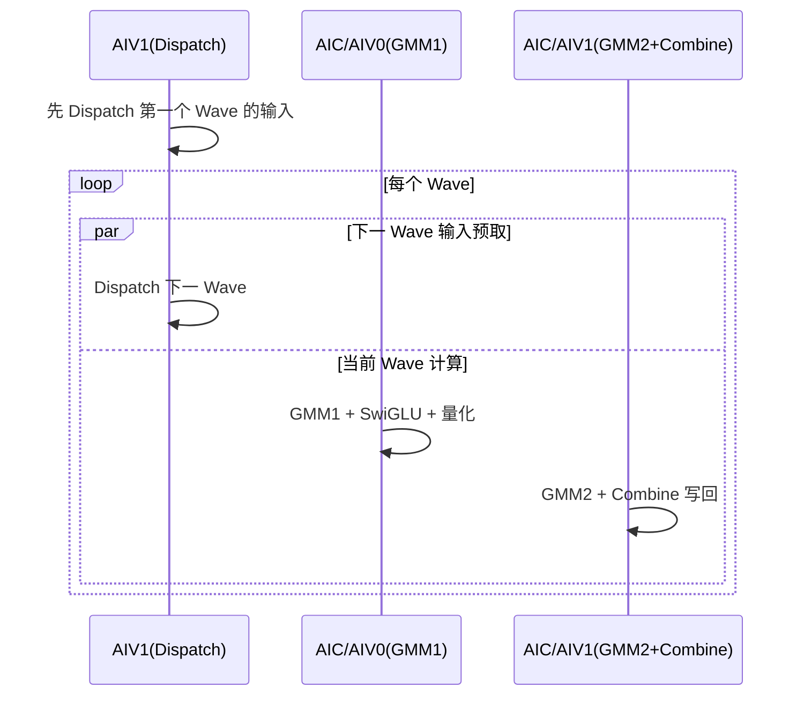

- **A8W8（`MegaMoeA8W8Wave`）**：先 `DispatchAllExpertTokens` 一次性分派完所有专家，再按 `mGroupsPerWave_` 把专家/token 切 Wave，交替跑 GMM1 Wave 和 GMM2 Wave，`ProcessCombineExperts` 在 AIV1 上回收结果。适合 FP8×FP8。
- **A8W4 / A4W4（`MegaMoeA8W4Wave` / `MegaMoeA4W4Wave`）**：继承 `MegaMoe` 的 `ProcessWave`，用**动态 Wave**——AIV1 交错执行「下一 Wave 的 Dispatch」和「当前 Wave 的 Activation」，当前 Wave 一结束立刻启动 GMM2/Combine，不需要等所有专家 GMM1 完成。这更激进地把 dispatch 与 matmul 重叠起来。

`CalcMGroupsPerWave`（host）根据 `aicNum` 和 GMM1/GMM2 的 N tile 数算每个 Wave 消费几个 M group，保证每个核有足够的 tile 打满。

---

## 7. 三种 A5 场景的数据类型流对照

| 场景 | 数据流 | GMM1 | GMM2 |
|---|---|---|---|
| **A8W8-FP** | `BF16 → MXFP8(E4M3/E5M2) → A8W8 → MXFP8 → A8W8 → BF16` | FP8 × FP8 | FP8 × FP8 |
| **A8W4-FP** | `BF16 → MXFP8(E4M3) → A8W4 → MXFP8(E4M3) → A8W4 → BF16` | FP8 × FP4（prologue W4→W8） | FP8 × FP4 |
| **A4W4-FP** | `BF16 → MXFP4(E2M1) → A4W4 → MXFP8(E4M3) → A8W4 → BF16` | FP4 × FP4 | FP8 × FP4 |

关键实现细节（对应 `mega_moe_arch35.h` 的编译期常量）：

- `ENABLE_A8W4 = (W1==fp4 && QuantOut==fp8)` → GMM1 走 A8W4 prologue。
- `ENABLE_A4W4 = (W1==fp4 && QuantOut==fp4)` → GMM1 走 generic a4w4，但 **GMM2 复用 A8W4**（避免两段都用 a4w4 精度损失过大）。
- A4W4 时 `ActivationQuantOutType` 被提升为 `fp8_e4m3fn`（`mega_moe_arch35.h:160`），正好对应文档里「SwiGLU 输出提升为 MXFP8 E4M3」。

权重 scale（`l1_weights_sf/l2_weights_sf`）是 E8M0，shape 带 `CeilDiv(K,64)` 和末尾 `2`，因为 MX scale 按 64 个 K 元素一组、成对存储；kernel 里 `scaleK = CeilDiv(k,64)*2`。

---

## 8. 一张图串起某 token 的一生

```text
Rank A 上的 token t（BF16 [1×H]）
  └─ 选专家 e1(在 Rank P)、e2(在 Rank Q)，门控 w1,w2

① Rank A 量化 t → [FP8 data | E8M0 scale] 写入 A 自己的 quantTokenScale 区
② Rank A 把 t 的 topk_ids 转成 mask，写 Rank P/Q 的 maskRecv 槽
③ Rank P/Q 扫描 mask，远程读 Rank A 的量化 token + scale，落本地 dispatchRev，
    并记录 meta=(srcRank=A, tokenId=t, topkIdx=k)
④ Rank P/Q 对各自专家 e1/e2 做 GMM1+SwiGLU+GMM2，得到结果行 Oe1、Oe2
⑤ Rank P/Q 按 meta 把 Oe1/Oe2 写回 Rank A 的 combineSend[(t,0)/(t,1)]
⑥ Rank A 的 Unpermute 读回两行，算 w1*Oe1 + w2*Oe2 (+共享专家)，写 y[t]
```

---

## 9. 小结（A5 实现的本质）

1. **单一融合算子**：Dispatch + Linear1 + SwiGLU + Linear2 + Combine 全部在一个 kernel 内完成，中间结果走 workspace，不回到 Python。
2. **MX 量化贯穿全程**：输入、SwiGLU 输出都可按 group=32 量化为 FP8/FP4，scale 用 E8M0，反量化在 matmul prologue/epilogue 里隐式完成。
3. **通信靠 peermem 对称窗口直写**：mask、量化 token、combine 结果都写对方窗口；用 GM flag + AtomicAdd 同步，去掉显式 alltoall，实现通信与计算重叠。
4. **Wave 流水**：按 256 行 M group 切 Wave，A8W4/A4W4 用动态 Wave 让「下一 Wave 的 Dispatch」和「当前 Wave 的 GMM」并发。
5. **硬件定制 GEMM**：`blaze/gemm` 的 `block_mmad_mx_fp8fp4.h` 提供 MX FP8×FP8 和 FP8×FP4 的 MMAD，A8W4 通过 prologue 把 FP4 权重解包成 FP8 再乘。

---

## 10. 专题：阶段② 路由 mask 广播详解

**原问题：**

> 请你结合 `C:\Code\cann\ops-transformer` 文件夹的代码内容，也可以辅助进行一些网络知识的搜索，回答以下问题：请详细解释一下上面的问题中提到的阶段② 路由 mask 广播具体在做什么？比如 topk_ids 是什么？路由 mask 是什么？每个全局专家一张 bit 位图具体存放的是什么？

**回答：**

这个阶段是 mega_moe 里「**用一张 bit 位图替换第一次 AlltoAll 里的『路由表交换』**」的关键设计。下面结合 `mega_moe_send_mask.h`、`mega_moe_token_dispatch.h` 和 host tiling 详细拆解。

### 10.1 三个名词

#### topk_ids 是什么

就是**每个 token 选中的专家编号矩阵**，mega_moe 入参之一，shape `[num_tokens, num_topk]`，`int32`。

对应文档里的 $\mathbf{E}$：

$$\mathbf{E}[i,k] = e_{i,k} \in \{0,\dots,num\_experts-1\}$$

含义：**第 i 个 token 的第 k 个 topK 专家，是全局专家 $e_{i,k}$**。

在代码里它叫 `params.expertIdxGmAddr`，`send_mask.h` 里直接读它：

```cpp
GlobalTensor<int32_t> topkIdsGm;
topkIdsGm.SetGlobalBuffer((__gm__ int32_t *)params.expertIdxGmAddr);
```

注意是**全局专家编号**，范围 `[0, num_experts)`，不是某个 rank 上的局部编号。EP 场景下 `num_experts` 是全局专家数，会被 `ep_world_size` 切分。

#### 路由 mask 是什么

是一个**位图**，用来回答一个问题：

> 在当前 rank 的 `topk_ids` 里，**哪些「(token, topK槽)」组合指向了某个特定专家 e？**

它把「这个 rank 的每个 token 要不要去专家 e」这个信息，压缩成一张 bit 位图，跨卡写到**专家 e 所在的 rank** 上。专家 e 所在 rank 之后只需看这张位图，就知道要从当前 rank 拉哪几行 token。

#### 「每个全局专家一张 bit 位图」具体存放什么

每个 bit 对应一个 **「路由项（route item）」**。路由项定义：

```text
route item r  =  token t 的第 k 个 topK 选择，其中 r = t * topK + k
```

也就是把 `topk_ids` 按行展开、扁平化后，第 r 个元素。

所以这张 bit 位图：

```text
bit[r] = 1   ⇔   topk_ids[t, k] == 全局专家 e   （其中 r = t*topK + k）
bit[r] = 0   ⇔   topk_ids[t, k] != e
```

**它不存专家编号本身，也不存 token 数据，只存「是不是去这个专家」这个 0/1 答案。** token 数据本身在阶段①已经量化好、放在本卡自己的窗口里，等对方来拉。

### 10.2 mask 槽的布局（谁发给谁、放在哪）

在 peermem 窗口的 `maskRecv` 区，每个 rank 为**每个 (localExpert, srcRank) 对**开一个独立槽位：

```text
maskRecv 区 = 按 (localExpertId, srcRankId) 二维排列的槽
每个槽 maskSlotSize 字节：
   ├─ [0 .. maskAlignSize)    bit 位图（每条路由 1 bit，32B 对齐）
   └─ [maskAlignSize .. +32B) count 计数（int32，末尾 32B）
```

对应 `mega_moe_peermem.h`：

```cpp
int64_t CalcMaskRecvSize(int64_t maskAlignSize, int64_t moeExpertPerRank, int64_t epWorldSize) {
    int64_t maskSlotSize = maskAlignSize + ALIGN_32;   // 位图 + 32B count
    return CeilAlign(moeExpertPerRank * epWorldSize * maskSlotSize, ALIGN_512);
}
```

以及 `send_mask.h` 的注释：

```cpp
// 发送侧按 (专家, 目标卡) 往对端 peermem 窗口写 mask 槽：
// 槽内先是按 32B 对齐的 mask 位图（每条候选路由 1 bit），末尾是 32B 的 count 区。
```

**槽是按「专家 e 的本地编号 × 源 rank」组织的，而不是按发送者聚合。** 这样专家 e 所在的 rank，可以分别从每个 src rank 拿到「这个 rank 有多少 token 来我这、分别是哪些」。

`maskAlignSize`（位图区字节数）由 `CalcDispatchMaskAlignSizeBy` 算：

```cpp
sendTotalNum = numMaxTokensPerRank * topK;               // 最多可能的路由项数
alignedRouteCount = CeilAlign(sendTotalNum * 4, 256) / 4; // 路由数按 256B 对齐
return CeilAlign(alignedRouteCount / 8, 32);              // 每路由 1 bit → /8 得字节，再 32B 对齐
```

注意它用的是**上界 `numMaxTokensPerRank`**（全卡一致），不是本卡真实 `num_tokens`——因为窗口布局必须各 rank 逐字节一致，即使某卡真实 token 更少，mask 槽大小也要按上界开。

### 10.3 发送方具体怎么做（`GatherAndSendExpertMasks`）

这是 `stage/mega_moe_send_mask.h` 的核心，分两层。

#### 任务分片：每个 AIV 负责一组全局专家

```cpp
int32_t totalExperts = worldSize * moeExpertPerRank;    // 全局专家总数
int32_t jobIndex = aivCoreIdx_;                          // 当前 AIV 的编号
int32_t totalJobs = blockAivNum_;                        // 所有 AIV 总数
// 每个 AIV 负责的专家编号：jobIndex, jobIndex+totalJobs, jobIndex+2*totalJobs, ...
int32_t ownedExpertNum = CeilDiv(totalExperts - jobIndex, totalJobs);
```

内层循环：

```cpp
for (ownedIdx in 0..ownedExpertNum-1):
    globalExpertId = jobIndex + ownedIdx * totalJobs;
    dstRank       = globalExpertId / moeExpertPerRank;   // 专家在哪张卡
    localExpertId = globalExpertId % moeExpertPerRank;   // 专家在该卡的局部编号
```

这就是 EP 分片映射：**全局专家 id → (dstRank, localExpertId)**。

#### 对每个负责的专家：逐批生成 mask 并推送

因为路由项总数可能很大（`numMaxTokensPerRank * topK`），按 batch 处理：

```cpp
for (batchIdx in 0..routeBatchCount-1):
    GatherAndSendExpertMaskBatch(...)
```

每个 batch（`GatherAndSendExpertMaskBatch`）：

1. **取本批 topk_ids 片段**：从 `topkIdsGm[batchStart]` 搬 `routeItemsPerBatch` 个 int32 到 UB；
2. **比较生成 0/1**：对每个负责的专家 `globalExpertId` 执行

   ```cpp
   CompareScalar(maskBuf, topkIdsTensor, globalExpertId, CMPMODE::EQ, routeItemsPerBatch);
   ```

   结果即「本批每个路由项 == 这个专家？」的 0/1 位图；
3. **计数**：`GatherMask` 统计本批有多少个 1（多少 token 去这个专家），累加到 `sendCntAccTensor`；
4. **推送位图**：

   ```cpp
   dstOffset = maskWinOffset
             + (localExpertId * worldSize + rankId) * maskSlotSize
             + batchStart / 8;                       // 本批在 bit 位图里的字节偏移
   dstMaskGm.SetGlobalBuffer(winRankAddr[dstRank] + dstOffset);
   DataCopyPad(dstMaskGm, maskBuf, {1, pushBytes, ...});
   ```

5. **末批额外写 count**：

   ```cpp
   if (isLastBatch) {
       maskBuf.ReinterpretCast<int32_t>().SetValue(sliceBytes/4, expertMatchedRouteCount);
   }
   ```

`pushBytes` 的细节（`send_mask.h:78-85`）：普通批只推 `sliceBytes = routeItemsPerBatch/8` 字节的位图；**最后一个 batch** 推 `sliceBytes + 4`，多出来的 4 字节就是 count。

### 10.4 一个具体例子把 bit 位图看清楚

假设（为直观用很小的数）：

- `num_tokens = 4`，`topK = 2` → 路由项总数 `F = 8`
- 全局专家 4 个：`e0 e1 e2 e3`
- EP 世界大小 = 2，`moeExpertPerRank = 2`（rank0 放 e0/e1，rank1 放 e2/e3）

`topk_ids`（本卡）：

```text
token0 → [e1, e3]    即 topk_ids[0] = [1, 3]
token1 → [e0, e1]    即 topk_ids[1] = [0, 1]
token2 → [e3, e0]    即 topk_ids[2] = [3, 0]
token3 → [e1, e2]    即 topk_ids[3] = [1, 2]
```

展开成 8 个路由项：

```text
r=0: token0 的第0个选择 → e1
r=1: token0 的第1个选择 → e3
r=2: token1 的第0个选择 → e0
r=3: token1 的第1个选择 → e1
r=4: token2 的第0个选择 → e3
r=5: token2 的第1个选择 → e0
r=6: token3 的第0个选择 → e1
r=7: token3 的第1个选择 → e2
```

「专家 e1 的 bit 位图」（bit r = 1 表示路由项 r 去 e1）：

```text
bit位:  0  1  2  3  4  5  6  7
e1:     1  0  0  1  0  0  1  0
        ↑        ↑        ↑
       t0k0     t1k1     t3k0
```

「专家 e0 的 bit 位图」：

```text
bit位:  0  1  2  3  4  5  6  7
e0:     0  0  1  0  0  1  0  0
```

每个全局专家 e 都有一张长度为 F 的位图，`bit[r]=1` 表示「本卡的第 r 个路由项属于专家 e」。配套 count（写入槽尾）：

```text
e0 的 count = 2   （t1k0, t2k1）
e1 的 count = 3   （t0k0, t1k1, t3k0）
e2 的 count = 1   （t3k1）
e3 的 count = 2   （t0k1, t2k0）
```

发送时位图和 count 写到**专家 e 所在 rank 的 `(localExpertId, srcRank)` 槽**：

- e1 → dstRank = `1 / 2 = 0`，localExpertId = `1 % 2 = 1` → 写 rank0 的 `(e1_local, 本卡)` 槽；
- e3 → dstRank = `3 / 2 = 1`，localExpertId = `1` → 写 rank1 的 `(e1_local, 本卡)` 槽。

### 10.5 接收方怎么用这张位图（阶段③ Dispatch）

代码在 `mega_moe_token_dispatch.h`。接收方（专家 e 所在 rank）做两件事。

#### 先读 count：知道「这个 src rank 给专家 e 送了多少 token」

```cpp
countSrcGlobal = maskRecvPtr
               + localExpertId * worldSize * maskSlotSize
               + maskAlignSize;                 // 跳到槽尾的 count 区
// 用 stride 从每个 src rank 的槽里各取一个 int32
DataCopyPad(sendCntTensor, countSrcGlobal, {worldSize, 4, maskSlotSize-4, ...});
```

然后累加所有 src rank 的 count，得到专家 e 一共收到多少 token，并做跨 rank 前缀和（`cumsumInfo`），确定专家 e 在本地紧凑接收序列里的起始行。

#### 再读位图：用 `GatherMask` 取出「哪些路由项命中」

```cpp
remoteRankMaskGlobal = maskRecvPtr
                     + (localExpertId * worldSize + remoteRankIdx) * maskSlotSize
                     + batchRouteBegin / 8;
DataCopy(maskBatchTensor, remoteRankMaskGlobal, maskSliceBytes);

CreateVecIndex(topkIndexTensor, batchRouteBegin, routeItemsPerBatch);  // 本批路由项索引 0,1,2,...
GatherMask(validTopkIndexTensor, topkIndexTensor, maskBatchU32Tensor, true, validRouteCount, ...);
```

`GatherMask` 根据位图里为 1 的位，把对应路由项索引挑出来。于是 `validTopkIndexTensor` 得到「本 src rank 里，哪些 (token, topK槽) 要送到专家 e」。然后按这些索引去 `winRankAddr[remoteRank]` 的量化 token 区拉数据：

```cpp
tokenIndex = topkIndex / topK;    // 反解出 token 行
topkIdx    = topkIndex % topK;    // 反解出 topK 槽
```

### 10.6 为什么这么做：mask 广播的本质

对比传统 MoE 的第一次 AlltoAllV：

| | 传统 AlltoAllV | mega_moe 的 mask 广播 |
|---|---|---|
| 交换什么 | 直接把 **token 数据** 搬过去 | 先只交换 **「谁要谁」的 bit 位图**（很小） |
| 数据量 | 大（token × H） | 极小（每路由 1 bit） |
| token 数据去哪 | 随 AlltoAll 一起走 | 留在本卡窗口，由对方**按位图远程拉取** |
| 效果 | 显式 send/recv | 接收方按需 pull，通信与 GMM 可重叠 |

**bit 位图 + count 就是「压缩后的路由表」**：它不搬 token，只告诉目标 rank「你该从我这拉哪些行」，从而把「token 数据的跨卡搬运」和「专家计算」解耦，让 dispatch 可以与后面的 GMM 流水重叠（这正是 A5 上 Wave 流水能掩盖通信的原因）。

一句话总结这个阶段：

> 阶段②把本卡 `topk_ids` 对每个全局专家展开成一张「第 r 个路由项是否属于专家 e」的 bit 位图，按 (localExpert, srcRank) 槽写到专家所在 rank 的 peermem 窗口，并在槽尾附一个 count；对方据此在阶段③用 `GatherMask` 反推出「要拉哪些 token」。

### 10.7 相关代码位置速查

- 槽布局/尺寸：`op_kernel/arch35/common/mega_moe_peermem.h`（`CalcMaskRecvSize`、`CalcDispatchMaskAlignSizeBy`）
- 发送侧：`op_kernel/arch35/stage/mega_moe_send_mask.h`（`GatherAndSendExpertMasks`、`GatherAndSendExpertMaskBatch`）
- 接收侧：`op_kernel/arch35/stage/mega_moe_token_dispatch.h`（`ComputeExpertTokenCountAndNotify`、`DispatchRankTokens`）
- host 侧批网格/UB 预算：`op_host/op_tiling/arch35/mega_moe_tiling.cpp`（`CalcSendMaskBufferConfig`、`CalcDispatchBufferConfig`）

---

## 11. 专题：AIV 数量与 topK / decode 搬运

**原问题：**

> 1. 上面提到的任务分片，每个 AIV 负责一组全局专家，那 A5 中共有多少个 AIV 呢？
> 2. qwen3.5-397B 的 topK 取值是多少？如果 numMaxTokensPerRank = 2048，而每次 decode 阶段只有一个 token，也需要搬运 numMaxTokensPerRank * topK 个路由项到 UB 吗？

**回答：**

### 11.1 结论速览

1. **A5 上 AIV 数量不是算子写死的，而是运行时从平台读出来的**。代码里 `blockAivNum = GetCoreNumAiv()`，AIC(AI Cube)=`GetCoreNumAic()`，且按 **AIC:AIV = 1:2** 配比组织成「1 个 Cube + 2 个 Vector」的 block。具体数值随 SoC/SKU 变化：950PR 约 56/64 个 AIV，950DT 约 56/64/72 个 AIV（对应 AIC 一半）。参与「路由 mask 广播」的 AIV 数就是 `blockAivNum`。
2. **Qwen3.5-397B 的 topK = 10**（再加 1 个共享专家，共 11 个活跃专家），对应模型名是 Qwen3.5-397B-A17B。
3. **decode 只有 1 个 token 时，不会搬 `numMaxTokensPerRank × topK` 个路由项**。它只会搬 `实际 num_tokens × topK = 1 × topK = 10` 个路由项到 UB。`numMaxTokensPerRank` 决定的是「mask 槽的**网格尺寸/布局**」（保证各卡字节对齐一致），不是「每次实际搬运量」；真实搬运量由本卡 `num_tokens` 决定，kernel 里有 `validLen` 夹紧逻辑。

### 11.2 A5 中一共有多少个 AIV

#### 代码依据：AIV 数是平台动态给的

host tiling 入口（`op_host/op_tiling/arch35/mega_moe_tiling.cpp:1960-1965`）：

```cpp
auto ascendcPlatform = platform_ascendc::PlatformAscendC(context->GetPlatformInfo());
uint32_t aivNum = ascendcPlatform.GetCoreNumAiv();   // 向量核 AIV 数
uint32_t aicNum = ascendcPlatform.GetCoreNumAic();   // 立方核 AIC 数
tilingData->aicNum = aicNum;
tilingData->blockAivNum = aivNum;
```

所以算子**不硬编码核数**，`blockAivNum` 就是 `GetCoreNumAiv()` 的返回值。

#### AIC 与 AIV 是 1:2 配比

kernel 侧（`mega_moe_arch35.h:131-135`）：

```cpp
uint32_t blockNum_    = GetBlockNum();          // 逻辑 block 数（=AIC 数）
uint32_t blockAivNum_ = GetBlockNum() * 2;       // AIV 数 = block 数 × 2
uint32_t blockIdx_    = GetBlockIdx() / GetTaskRation();
uint32_t aivCoreIdx_  = GetBlockIdx();           // 直接就是 AIV 编号
```

也就是每个 block 是 **1C2V**：1 个 AIC(Cube) + 2 个 AIV(Vector)。

```text
block 0:  [ AIC0 , AIV0, AIV1 ]
block 1:  [ AIC1 , AIV2, AIV3 ]
block 2:  [ AIC2 , AIV4, AIV5 ]
...
```

host 侧也用 `CalcTschBlockDim` 按这个配比设 block 数（`mega_moe_tiling.cpp:1978`）：

```cpp
context->SetBlockDim(ascendcPlatform.CalcTschBlockDim(aivNum, aicNum, aivNum));
```

通用工具函数 `mc2/common/op_host/op_tiling/mc2_calc_num_blocks.h` 也写明了配比原则：

```cpp
// 根据 ascendc 提供的 aic aiv 数量，按照 aic:aiv=1:2 比例设置逻辑核数量
uint64_t numBlocks = std::min(aicNum, aivNum / 2);
```

即 `block 数 = min(aicNum, aivNum/2)`，而 `AIV 数 = block 数 × 2`。

#### 具体数量（按 SKU）

代码里没有硬编码数字，按硬件平台动态返回。综合公开的昇腾 950 架构规格信息，AIC:AIV=1:2，常见 SKU 数值如下：

| 产品 | AIC（Cube）数量 | AIV（Vector）数量 |
|---|---|---|
| Ascend 950PR | 28 / 32 | 56 / 64 |
| Ascend 950DT | 28 / 32 / 36 | 56 / 64 / 72 |

（`/` 表示不同 SKU/配置档位）

> ⚠️ 这些是公开规格资料里的档位数值，实际以设备运行时 `GetCoreNumAiv()` 返回为准——mega_moe 的 tiling 就是拿那个返回值当 `blockAivNum`。

#### 「任务分片」里到底用了多少 AIV

回到任务分片：

```cpp
int32_t totalExperts = worldSize * moeExpertPerRank;   // 全局专家数
int32_t totalJobs   = blockAivNum_;                     // = 参与的所有 AIV 数
// 每个 AIV 负责的全局专家：jobIndex, jobIndex+totalJobs, ...
```

「一组全局专家」就是把 `totalExperts` 个全局专家**均摊给全部 `blockAivNum` 个 AIV**，步长是 `blockAivNum`：

```text
AIV0  → globalExpert 0, blockAivNum, 2*blockAivNum, ...
AIV1  → globalExpert 1, blockAivNum+1, ...
...
AIV{blockAivNum-1} → globalExpert {blockAivNum-1}, ...
```

如果全局专家数 < AIV 数，会有部分 AIV 分不到专家（`ownedExpertNum = 0` 直接返回）。

### 11.3 qwen3.5-397B 的 topK，以及 decode 是否要搬满 2048×topK

#### topK 取值

Qwen3.5-397B 是 MoE 模型（全名 **Qwen3.5-397B-A17B**），关键配置：

| 项 | 值 |
|---|---|
| 专家总数 `num_experts` | **512** |
| 每 token 路由专家数 `num_experts_per_tok`（=topK） | **10** |
| 共享专家 | 有（+1） |
| MoE 中间维度 `moe_intermediate_size` | 1024 |

所以 **topK = 10**，每个 token 激活 10 个路由专家 + 1 个共享专家。

（顺带纠正：没有「397B-A3B」这个模型，A3B 对应的是 Qwen3.6-35B-A3B。）

#### decode 只搬 `num_tokens × topK`，不是 `numMaxTokensPerRank × topK`

**结论：不用搬满。** `numMaxTokensPerRank = 2048` 只是用来**确定网格尺寸和槽位布局**的上界，真实搬运量由**本卡真实 `num_tokens`** 决定。

**证据 1：批网格按上界，但装载长度按真实 token 数夹紧**

host 侧 `CalcSendMaskBufferConfig`（`mega_moe_tiling.cpp:777-787`）：

```cpp
// 发送批网格按上界 numMaxTokensPerRank*topK 划分，保证每张卡的批数和 mask 推送字节数一致，
// 对端 mask 槽才能被完整覆盖；本卡真实路由数 bs*topK 可能小于网格，装载长度在 kernel 内逐批夹紧
uint64_t sendTotalNum = numMaxTokensPerRank * topK;
...
bufferConfig.routeBatchCount = CeilDiv(sendTotalNum, routeItemsPerBatch);
```

它把「网格」按 `numMaxTokensPerRank * topK` 划分，是为了**所有 rank 用同一套 slot 布局**。但这只是「网格覆盖范围」，不等于「实际要处理的数据量」。

**证据 2：kernel 里 `validLen` 把真实数据量夹紧**

`GatherAndSendExpertMaskBatch`（`mega_moe_send_mask.h:72-92`）：

```cpp
int32_t realSendTotalNum = static_cast<int32_t>(common.tokenNum * common.topK); // 本卡真实路由项数
int32_t realRemain = realSendTotalNum - batchStart;
int32_t validLen = bufferConfig.routeItemsPerBatch;
if (realRemain < validLen) {
    validLen = realRemain > 0 ? realRemain : 0;   // 关键：按真实剩余量夹紧
}
...
if (validLen > 0) {
    DataCopyPad(topkIdsTensor, topkIdsGm[batchStart], {1, validLen*sizeof(int32_t), ...});
}
```

`common.tokenNum` 就是本卡真实 token 数（= x.shape[0]），decode 时是 **1**。所以：

```text
decode: realSendTotalNum = 1 * topK = 10
        → 只 DataCopy 10 个 int32 到 UB，只对 10 个路由项做 CompareScalar / GatherMask
        → 不是 2048*10 = 20480 个
```

**证据 3：只有末批额外写一个 count**

```cpp
if (isLastBatch) {
    maskBuf.ReinterpretCast<int32_t>().SetValue(sliceBytes/4, expertMatchedRouteCount);
}
```

count 也是「本卡真实命中这个专家的 token 数」，而不是 `numMaxTokensPerRank`。

#### 用图对比：上界 vs 真实数据量

```text
numMaxTokensPerRank = 2048, topK = 10  →  网格覆盖 = 20480 个路由项（用于 mask 槽字节数/对齐）
────────────────────────────────────────────────────────────
prefill（假设本卡 2048 个 token）:
   真实路由项 = 2048 * 10 = 20480  →  逐批装满，搬满整个网格

decode（本卡 1 个 token）:
   真实路由项 = 1 * 10 = 10      →  只搬 10 项
   [batch0: 10 项有效] [batch1..: validLen=0，仅推 0 掩码保证槽覆盖]
```

- `numMaxTokensPerRank` 决定的是 **mask 槽的几何尺寸**（`maskAlignSize`、`routeBatchCount`、各卡字节对齐一致性）；
- `num_tokens`（真实）决定的是 **kernel 实际搬运/比较的路由项数量**。

#### 为什么还要按上界开网格

因为 peermem 窗口是**跨卡对称的**，每个 rank 的 `maskRecv` 槽布局必须**逐字节一致**，否则 rank A 写到 rank B 的某个偏移，rank B 会读错位置。

所以即使某卡 decode 只有 1 个 token，它的 mask 槽仍按 `numMaxTokensPerRank` 的尺寸开，但**槽里大部分位是 0**，kernel 实际只填它那 10 个有效位 + 一个 count。接收方读 count 后就知道「这个 src rank 只来了 N 个 token」，只按 count 拉数据，不会去处理那些空位。

#### 顺带：这正是 decode 场景的优化点

decode 时虽然只搬 10 个路由项，但**mask 槽的空间和「推空掩码覆盖」的固定开销还在**（因为布局按上界对齐）。这也解释了为什么：

- 前面的 **dummy/sentinel token 补齐** 有意义——它不是为了把 UB 搬满，而是为了通信对齐/避免各卡负载严重不均；
- `num_max_tokens_per_rank` 建议设置成「sym_buffer 复用期间的最大单卡 token 数」（prefill 大、decode 小），decode 复用同一个 buffer 时实际工作量随 `num_tokens` 自动下降。

### 11.4 参考来源

- A5 AIC/AIV 数量与 1:2 配比（公开规格资料）：[华为 昇腾 950 NPU 架构参数 规格书](https://www.16rd.com/forum.php?mod=viewthread&tid=647843&page=1&authorid=143687)、[面向 Ascend 950 CANN 技术架构的变与不变](https://m.it168.com/article_6924056.html)、[CANN NEXT 面向 950 架构详解](https://gitcode.csdn.net/69d8aa7f0a2f6a37c59e5e95.html)
- AIV 平台信息获取 API：[GetCoreNumAiv - PlatformAscendC](https://www.hiascend.com/document/detail/zh/CANNCommunityEdition/910/API/ascendcopapi/docs/api/Utils-API/%E5%B9%B3%E5%8F%B0%E4%BF%A1%E6%81%AF%E8%8E%B7%E5%8F%96/PlatformAscendC/GetCoreNumAiv.md)
- Qwen3.5-397B-A17B 的专家数 / topK 配置：[Qwen3.5-397B-A17B Model Card](https://huggingface.co/vincentzed-hf/Qwen3.5-397B-A17B-NVFP4)、[SGLang Qwen3.5-397B-A17B 部署文档](https://docs.sglang.io/docs/hardware-platforms/ascend-npus/model-deployment/tutorials/qwen3_5_397b)

---

## 12. 专题：阶段③ Dispatch 详解

**原问题：**

> 请详细解释一下上面的问题中提到的阶段③ Dispatch 在做什么？

**回答：**

### 12.1 一句话总结

**阶段③ Dispatch 就是「专家 e 所在的 rank，根据阶段②广播过来的 mask 位图 + count，从各个源 rank 的量化 token 窗口里，把『发给专家 e 的那些 token』远程拉取到本地，按专家紧凑排好，并记下每条 token 的来历（meta），最后通知 GMM1 可以开算」。**

它是 mega_moe 里「第一次 AlltoAll（token 分发）」的**接收侧**实现——但注意，它不靠显式 AlltoAllV，而是**接收方主动按 mask 去 pull**。

### 12.2 定位：Dispatch 在哪个文件、输入输出是什么

核心文件：`mc2/mega_moe/op_kernel/arch35/stage/mega_moe_token_dispatch.h`

它的「输入」有两类：

| 输入 | 在哪 | 内容 |
|---|---|---|
| 远端 mask | 各 src rank 的 `maskRecvPtr` | 每个 (localExpert, srcRank) 槽：bit 位图 + count |
| 远端量化 token | 各 src rank 的 `quantTokenScalePtr` | 每 token 一条量化记录（FP8/FP4 数据 + E8M0 scale，可选 topk 权重） |

它的「输出」写在本地 workspace：

| 输出 | 指针 | 内容 |
|---|---|---|
| 专家输入数据 | `dispatchRevDataPtr` | 每个专家收到的 token 数据，**按专家紧凑堆叠** |
| 专家输入 scale | `dispatchRevScalePtr` | 对应每 token 的 MX scale |
| 元信息 | `metaInfoPtr` | 每条 token 的 `(srcRank, tokenId, topkIdx[, 权重])` |
| 专家 token 数 | `expertRevTokenNumsPtr` / `cumsumInfo` | 每个专家收到多少 token、在紧凑序列里的偏移 |
| GMM1 就绪标志 | `flagDispatchToGmm1Ptr` | 通知 AIC「这个专家的输入到齐了」 |

### 12.3 总览：Dispatch 的分层结构

代码是明显的**三层**：

```text
RunMoeExpertDispatchStage                 ← 第 1 层：对一个专家，算 count 后选择分片策略
   │
   ├─ ComputeExpertTokenCountAndNotify    ← 先算「专家 e 一共收到多少 token」
   │
   ├─ DispatchExpertTokensByRows          ← A8W8 用：按「行」均分给所有 AIV
   │      └─ DispatchExpertTokensByRank   ← 定位每个 AIV 的行段落在哪些 src rank
   │             └─ DispatchRankTokens    ← 扫 mask → 拉 token → 写 meta
   │
   └─ DispatchExpertTokensByRankShard     ← A8W4/A4W4 用：按「(源rank, 分片)」分给 AIV
          └─ DispatchRankTokens
```

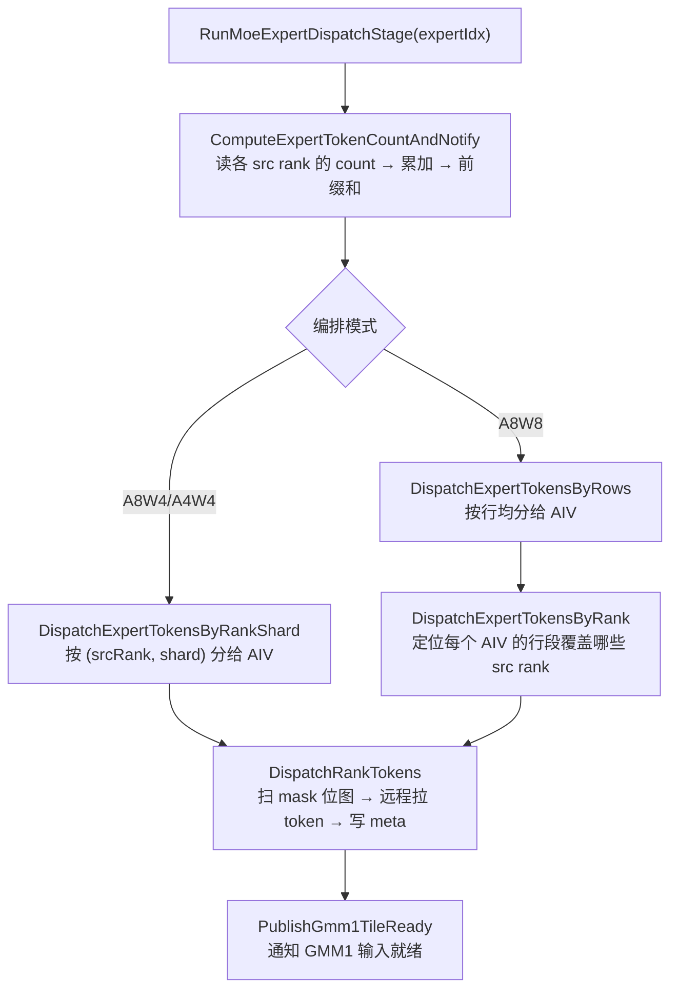

### 12.4 第 1 步：算「专家 e 收到多少 token」+ 前缀和

函数：`ComputeExpertTokenCountAndNotify`（`mega_moe_token_dispatch.h:511-562`）

#### 它读什么

每个 src rank 在阶段②已经把「发给专家 e 的 token 数」写进了 `(localExpertId, srcRank)` 槽末尾的 count 区。这里一次用 strided copy 把 **worldSize 个 count** 都读进来：

```cpp
countSrcGlobal = maskRecvPtr
               + localExpertId * worldSize * maskSlotSize   // 定位到专家 e 的槽组
               + maskAlignSize;                              // 跳到 count 区
DataCopyExtParams countCopyParams{worldSize, sizeof(int32_t), maskSlotSize - sizeof(int32_t), 0, 0};
DataCopyPad(sendCntTensor, countSrcGlobal, countCopyParams, countPad);
// 相当于：sendCntTensor[rankIdx] = 专家e 从 src rank `rankIdx` 收到的 token 数
```

#### 它算什么

累加所有源 rank 的 count，得到专家 e 的总 token 数，并维护**跨 rank 前缀和**：

```cpp
for (rankIdx = 0; rankIdx < worldSize; ++rankIdx) {
    rankCount = sendCntTensor.GetValue(rankIdx * countStrideI32);
    sendCnt += rankCount;                            // 专家 e 总 token 数
    cumsumRevCntInRank += rankCount;
    cumsumInfoTensor.SetValue(localExpertId * worldSize + rankIdx, cumsumRevCntInRank);
}
```

`cumsumInfoTensor[localExpertId * worldSize + rankIdx]` 的含义：

```text
从专家 0 到专家 localExpertId，截止到 src rank `rankIdx`，本卡一共累计收到多少 token
```

#### 它做什么

1. 把专家 e 的总数写到 workspace（`expertRevTokenNumsPtr`）；
2. 用 `AtomicAdd` 打一个 `flagSendCntCalToUpdParams` 标志，告诉 GMM1「这个专家的 token 数已经算好了」。

有了这个前缀和，`GetExpertGlobalRowBegin` 就能算出专家 e 在「本地紧凑接收序列」里的**起始行**：

```cpp
// localExpertId==0 恒为 0；否则 = 前一个专家(所有 rank 累计后)的总数
return cumsumInfoTensor.GetValue(localExpertId * worldSize - 1);
```

```text
紧凑接收序列（dispatchRevData 的布局）：
[ 专家0 的所有 token ][ 专家1 的所有 token ][ 专家2 的所有 token ]...
 ↑                     ↑                     ↑
 rowBegin(0)=0         rowBegin(1)=专家0总数   rowBegin(2)=专家0+专家1总数
```

### 12.5 第 2 步：把专家 e 的行分给多个 AIV

#### A8W8：`DispatchExpertTokensByRows`（按行均分）

```cpp
uint32_t dispatchCoreCount = blockJob.totalJobs;   // = blockNum（AIC 数 / 参与核数）
int32_t rowsPerCore = CeilDiv(dispatchRowCount, dispatchCoreCount);
int32_t coreDispatchRowBegin = blockJob.jobIndex * rowsPerCore;
int32_t coreDispatchRowEnd   = coreDispatchRowBegin + rowsPerCore;
```

即：**专家 e 的 `N_e` 行，均分给所有参与核**，每个核处理 `[coreBegin, coreEnd)` 这一段行。

然后 `FindDispatchExpertRankRange` 用 `cumsumInfoTensor` 定位：这一段行区间落在哪些 src rank 的段里（因为专家 e 的 token 是按 src rank 顺序拼接的）。

```cpp
// 对当前核负责的行段 [coreExpertRowBegin, coreExpertRowEnd)，
// 找到第一个/最后一个与它相交的 src rank，以及起始 offset
FindDispatchExpertRankRange(worldSize, scratch, localExpertId,
                            expertGlobalRowBegin, coreExpertRowBegin, coreExpertRowEnd);
```

#### A8W4/A4W4：`DispatchExpertTokensByRankShard`（按 (源 rank, 分片) 分）

```cpp
uint32_t rankShardCount = countWorkspace.blockNum / worldSize;   // 每个 src rank 再切几片
for (dispatchShardIdx = blockJob.jobIndex; dispatchShardIdx < worldSize*rankShardCount;
     dispatchShardIdx += blockJob.totalJobs) {
    remoteRankIdx = dispatchShardIdx / rankShardCount;   // 哪个 src rank
    rankShardIdx  = dispatchShardIdx % rankShardCount;   // 该 rank 的第几片
    ...
}
```

即：把「(src rank, 分片)」这个二维任务摊给所有核，更细粒度，适配 A8W4/A4W4 动态 Wave 的负载平衡。

### 12.6 第 3 步：扫 mask → 拉 token → 写 meta（核心）

函数：`DispatchRankTokens`（`mega_moe_token_dispatch.h:315-377`）

它对一个「源 rank」的 mask 位图分批扫描：

```cpp
for (batchIdx in 0..routeBatchCount-1):
    remoteRankMaskGlobal = maskRecvPtr
                         + (localExpertId * worldSize + remoteRankIdx) * maskSlotSize
                         + batchRouteBegin / 8;        // 本批 bit 位图的字节偏移
    DataCopy(maskBatchTensor, remoteRankMaskGlobal, maskSliceBytes);
```

然后：

```cpp
CreateVecIndex(topkIndexTensor, batchRouteBegin, routeItemsPerBatch);
// topkIndexTensor = [batchRouteBegin, batchRouteBegin+1, batchRouteBegin+2, ...]

GatherMask(validTopkIndexTensor, topkIndexTensor, maskBatchU32Tensor, true, validRouteCount, ...);
```

`GatherMask` 的作用：**从 `topkIndexTensor` 里，挑出那些 mask 位为 1 的路由项索引**。

于是 `validTopkIndexTensor` 就是「本 src rank 里，哪些 `(token, topk槽)` 要送到专家 e」的索引列表。

#### 从路由项索引反解出 token 行和 topk 槽

```cpp
tokenIndex = topkIndex / topK;    // 第几个 token
topkIdx    = topkIndex % topK;    // 该 token 的第几个 topK 槽
```

#### 远程拉取 token 数据（`FetchDispatchTokenAndMetaInfo`）

```cpp
remoteCopyOffset = tokenIndex * quantTokenScaleAlignBytes;   // 该 token 在远端窗口的记录偏移
DataCopy(copyTmpTensor, remoteRankGlobalTensor[remoteCopyOffset], quantTokenScaleAlignBytes);
```

`remoteRankGlobalTensor` 指向 `winRankAddr[remoteRankIdx] + quantWinOffset`，也就是**远端 rank 的量化 token 窗口**。

这条 `DataCopy` 搬的是**一条完整的量化记录**：量化数据 + E8M0 scale（prefetch 时还带 topk 权重）。

#### 写入本地紧凑区 + meta（`StoreDispatchTokenAndMetaInfo`）

```cpp
DataCopyPad(tokenRevGlobalTensor[copyIdx * revTokenElemCnt], tokenScaleBuffer, ...);   // 数据
DataCopyPad(scaleRevGlobalTensor[copyIdx * revScaleElemCnt], scaleBuffer, ...);        // scale
DataCopy(metaInfoGlobalTensor[copyIdx * INT32_PER_256B], metaInfoTensor[bufferIdx * INT32_PER_256B], INT32_PER_256B);
```

写入的 meta 是一条 **8×int32**（`META_INFO_SIZE = 8`）：

```cpp
metaInfoTensor.SetValue(RANK_ID,     remoteRankIdx);   // 这条 token 来自哪个 src rank
metaInfoTensor.SetValue(TOKEN_ID,    tokenIndex);      // 原来是哪个 token 行
metaInfoTensor.SetValue(TOPK_INDEX,  topkIndex % topK); // 是第几个 topK 槽
// prefetch 时还会写 WEIGHT_INDEX：该 token 的 topk 权重位
```

**这条 meta 就是后面 Combine 阶段「把专家结果送回原 token」的通行证。**

#### ring buffer 软流水

`CopyTokensAndMetaForDispatch` 用 `bufferCount` 个 copy 槽 + 事件做软流水（`EVENT_ID0..EVENT_ID5`）：

```text
copyTmp 槽 0..bufferCount-1：
   槽 = 量化 token 记录（远端拉取后暂存 UB）
   meta 槽一一对应
用 MTE3/MTE2/S 事件把「拉取→写 GM→写 meta」流水起来
```

这样「远端 DMA 拉 token」和「写本地 GM」可以重叠。

### 12.7 第 4 步：通知 GMM1 输入就绪

`DispatchRankTokens` 末尾调用：

```cpp
PublishGmm1TileReady(syncLayout, params, localExpertId, gmm1TileRowCount,
                     segmentExpertRowBegin, segmentExpertRowEnd);
```

它按 `gmm1TileRowCount`（=GMM1_TILE_M=256）把「已就绪的行」拆成 tile，用 `AtomicAdd` 累加到 `flagDispatchToGmm1Ptr` 的对应计数：

```cpp
AtomicAdd(gmm1TileReadyCount + tileIdx * INT_CACHELINE, overlapRowEnd - overlapRowBegin);
```

GMM1 侧（AIC）在 `WaitForGmm1InputReady` 里轮询这个计数，达到目标值才开始算该 tile：

```cpp
WaitUntilGmFlagEquals(flagValueAddr, targetValue);
```

这就是「**Dispatch 与 GMM1 的流水握手**」：Dispatch 搬够一个 256 行 tile，GMM1 就能先算这一块，不用等整个专家搬完。

### 12.8 一张图串起整个 Dispatch 数据流

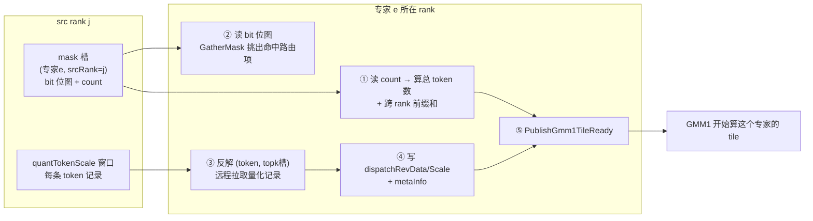

### 12.9 用一个具体例子走一遍

沿用前面 mask 广播的例子：4 token，topK=2，4 专家，2 rank，本卡 `topk_ids` 里专家 e1 命中：

```text
路由项:  r0→e1  r1→e3  r2→e0  r3→e1  r4→e3  r5→e0  r6→e1  r7→e2
专家 e1 的 bit 位图 = 1 0 0 1 0 0 1 0
专家 e1 的 count    = 3
```

专家 e1 所在 rank 的 Dispatch 做：

1. 读 e1 在各 src rank 的 count（本例一个 src rank = 3），总 token 数 `N_e = 3`；
2. `GatherMask` 用位图 `1 0 0 1 0 0 1 0` 挑出命中索引：`{0, 3, 6}`；
3. 反解：
   - `0 → (token0, k0)`
   - `3 → (token1, k1)`
   - `6 → (token3, k0)`
4. 远程拉取 token0、token1、token3 的量化记录，写进 `dispatchRevData` 第 0、1、2 行；
5. 写 meta：
   - `(srcRank, 0, 0)`、（srcRank, 1, 1）、（srcRank, 3, 0）；
6. 发布 ready，通知 GMM1 可以用这 3 行去算 `X_e1 · W1[e1]`。

### 12.10 和传统 AlltoAll 对比，Dispatch 的特别之处

| | 传统 AlltoAllV | mega_moe 的 Dispatch |
|---|---|---|
| 数据流向 | 发送方主动推 | **接收方按 mask 主动 pull** |
| 先交换什么 | 直接搬 token | 先广播极小 mask，再按需拉 token |
| 顺序 | 一次性收齐才计算 | **边搬边算**（tile 级就绪通知） |
| 元数据 | 额外算路由表 | 拉取时顺手写 `metaInfo`，直接供 Combine 复用 |
| 与 GMM 重叠 | 较难 | `PublishGmm1TileReady` + Wave 流水实现重叠 |

一句话总结：

> **Dispatch 是 mega_moe 里「第一次 AlltoAll」的 pull 化实现**：它用阶段②广播的 bit 位图定位「要拉哪些 token」，把远端量化记录拉进本地并紧凑排好，同时写 meta 和发布 GMM1 tile 就绪标志，从而把「跨卡数据搬移」和「专家 GMM 计算」流水化、重叠化。

---

## 13. 专题：MegaMoeA4W4Wave 流程 / tile 划分 / AIV 数量

**原问题：**

> 1. 请详细解释一下上面的问题中提到的 MegaMoeA4W4Wave 的过程和每个过程的实现原理是什么？
> 2. 既然是流水，就要划分 tile，这个划分 tile 的依据是什么？
> 3. 核角色划分中只是说明了有 AIV0 和 AIV1 这两个角色，并不是说明 A5 上有多少个 AIV，对吗？那 950 上有多少个 AIV 呢？

**回答：**

### 13.1 先定位 A4W4 在整套实现里的位置

A4W4 是 Ascend 950 上的三种量化场景之一，数据流是：

```text
BF16 → MXFP4(E2M1) → A4W4 GMM1 → MXFP8(E4M3) → A8W4 GMM2 → BF16
```

关键点（代码里反复强调）：**A4W4 场景下 GMM1 走 generic A4W4（FP4×FP4），但 GMM2 复用 A8W4（FP8×FP4）**，因为 SwiGLU 输出会被提升成 FP8 E4M3，避免两段都用 FP4 导致精度损失过大。

对应类型在 `mega_moe_wave_a4w4.h:81-116` 的两个函数里：

- `RunGmm1ActivationForExpert` → 调 `RunGmm1GenericByWeightFormat`（generic a4w4）
- `RunGmm2CombineForExpert` → 调 `RunGmm2A8W4`

### 13.2 MegaMoeA4W4Wave 的整体过程

A4W4Wave 继承自 `MegaMoe` 基类，复用 `ProcessWave` 的阶段骨架，只重写 `ProcessMoeExpertStages`（MoE 专家部分）。

`mega_moe_arch35.h:574-620` 的 `ProcessWave` 是**所有 Wave 共用的五阶段边界**：

```text
阶段1  ProcessInputPreparationStage   本卡量化 + mask 广播 + 清同步区 (+ 共享专家输入准备)
阶段2  ProcessSharedExpertGmm1        可选：共享专家 GMM1 + SwiGLU
阶段3  derived.ProcessMoeExpertStages A4W4Wave 自己的 Dispatch/GMM1/GMM2/Combine 编排
阶段4  ProcessSharedExpertGmm2        可选：共享专家 GMM2
阶段5  UnpermuteTokens                本卡加权求和还原输出
```

而 `MegaMoeA4W4Wave` 的核心就在 `ProcessMoeExpertStages`（`mega_moe_wave_a4w4.h:126-236`）。

#### A4W4 的「动态 Wave」是什么

注释（`mega_moe_wave_a4w4.h:118-125`）把思想写得很清楚：

> 按专家顺序将 token 划分为连续 Wave。Wave 以 256 行 M group 为单位，根据 GMM1 的 N tile 数控制总负载；空间不足时可在专家内部切分，但同一 Wave 的 GMM1 和 GMM2 始终处理相同的 token 范围。
> Dispatch 预取用于提前准备下一 Wave 的 GMM1 输入。启动阶段先 Dispatch 第一个完整 Wave；稳态阶段由 AIV1 准备下一 Wave，同时 AIC/AIV0 执行当前 Wave 的 GMM1/Activation。当前 Wave 完成后执行其 GMM2/Combine，再切换到已经准备好的下一 Wave。

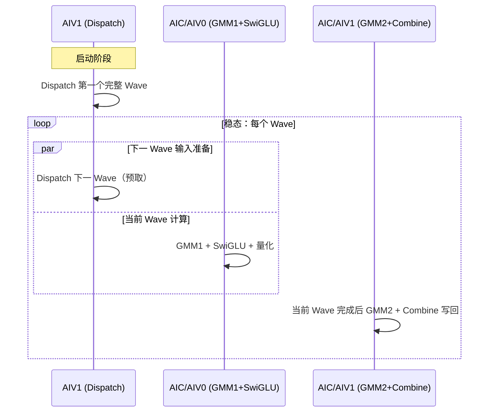

**核心思想**：不让 GMM 等 Dispatch，也不让 GMM2 等所有 GMM1 完成。`AIV1` 一边给「下一 Wave」准备输入，`AIC/AIV0` 一边算「当前 Wave」的 GMM1，两者交错推进。

#### `ProcessMoeExpertStages` 三个部分

**① 启动阶段（`mega_moe_wave_a4w4.h:148-162`）**

AIV1 先把**第一个完整 Wave** 的输入 Dispatch 好：

```cpp
if (GetSubBlockIdx() == 1U) {
    uint32_t dispatchedWaveMGroupCount = 0U;
    while (IsPositionWithinWave(dispatchPosition, dispatchedWaveMGroupCount)) {
        expertTokenCount = (tokenIndexInExpert == 0)
            ? DispatchMoeExpert(dispatchPosition.expertIdx)   // 新专家：算 count + 拉 token
            : GetExpertTokenCountFromWorkspace(...);          // 同一专家继续：直接读已有 count
        AdvanceExpertTokenPositionInWave<GMM1_TILE_M>(expertTokenCount, mGroupsPerWave_,
                                                      dispatchedWaveMGroupCount, dispatchPosition);
    }
}
```

**② 稳态：交错推进 Dispatch 与 GMM1（`mega_moe_wave_a4w4.h:164-211`）**

外层 `while (gmm1Position.expertIdx < moeExpertPerRank)` 按 Wave 迭代；内层 `while (currentWaveNeedsGmm1 || nextWaveNeedsDispatch)` 里：

- **AIV1**：如果下一 Wave 还需要输入，就继续 `DispatchMoeExpert` 推进 `dispatchPosition`；
- **AIC/AIV0**：推进当前 Wave 的 `gmm1Position`，每推进一个 slice 就调 `RunGmm1ActivationForExpert` 算 GMM1+SwiGLU。

```cpp
while (currentWaveNeedsGmm1 || nextWaveNeedsDispatch) {
    // AIV1 逐专家准备下一 Wave；AIC/AIV0 同时推进当前 Wave 的 GMM1/Activation。
    if (AIV1 && nextWaveNeedsDispatch) { DispatchMoeExpert(...); ... }

    if (currentWaveNeedsGmm1) {
        if (tokenIndexInExpert == 0) PrepareGmmExpertState<true>(gmm1State, ...);
        sliceTokenCount = AdvanceExpertTokenPositionInWave<GMM1_TILE_M>(
            expertTokenCount, mGroupsPerWave_, currentWaveMGroupCount, gmm1Position);
        if (sliceTokenCount != 0)
            RunGmm1ActivationForExpert(gmm1State, gmm1AddrInfo, gmm1RuntimeState,
                                       sliceTokenStartIndexInExpert, sliceTokenCount, gmm1TilesPerMGroup);
        ...
    }
}
```

**③ 当前 Wave 完成后立刻 GMM2/Combine（`mega_moe_wave_a4w4.h:213-230`）**

对当前 Wave 覆盖的专家区间 `[waveBegin, waveEnd)`，逐专家执行：

```cpp
for (expertIdx = waveBeginPosition.expertIdx; expertIdx < waveGmm2ExpertEndExclusive; ++expertIdx) {
    sliceTokenStartIndexInExpert = (expertIdx == waveBegin) ? waveBegin.tokenIndex : 0;
    ...
    sliceTokenCount = sliceTokenEndIndex - sliceTokenStartIndex;
    if (sliceTokenCount != 0)
        RunGmm2CombineForExpert(gmm2State, gmm2AddrInfo, startBlockIdx, gmTileSequence,
                                sliceTokenStartIndexInExpert, sliceTokenCount);
}
```

注意注释里强调的：**Wave 在专家内部结束时，这个专家要完整包含进 GMM2 区间**（`waveEndPosition.tokenIndexInExpert != 0` 时专家 end 要 +1），保证 GMM1 和 GMM2 处理的是同一段 token 范围。

### 13.3 每个过程（函数）的实现原理

#### `RunGmm1ActivationForExpert`（A4W4 的 GMM1 + SwiGLU）

```cpp
UpdateMoeExpertGmm1GlobalBuffer<ActivationType, Weight1Type, ActivationQuantOutType, ...>(...);
// 构造这个专家 slice 的 A/B/scale/C 地址

Get<M_VALUE>(sliceProblemShape) = sliceTokenCount;
RunGmm1GenericByWeightFormat<QuantOutType, ActivationQuantOutType, ...>(...);
```

- 输入 A = `dispatchRevData`（FP4 E2M1 激活）+ `dispatchRevScale`；
- 权重 B = `l1_weights`（FP4 E2M1）+ `l1_weights_sf`（E8M0）；
- 走 generic GMM1：FP4×FP4 的 MMAD；
- epilogue `BlockEpilogueActivationMxQuant` 里完成 **SwiGLU + 输出量化**，因为 A4W4 下 `ActivationQuantOutType = fp8_e4m3fn`（`mega_moe_arch35.h:160`），所以 SwiGLU 输出被提升为 **MXFP8 E4M3** 存到 `activationQuantDataPtr`。

#### `RunGmm2CombineForExpert`（A8W4 的 GMM2 + Combine）

```cpp
UpdateMoeExpertGmm2GlobalBuffer<Weight1Type, ActivationQuantOutType, QuantScaleOutType, ...>(...);
Get<M_VALUE>(sliceProblemShape) = sliceTokenCount;
RunGmm2A8W4<CombineQuantMode, ActivationQuantOutType, Weight1Type, ...>(...);
ScheduleQuantizedMoeExpertCombine<CombineQuantMode>(...);
```

- 输入 A = SwiGLU 量化结果（FP8 E4M3）+ scale；
- 权重 B = `l2_weights`（FP4 E2M1），在 A8W4 prologue 里解包成 FP8 再乘；
- 得到专家输出 `gmm2OutGlobal`；
- 然后 `ScheduleQuantizedMoeExpertCombine` 按 meta 把结果行写回原 token 所在 rank（Combine 阶段）。

#### 三态交错的关键：`gmm1RuntimeState` 与 `startBlockIdx`

A4W4 里 `gmm1RuntimeState` 持有 `{startBlockIdx, vecSetSyncCom, gmTileSequence, pingpongIdx}`，这些游标被 GMM1 反复更新。因为同一 Block 的 1C2V 各自持有游标，但必须**按相同调用顺序推进**，否则 AIC/AIV 对 tile 的分配会错位（`mega_moe_wave_a4w4.h:136-137` 的注释）。

### 13.4 为什么切 tile，划分依据是什么

#### 切 tile 的根本目的

流水要「细粒度重叠」，就必须把大 GEMM 切成小块：

1. **填充所有核**：一个大 GEMM 切成很多 tile，才能让所有 block/核都有活干；
2. **通信计算重叠**：Dispatch 搬够一个 tile 的输入，GMM1 就能先算这个 tile，不用等整个专家搬完；
3. **UB 容量限制**：一个 tile 的数据要能装进 UB，才能算；
4. **Wave 负载均衡**：把「M 方向（token 行）」按固定粒度切成 group，才能量化地控制每个 Wave 做多少。

#### 三层「tile」概念

A4W4 里其实有三层粒度，别混：

| 层级 | 粒度 | 谁定 | 代码 |
|---|---|---|---|
| **M group（Wave 划分单位）** | 256 行 token | `GMM1_TILE_M = L1_TILE_M_256 = 256` | `mega_moe_constants.h:76` |
| **GMM tile（调度单位）** | 256×256（M×N） | `L1_TILE_N = 256` | `block_scheduler_swizzle.h` |
| **MMAD L1/L0 tile** | 更小，由硬件 MMAD 决定 | `L0_TILE_K = 128`，L1 params 自适应 | `mega_moe_gmm_common.h` |

#### Wave 的 M 方向划分依据（token 行）

Wave 大小 = `mGroupsPerWave` 个 M group，每个 group 256 行 token。

`AdvanceExpertTokenPositionInWave`（`mega_moe_utils.h:302-317`）是核心划分函数：

```cpp
template <uint32_t TileM>   // TileM = 256
uint32_t AdvanceExpertTokenPositionInWave(uint32_t expertTokenCount,
                                          uint32_t waveMGroupTarget,   // = mGroupsPerWave
                                          uint32_t &waveMGroupCount,   // 当前 Wave 已用的 group 数
                                          ExpertTokenPosition &position)
{
    uint32_t expertRemainingTokenCount = expertTokenCount - position.tokenIndexInExpert;
    uint32_t waveRemainingTokenCapacity = (waveMGroupTarget - waveMGroupCount) * TileM;
    uint32_t sliceTokenCount = min(expertRemainingTokenCount, waveRemainingTokenCapacity);
    waveMGroupCount += CeilDiv(sliceTokenCount, TileM);   // 向上取整：不足 256 行也算 1 个 group
    position.tokenIndexInExpert += sliceTokenCount;
    if (position.tokenIndexInExpert >= expertTokenCount) { ++position.expertIdx; position.tokenIndexInExpert = 0; }
    return sliceTokenCount;
}
```

含义：

- 每个 Wave 最多装 `mGroupsPerWave × 256` 行 token；
- **专家边界不跨 group 共享**：不同专家权重不同，所以专家不足 256 行的尾块也单独占一个 group（`GetMGroupCountForRows` 的注释）。
- 一个专家 token 很多时，会在专家内部被切成多个 slice。

#### 为什么 `mGroupsPerWave` 是这个值（N 方向依据）

`mGroupsPerWave` 是 host tiling 根据「每个核至少要处理多少个 N tile」反推出来的，让核都打满。

host 侧 `CalcMGroupsPerWave`（`mega_moe_tiling.cpp:78-96`）：

```cpp
uint64_t gmm1LogicalTilesPerMGroup = CeilDiv(hiddenDim, GMM_TILE_N);      // 一个 M group 里的 N tile 数
uint64_t gmm2TilesPerMGroup        = CeilDiv(h, GMM_TILE_N);             // GMM2 的 N tile 数
uint64_t gmm1RequiredMGroups = CeilDiv(aicNum * GMM1_MIN_LOGICAL_TILES_PER_CORE,
                                       gmm1LogicalTilesPerMGroup);
uint64_t gmm2RequiredMGroups = CeilDiv(aicNum, gmm2TilesPerMGroup);
return max(gmm1RequiredMGroups, gmm2RequiredMGroups);
```

其中 `GMM1_MIN_LOGICAL_TILES_PER_CORE = 4`（`mega_moe_tiling.cpp:76`）。逻辑是：

```text
每个 AIC 至少要有 4 个独立 N tile 才能并行打满
→ 反推一个 Wave 至少需要多少个 M group
→ mGroupsPerWave = max(GMM1 需求, GMM2 需求)
```

在 A4W4 kernel 侧，`gmm1TilesPerMGroup`（每个 M group 对应的 N tile 数）是（`mega_moe_wave_a4w4.h:286-287`）：

```cpp
const uint32_t gmm1TilesPerMGroup =
    Ops::Base::CeilDiv(commonConfig_.gmm1OutputDim, static_cast<uint32_t>(L1_TILE_N));
```

注意这里**没有除以 `ACTIVATION_N_HALF`**：`gmm1OutputDim`（=`hiddenDim`）已经是 GMM1 含 gate/up 两路的**完整**输出宽度（= 2 × intermediate），直接除以 `L1_TILE_N=256` 即得每个 M group 的 N tile 数。`ACTIVATION_N_HALF` 只在更低层的 MMAD/prologue/epilogue 内部把 gate/up 成对处理，不影响 scheduler 层的逻辑 tile 计数（详见 §13.7）。

#### GMM tile 的 M×N 划分依据（GEMM 内部）

`BlockSchedulerSwizzle`（`block_scheduler_swizzle.h`）把一个问题 `[M, N, K]` 按 `tileShape = [256, 256]` 切成 tile：

```cpp
loopFirst_  = ceil(M / 256);   // M 方向 tile 数
loopSecond_ = ceil(N / 256);   // N 方向 tile 数
GetTileNum() = loopFirst_ * loopSecond_;
```

`SwizzleOffset=3` 做 **swizzle**（锯齿形/交错调度）：它重排「tile 编号 → (mLoc, nLoc) 坐标」的映射，让相邻 tile 编号对应到**同一 N 列（同一份 B 权重）、不同 M 行**，从而让并发执行的核共享同一份权重、命中 L2（详见 §13.9）。`GetBlockCoord(tileIdx)` 返回该 tile 的 `(mLoc, nLoc)` 起始坐标，`GetBlockShape` 处理边界尾块。

所以划分依据可以总结成一句话：

> **tile 按「M 方向 256 行、N 方向 256 列」切；Wave 按「M 方向 256 行的 group」聚合，再按「每个核至少 4 个 N tile」反推一个 Wave 的 group 数。**

### 13.5 「AIV0/AIV1 是角色，不是 A5 上 AIV 总数」——对的

你的理解**正确**。

`AIV0` / `AIV1` 是**一个 Block 内部的两个 Vector 核角色**，不是「A5 上有两个 AIV」。

看 `mega_moe_arch35.h:131-135`：

```cpp
uint32_t blockNum_    = GetBlockNum();          // 逻辑 block 数
uint32_t blockAivNum_ = GetBlockNum() * 2;       // AIV 总数 = block 数 × 2
uint32_t blockIdx_    = GetBlockIdx() / GetTaskRation();
uint32_t aivCoreIdx_  = GetBlockIdx();           // AIV 全局编号
```

结构是 **1C2V**（每个 block = 1 AIC + 2 AIV）：

```text
block 0:  [ AIC0 , AIV0, AIV1 ]   ← AIV0/AIV1 是这两个角色
block 1:  [ AIC1 , AIV2, AIV3 ]
block 2:  [ AIC2 , AIV4, AIV5 ]
...
```

代码里判断角色用 `GetSubBlockIdx()`（0 或 1）：

```cpp
if (GetSubBlockIdx() == 0U) { /* AIV0 的活 */ }
if (GetSubBlockIdx() == 1U) { /* AIV1 的活 */ }
```

所以「AIV0 / AIV1」是**每个 block 里重复出现的两个角色**，而 A5 上 AIV 的总数是 `blockAivNum = GetBlockNum() × 2`。

#### 950 上有多少个 AIV

回到 host tiling 的取值（`mega_moe_tiling.cpp:1960-1965`）：

```cpp
uint32_t aivNum = ascendcPlatform.GetCoreNumAiv();   // 硬件返回，不硬编码
uint32_t aicNum = ascendcPlatform.GetCoreNumAic();
tilingData->aicNum = aicNum;
tilingData->blockAivNum = aivNum;
```

即 A5 的 AIV 总数 = `GetCoreNumAiv()` 的返回值，随 SKU 变化。按公开规格资料，AIC:AIV = 1:2，常见档位：

| 产品 | AIC（Cube）数量 | AIV（Vector）数量 |
|---|---|---|
| Ascend 950PR | 28 / 32 | 56 / 64 |
| Ascend 950DT | 28 / 32 / 36 | 56 / 64 / 72 |

（`/` 表示不同 SKU/配置档位）

> 注意：这是公开规格里的档位值，实际以设备运行时 `GetCoreNumAiv()` 为准。mega_moe 自己不写死核数。

所以：

- **「AIV0 / AIV1」** = 每个 block 里的 2 个角色；
- **「A5 上有多少个 AIV」** = `blockAivNum`，即 950PR 约 56/64、950DT 约 56/64/72（AIC 数的 2 倍）。

### 13.6 参考来源

- A5 AIC/AIV 数量与 1:2 配比（公开规格资料）：[华为 昇腾 950 NPU 架构参数 规格书](https://www.16rd.com/forum.php?mod=viewthread&tid=647843&page=1&authorid=143687)、[面向 Ascend 950 CANN 技术架构的变与不变](https://m.it168.com/article_6924056.html)、[CANN NEXT 面向 950 架构详解](https://gitcode.csdn.net/69d8aa7f0a2f6a37c59e5e95.html)
- AIV 平台信息获取 API：[GetCoreNumAiv - PlatformAscendC](https://www.hiascend.com/document/detail/zh/CANNCommunityEdition/910/API/ascendcopapi/docs/api/Utils-API/%E5%B9%B3%E5%8F%B0%E4%BF%A1%E6%81%AF%E8%8E%B7%E5%8F%96/PlatformAscendC/GetCoreNumAiv.md)

### 13.7 补充：`gmm1TilesPerMGroup` 公式详解 + 950 的 AIC 数量

**原问题：**

> 在 A4W4 kernel 侧，`gmm1TilesPerMGroup`（每个 M group 对应的 N tile 数）是 `CeilDiv(commonConfig_.gmm1OutputDim / ACTIVATION_N_HALF, L1_TILE_N)`，请仔细解释一下这个公式。另外，在 950 中，有多少个 AIC 呢？

**回答：**

先给结论：**你引用的公式里多了一个 `/ ACTIVATION_N_HALF`**。当前代码（`mega_moe_wave_a4w4.h:286-287`）实际是：

```cpp
const uint32_t gmm1TilesPerMGroup =
    Ops::Base::CeilDiv(commonConfig_.gmm1OutputDim, static_cast<uint32_t>(L1_TILE_N));
```

A8W4（`mega_moe_wave_a8w4.h:279-280`）、A8W8（`mega_moe_wave_a8w8.h:509-510`）也是同一形式，都不除 2。§13.4 上文已据此更正。

#### 逐符号拆解

| 符号 | 值/来源 | 含义 |
|---|---|---|
| `gmm1OutputDim` | `= tilingData->hiddenDim`（`mega_moe_arch35.h:238`） | GMM1 的**完整**输出宽度，含 gate+up 两路 = 2 × intermediate |
| `hiddenDim` | 从 `weight1` 的**行数**读出（`mega_moe_tiling.cpp:2451`） | 同上，注释明确「hiddenDim 是 GMM1 含 gate/up 两路的完整输出宽度」（`mega_moe_tiling.cpp:68`） |
| `L1_TILE_N` | `256`（`mega_moe_constants.h:101`） | N 方向 scheduler tile 宽度（每 tile = 256×256） |
| `CeilDiv` | `(x+y-1)/y` | 向上取整，尾块也算 1 个 tile |

关键佐证是 host 的 shape 校验（`mega_moe_tiling.cpp:1925,1939`）：

```cpp
// 单专家 GMM 形状：weight1=[N, H]，weight2=[H, N/2]，x=[BS, H]。
// weight1 row count must equal weight2 column count multiplied by 2
weightOneRowCount != weightTwoColumnCount * SWIGLU_GATE_UP_SPLIT_FACTOR
```

即 `gmm1OutputDim = weight1 行数 = 2 × weight2 列数 = 2 × intermediate`（笔记 §14 记法里的 `2N`）。对 Qwen3.5-397B：`intermediate=1024` → `gmm1OutputDim = 2048`。

#### 这个值到底在算什么

GMM1 的调度是**二维切 tile**：M 方向按 256 行切「M group」，N 方向按 256 列切「N tile」。`gmm1TilesPerMGroup` 就是「一个 M group（256 行）× 完整 N 宽（2N）」能切出多少个 256 宽的 N tile：

```text
GMM1 输出 [M × 2N]（M 方向每 256 行为一个 group）

   N 方向:  | tile0 | tile1 | ... | tile{2N/256−1} |
            | 256列  | 256列 |     |      256列     |
   ────────┼───────┼───────┼─────┼───────────────┤
   group0  │  ◻    │  ◻    │ ... │       ◻       │  ← 这 2N/256 个 ◻ 就是
   (256行) │       │       │     │               │    gmm1TilesPerMGroup
   ────────┼───────┼───────┼─────┼───────────────┤
   group1  │  ◻    │  ◻    │ ... │       ◻       │
   (256行) │       │       │     │               │
```

#### 三个用途

1. **算一个 token slice 的 GMM1 总 tile 数**（`mega_moe_wave_a4w4.h:98`）：
   ```cpp
   uint32_t problemTileCount =
       GetMGroupCountForRows(sliceTokenCount, GMM1_TILE_M) * gmm1TilesPerMGroup;
   //              ↑ M 方向 group 数（动态，看 token 数）   ↑ N 方向每 group 的 tile 数（静态，看 2N）
   ```
2. **把 tile 均摊给 AIC、判断当前核有没有活**：`HandleWaveProblemWithoutWork`（`mega_moe_utils.h:210-225`）按 `problemTileCount` 做轮转分配（`startBlockIdx` 滚动游标），当前 AIC 分不到任何 tile 就跳过。
3. **算 prefetch 的 tile 就绪状态槽偏移**：透传给 `UpdateMoeExpertGmm1GlobalBuffer`（`mega_moe_gmm1_activation.h:768`），每个 expert 每个 M group 预留 `gmm1TilesPerMGroup` 个 `gmm1TileStatus` 状态槽。

#### 为什么公式里没有 `/ ACTIVATION_N_HALF`

笔记旧版给 `/2` 的理由是「非交织模式 GMM1 的 N 调度只遍历一半」，这把「scheduler 层逻辑 tile」和「MMAD 内部 gate/up 成对处理」混了：

- `ACTIVATION_N_HALF = 2` 是**更低层**用的：`Gmm1AicMmadTileToGmGeneric` 里 `singleShape.N /= 2`、`RunGmm1Generic` 里 `config.outputN = config.n / 2`，处理的是「把 gate/up 半片拼在一个物理 tile 里算」。
- 而 `gmm1TilesPerMGroup` 是 **scheduler 层**的「逻辑 tile 计数」，调度器 `BlockScheduler` 拿 `schedulerN = config.n = 2N` 去切格（`mega_moe_gmm_common.h:312`），必须覆盖完整 2N。

host 侧 `CalcMGroupsPerWave`（`mega_moe_tiling.cpp:153`）用的也是完整宽度、且注释明确「两种编译模式共用本公式」：

```cpp
uint64_t gmm1LogicalTilesPerMGroup = ops::CeilDiv<uint64_t>(tilingData->hiddenDim, GMM_TILE_N);
//                                              = CeilDiv(2N, 256)  ← 完整宽度，无 /2
```

所以 `gmm1TilesPerMGroup` 是 host `gmm1LogicalTilesPerMGroup` 的内核侧对应物，两者都等于 `CeilDiv(2N, 256)`。

#### 带数字的例子（Qwen3.5-397B）

```text
gmm1OutputDim = hiddenDim = 2048        （gate 1024 + up 1024）
L1_TILE_N     = 256

gmm1TilesPerMGroup = CeilDiv(2048, 256) = 8

某专家一个 Wave 有 512 token（= 2 个 M group）：
    problemTileCount = GetMGroupCountForRows(512, 256) × 8 = 2 × 8 = 16 个 tile
    → 16 个 256×256 tile 轮转分配给 28~36 个 AIC
```

若按旧版 `/2` 公式会得到 `CeilDiv(1024, 256) = 4`，只覆盖一半宽度，tile 分配与 prefetch 状态槽都会错位。

#### 950 有多少个 AIC

AIC 数不是写死的，运行时 `GetCoreNumAic()` 返回（`mega_moe_tiling.cpp:2561,2569`）。AIC:AIV = 1:2（每个 AI 子系统 = 1 Cube + 2 Vector），逻辑 block 数 = AIC 数（`mega_moe_arch35.h:131-135`）。

| 芯片 | AIC（Cube） | AIV（Vector） |
|---|---|---|
| 950PR | 32（满 die）/ 28（装箱版） | 64 / 56 |
| 950DT | 36 / 32 / 28 | 72 / 64 / 56 |

满 die 昇腾 950 = **36 AIC + 72 AIV**。即 **950 的 AIC 在 28~36 之间**，恒为 AIV 数的一半。生产路径一律以 `GetCoreNumAic()` 运行时返回为准（单元测试 `test_mega_moe_tiling.cpp:510` 里硬编码的 `aicNum = 28` 只是测试值）。

### 13.8 补充：权重列表语义（本卡专家）+ 专家并行模型

**原问题：**

> 在调用 mega_moe API 时，每一层 MoE 计算传入的是一个权重列表，它表示卡上的所有专家权重吗？假如是的，是不是每个专家的上述流程（GMM1 + SwiGLU + 再量化）是并行计算的呢？

**回答：**

先给结论：

1. **权重列表表示的是「本卡（本 rank）上的所有路由专家」，不是全部全局专家。** 全局 `num_experts` 被 EP 均分后，每张卡只持有 `local_moe_expert_num = num_experts / ep_world_size` 个专家的权重。
2. **不是「一个专家占一个核」那种专家级并行，而是「tile 级并行 + 流水重叠」。** 专家按顺序逐个处理，但每个专家的 GEMM 被切成 256×256 的 tile 摊给**全部 AIC 核**并行算；同时 Dispatch / GMM1 / GMM2 三个环节在时间上流水重叠。

#### 权重列表 = 本卡的 `local_moe_expert_num` 个专家

接口文档（`torchapi_mega_moe.md`）里 `l1_weights` / `l2_weights` 都是 `list[Tensor]`，描述明确写「**单卡 MoE 专家数为 `local_moe_expert_num`**」；输入公式（`:38-39`）也用本 rank 专家数：

$$\mathbf{W}_1^{\mathrm{moe}} \in \mathbb{R}^{\text{local\_moe\_expert\_num} \times \text{hidden} \times (2\,\text{intermediate\_hidden})}$$

且文档给了定义（`:481`）：`local_moe_expert_num = num_experts / ep_world_size`（每个 Rank 的路由 MoE 专家数）。`num_experts`（全局总数）是在 `get_symm_buffer_for_mega_moe` 里传的，只用来算通信 buffer 和做 EP 分片。

host tiling 里 `moeExpertPerRank` 就是从全局数除以 EP 世界大小算出，并**强制权重列表专家数等于它**（`mega_moe_tiling.cpp:581-594`）：

```cpp
int64_t moeExpertPerRank = moeExpertNum / epWorldSize;   // 本卡专家数
...
// weight1 expert count should equal the local MoE expert count (moeExpertNum / epWorldSize)
```

950 的 MXFP 场景支持两种打包方式（`torchapi_mega_moe.md:1232`、`mega_moe_tiling.cpp:1847`）：

| 布局 | `list[Tensor]` 长度 | 每个 tensor 维度 |
|---|---|---|
| 逐专家 TensorList | `local_moe_expert_num` | 二维，如 `[2×intermediate_hidden, hidden]` |
| 堆叠布局 | `1` | 三维，`[local_moe_expert_num, 2×intermediate_hidden, hidden]` |

两种都表示**本卡的 `local_moe_expert_num` 个专家**，`isPerExpertWeightTensor`（`mega_moe_tiling.h:204`）区分它们。

`topk_ids` 存的是**全局专家编号** `[0, num_experts)`（文档 `:797`），靠 EP 分片映射对上本地专家（`mega_moe_send_mask.h`）：

```cpp
dstRank       = globalExpertId / moeExpertPerRank;
localExpertId = globalExpertId % moeExpertPerRank;
```

例子（Qwen3.5-397B，`num_experts=512`，`ep_world_size=8`）：

```text
local_moe_expert_num = 512 / 8 = 64
每张卡传 l1_weights / l2_weights : list 长度 64（本卡 64 个专家）
topk_ids 值域 [0, 512)  ← 全局 id

某 token 选全局专家 130：
  dstRank       = 130 / 64 = 2   → rank2
  localExpertId = 130 % 64 = 2   → rank2 权重列表第 2 个
```

#### 每个专家的流程是「并行」的吗？——三层并行

**空间并行（tile 级）**：一个专家的 `[Ne × 2N]` GEMM 被 `BlockSchedulerSwizzle` 切成 `ceil(Ne/256) × ceil(2N/256)` 个 256×256 tile，轮流摊给所有 AIC 核（`mega_moe_gmm1_activation.h:201` 的 `loopIdx += config.blockNum` 循环）。**所有核同时服务同一个专家**，与「一个专家占一个核」完全不同。

**专家顺序处理**：`ProcessGmm1Wave`（`mega_moe_wave_a8w8.h:227-296`）外层循环按专家顺序走，每次 `RunGmm1Generic` 只算「当前专家的一个 slice」。A4W4 的动态 Wave 同样（`mega_moe_wave_a4w4.h:292` 的 `RunGmm1ActivationForExpert` 一次一个专家 slice）。所以**同一时刻 GMM1 只算一个专家（或其一截），不会「核 0 算专家 A、核 1 算专家 B」同时进行**。

> 为什么不用专家级并行？因为 MoE 各专家 token 数极不均衡（热点专家几百 token、冷门专家 0 token）。按专家分核会让热点专家所在核成瓶颈、冷门核空转；tile 级并行让**每个专家都用满全部核**，负载天然均衡。

**流水并行（跨环节/跨 Wave）**：Dispatch（下一 Wave）、GMM1（当前）、GMM2（上一 Wave）在时间上重叠（笔记 §6），加上 1C2V 核内分工——AIC 算 MMAD、AIV0 做 W4→W8 prologue、AIV1 做 SwiGLU+量化（`mega_moe_gmm1_activation.h:591-605`）——三者也在同一 block 内并发。

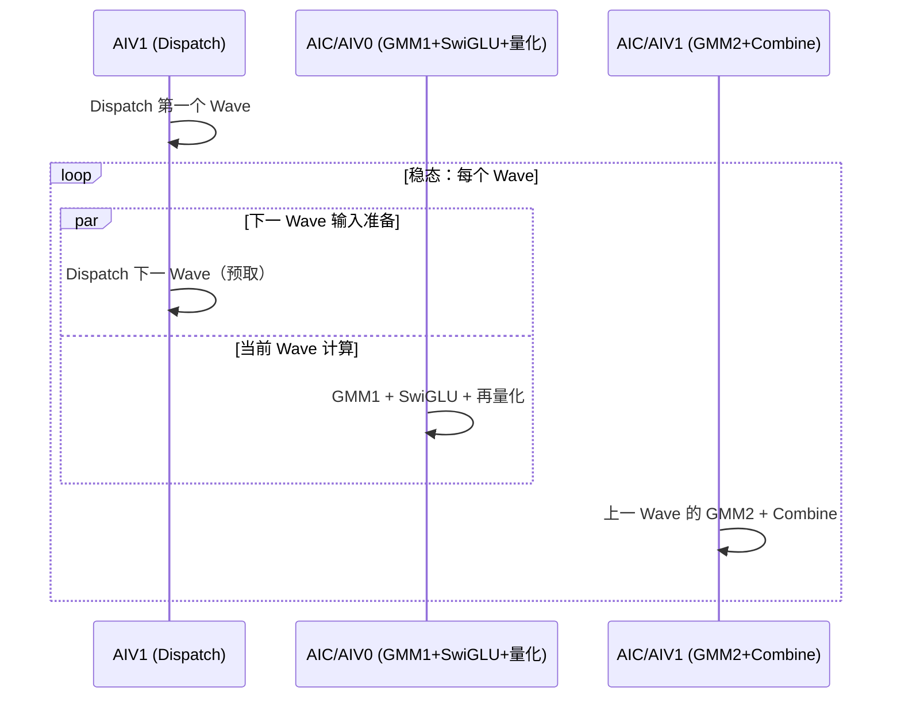

带数字例子（Qwen3.5-397B，某专家 512 token = 2 M group，`hiddenDim=2048`）：

```text
gmm1TilesPerMGroup = 8，该专家 GMM1 总 tile 数 = 2 × 8 = 16
→ 16 个 256×256 tile 摊给 28~36 个 AIC 并行算
→ 算完 advance 到下一个专家，同样摊 tile
同时：AIV1 Dispatch 下一个专家输入，AIC/AIV1 做上一 Wave 的 GMM2+Combine
```

**一句话总结**：权重列表 = 本卡分到的 `num_experts / ep_world_size` 个路由专家；每个专家的 GMM1+SwiGLU+再量化是并行的，但并行粒度是 **tile** 而非专家——所有 AIC 把同一个专家 GEMM 的 tile 摊掉并行算，专家之间顺序推进，靠 Wave 流水让 Dispatch/GMM1/GMM2 时间重叠。

### 13.9 补充：swizzle 调度的原理、作用、使用位置与 SwizzleOffset=3

**原问题：**

> 「swizzle（锯齿形/交错调度），让相邻 tile 尽量分到不同 block，改善访存局部性和负载均衡」——请详细解释这句话，说明 swizzle 调度的作用、都在哪些地方用到、SwizzleOffset=3 是如何确定的？

**回答：**

先纠正一处：**「相邻 tile 分到不同 block」其实是 round-robin 分配本身就做的**（核 c 处理 `c, c+blockNum, ...`），不是 swizzle 做的。swizzle 真正做的是**决定每个 flat 编号对应哪个 (mLoc, nLoc) 坐标**——它重排 tile 遍历顺序，让「相邻 flat 编号」映射到**同一 N 列（同一份权重）、不同 M 行**，从而让并发核共享同一份 B 权重、命中 L2。这正是 CUTLASS 里 `GemmIdentityThreadBlockSwizzle` 的思想（代码命名空间 `Catlass`、结构 `GemmIdentityBlockSwizzle` 直接对应 CUTLASS）。

#### 代码逐行拆解（`GetBlockCoord`，`block_scheduler_swizzle.h:70-94`）

```cpp
int64_t blockSpan = SwizzleOffset * loopSecond_;                 // 一组 = 3 个 M-tile × 全部 N-tile
int64_t blockIdx  = tileIdx / blockSpan;                         // 第几组（M 方向）
int64_t inBlockIdx = tileIdx % blockSpan;                        // 组内偏移
int64_t firstValid = Min(loopFirst_ - blockIdx * SwizzleOffset, SwizzleOffset); // 本组实际 M-tile 数（尾组可能不足）
int64_t firstIdx  = blockIdx * SwizzleOffset + inBlockIdx % firstValid;  // M 索引
int64_t secondIdx = inBlockIdx / firstValid;                              // N 索引
if (blockIdx & 1) secondIdx = loopSecond_ - secondIdx - 1;               // 奇数组反转 N（锯齿）
return {firstIdx * tileM, secondIdx * tileN, 0};                          // (mLoc, nLoc)
```

关键：① M 方向每 3 个 M-tile 分一组；② 组内「M 最快」的列优先遍历（`inBlockIdx` 每 +1 先让 M 索引 +1，走满 3 个才让 N 索引 +1）；③ 奇数组反扫 N 形成锯齿。

#### 一个具体 trace（loopM=6, loopN=4, offset=3）

```text
无 swizzle（row-major，offset=1）：flat = m*4 + n
 0:(m0,n0)  1:(m0,n1)  2:(m0,n2)  3:(m0,n3)  4:(m1,n0) ...
   ↑ 相邻编号 = 同一 M 行、相邻 N 列 = 不同权重

有 swizzle（offset=3）：
组0:  0:(m0,n0)  1:(m1,n0)  2:(m2,n0)  3:(m0,n1)  4:(m1,n1)  5:(m2,n1)
      6:(m0,n2)  7:(m1,n2)  8:(m2,n2)  9:(m0,n3) 10:(m1,n3) 11:(m2,n3)
组1: 12:(m3,n3) 13:(m4,n3) 14:(m5,n3) 15:(m3,n2) 16:(m4,n2) 17:(m5,n2)
     18:(m3,n1) 19:(m4,n1) 20:(m5,n1) 21:(m3,n0) 22:(m4,n0) 23:(m5,n0)
   ↑ 相邻编号 = 同一 N 列（同一份权重）、相邻 M 行
```

#### 作用 1（核心）：访存局部性 / L2 权重复用

一个专家所有 token 共用同一个 `W1/W2`，权重按 N 列切片、同一 N 列是同一份数据。

- 无 swizzle：相邻 flat 编号 = 同一 M 行、不同 N 列 → 不同权重，并发核各拉各的权重 → L2 每份权重只服务 1 个核。
- 有 swizzle（offset=3）：相邻 flat 编号 = 同一 N 列、不同 M 行 → 同一份权重，并发 3 个核共享一次 L2 载入，权重读取流量降为 ~1/3。

这与 `SetWaveWeightL2CacheHint`（`mega_moe_gmm_common.h`）是同一套目标——swizzle 创造复用机会，cache hint 旁路不复用的权重。

#### 作用 2：负载均衡

① 尾 tile（M/N 非 256 整数倍的残缺 tile）被锯齿分散，不扎堆；② 奇数 offset 打破对称，避免所有核在固定相位反复撞同一组权重。

#### 使用位置

`mega_moe_gmm_common.h:34` 定义别名 `using BlockScheduler = BlockSchedulerSwizzle<3, 0>;`，被 GMM1/GMM2 的所有调度路径复用：

| 位置 | 代码 |
|---|---|
| GMM1 AIC MMAD + AIV epilogue | `mega_moe_gmm1_activation.h:628-629`、`702-704` |
| GMM2 AIC MMAD + AIV1 Combine | `mega_moe_gmm2_combine.h:876-878`、`935-937` |
| GMM2 输入就绪 tile 计数 | `mega_moe_gmm2_combine.h:509-513`（`WaitForGmm2InputReady`） |

AIC 的 MMAD 循环与 AIV1 的 Combine 循环**重放同一个 scheduler**，所以 swizzle 映射必须两边一致。同一套 swizzle 也复用于 `mc2/matmul_allto_all`、`gmm/grouped_matmul`（都叫 `GemmIdentityBlockSwizzle<3,0>`）。

#### SwizzleOffset=3 如何确定

代码里**没有「为什么是 3」的显式推导**，它是模板参数（默认 1），mega_moe 显式选 3，属**经验调优值**。含义：M 方向每 3 个 M-tile 归一组，每份权重被 3 个 M-tile 复用一次。

| offset | 效果 |
|---|---|
| 1 | row-major，零复用（最差） |
| 3 | 每份权重服务 3 个核，权重流量 ~1/3 |
| 更大（8/16…） | 复用更多，但对 MoE「小 M」场景组填不满，锯齿粒度变粗、边缘负载不均 |

落在 3 的三个现实因素：① MoE 的 M 往往很小（decode 一个专家可能只有 1 个 token = 1 个 M-tile），小 offset 更稳健；② 3 倍复用已显著降权重带宽，再大边际递减；③ CUTLASS identity swizzle 偏爱奇数尺寸（2/3/4/8 中的奇数）打破对称、配合锯齿分散尾 tile。

> 总结：`SwizzleOffset=3` 不是从核数严格推导出来的，而是「MoE 小 M、共享权重、共享 L2」约束下一组小奇数里的经验甜点——比 1 多 3 倍权重复用，又比 8 更适配小 M 专家。

**参考来源：**

- [NVIDIA CUTLASS — Threadblock swizzle / rasterization 与 L2 locality（DeepWiki）](https://deepwiki.com/NVIDIA/cutlass/5.4-dispatch-policies-and-schedule-types)
- [NVIDIA CUTLASS issue #302 — threadblock rasterization 讨论](https://github.com/NVIDIA/cutlass/issues/302)

---

## 14. 专题：Qwen3.5-397B 带共享专家的 MoE 计算过程

**原问题：**

> 请你结合 mega_moe原理笔记.md 文件中内容，给出 Qwen3 397B 的带有共享专家的 MoE 的具体计算过程。要画图，并且在图中重点标出共享专家和路由专家的。

**回答：**

下面先讲清四个设计原理（**为什么这么设计**），再落到 Qwen3.5-397B-A17B 的**具体计算过程**，最后用图标出共享专家与路由专家的差别。

> 内容边界说明：具体数字（512 专家 / topK=10 / 共享 +1 / 中间维 1024）来自笔记 §11.3；「为什么这么设计」是 MoE 的通用原理，用于理解这些数字背后的动机。

### 14.1 先锁定模型配置

| 项 | 值 | 来源 |
|---|---|---|
| 路由专家总数 `num_experts` | **512** | 笔记 §11.3 |
| 每 token 路由专家数 `topK` | **10** | 笔记 §11.3 |
| 共享专家 | **1**（+1） | 笔记 §11.3 |
| 每 token 活跃专家数 | **11** = 10 路由 + 1 共享 | 推导 |
| MoE 中间维度 `moe_intermediate_size` | **1024**（gate/up 拼接宽 = 2048） | 笔记 §11.3 |
| `hidden_size H` | 笔记未给出，下文以 **H** 表示 | — |

「A17B」的含义就是：虽然总参数 397B，但每个 token 只激活 11 个专家（10 路由 + 1 共享），活跃参数只有 17B。

### 14.2 原理一：MoE 的本质是「容量」与「计算」解耦

Dense LLM 里，一层 FFN 的**参数量 = 计算量**，两者绑死：想涨知识容量，推理开销也同步变大。

MoE 把一层 FFN 换成「512 个专家 + 1 个路由器」：

- **总参数量**（知识容量/存储）≈ 512 个专家全部存下来 → 巨大 → 397B；
- **每 token 计算量**（推理开销）只取决于被激活的专家 → topK=10 + 共享 1 = 11 个 → 17B。

于是「参数规模」和「单 token 算力」被解耦：总参数可以堆到 397B（模型更聪明），推理却只按 17B 付费。这就是 MoE 稀疏激活的核心红利。

### 14.3 原理二：共享专家是「通用能力的兜底」

路由专家是**特长化**的：训练中路由器会把不同类型的 token 分给不同专家，各专家只专精自己的那部分（代码、数学、中文、多语言……）。

但纯路由有两个隐患：

1. **通用能力被稀释**：语法、常识、格式、基础推理这些「每个 token 都需要」的能力，如果也要靠路由专家承载，每个专家都得兼修通识，挤压专业容量；
2. **路由不可靠时需要兜底**：路由器有噪声、会犯错，负载不均时某些 token 可能没被分到最合适的专家。

解法：加 1 个**共享专家**（shared expert，也叫 always-on / common FFN），它对**每个 token 无条件生效、不参与路由**，专门承载「通用知识」，路由专家则放心专精。

类比：共享专家 = 每个学生必上的**通识课**；路由专家 = 按兴趣/特长选修的**专业课**。最终成绩 = 通识课 + 专业课加权和。

这也是为什么公式里共享专家是**单独一项、无条件相加**，而不是参与 topK 加权。DeepSeek-V2/V3、Qwen3、Gemma3 等主流 MoE 都采用了共享专家。

### 14.4 原理三：门控（Router）如何选出 topK=10 个专家

```text
logits       = x · W_r                 [H] → [512]
score        = 激活函数(logits)          # softmax 或 sigmoid 两种风格
topk_ids     = top-K(score) 取前 10     # 选中的 10 个专家编号 [1×10]
topk_weights = normalize(score[topk])   # 对这 10 个分数归一化，作为加权权重
```

三个要点：

- **归一化两种风格**：① softmax（对选中的专家做 softmax）；② sigmoid + 归一化（对 logits 取 sigmoid 再对 topK 归一化，DeepSeek-V3 风格）。无论哪种，最终都得到 `topk_ids`（专家编号）和 `topk_weights`（归一化权重，即公式里的 `W[i,k]`）。
- **topK 而非全量**：512 个全算就退回 dense 了；只算 topK=10 才有「参数大、计算小」的红利。
- **负载均衡**：如果某个专家总被选中会过载、其余闲置。训练时通常加 aux loss（负载均衡损失）约束各专家被选频率大致均匀，或采用无辅助损失的 dynamic bias 等方式。

### 14.5 原理四：SwiGLU 的 gate/up 双分支

专家 FFN 中间用 SwiGLU 激活，这正是 `W1` 要 `[H × 2N]`（gate 和 up 各 N=1024 拼接成 2048）的原因。下面把「gate/up 双分支」讲透。

#### 三矩阵 vs 两矩阵

普通 FFN 是**两个**矩阵 + 一个激活函数：

```text
y = W_down · σ( W_up · x )      # W_up: [H→N], W_down: [N→H]
```

SwiGLU 改造成**三个**矩阵 + 一次逐元素相乘：

```text
gate = W_gate · x        # 门分支，[H→N]
up   = W_up   · x        # 上分支（值分支），[H→N]
y    = W_down · ( SiLU(gate) ⊙ up )
```

`⊙` 是逐元素（Hadamard）相乘。第一层投影被**拆成两个并行线性变换**，一个当门控、一个当内容，相乘后再投影回原维度。

#### gate 分支 vs up 分支

| | gate 分支 | up 分支 |
|---|---|---|
| 计算 | `W_gate · x` | `W_up · x` |
| 再处理 | 过 **SiLU** 激活 | **保持线性，不过激活** |
| 角色 | 输出「门」——每个维度放行多少 | 输出「候选内容」——要被门控的原始值 |

一句话：**up 分支提供「内容」，gate 分支决定「每个维度放行多少」**，逐元素相乘 = 给 up 的每个通道装一个由输入自己设定的「音量旋钮」。

#### 为什么是「乘」而不是加/拼接 —— 门控的本质

```text
output[j] = SiLU(gate[j]) · up[j]
```

- `gate[j]` 大 → 该维度的 `up[j]` 被放大/通过；
- `gate[j]` 接近 0 → 该维度被压制；
- `gate[j]` 本身是输入 x 的函数（`W_gate·x`），所以「哪些维度通过、哪些被抑制」是**数据决定**的，不是固定的。

普通 FFN 的 `σ(W·x)` 那个 σ 是**固定的、对所有输入一视同仁**的；SwiGLU 把「固定非线性」换成「**可学习的、依赖输入的门控非线性**」——软性的、逐通道的条件选择，表达能力更强。乘法是 AND 式阀门，能实现「选择性抑制」；加法只是残差/偏置，做不到这一点。

#### 为什么 gate 用 SiLU，而不是 sigmoid / ReLU

GLU 家族的区别就在于 gate 分支用哪个激活：

| 变体 | gate 激活 | 公式 |
|---|---|---|
| GLU | Sigmoid | `(xW₁) ⊙ σ(xW₂)` |
| ReGLU | ReLU | `(xW₁) ⊙ ReLU(xW₂)` |
| GeGLU | GELU | `(xW₁) ⊙ GELU(xW₂)` |
| **SwiGLU** | **Swish / SiLU** | `(xW₁) ⊙ SiLU(xW₂)` |

选 SiLU（`SiLU(x) = x·σ(x) = x·sigmoid(x)`）的原因：

- **sigmoid**：有界 `[0,1]`、两端饱和 → 梯度消失，且只能衰减不能放大；
- **ReLU**：负数段硬截断为 0 → 死神经元、梯度为 0；
- **SiLU**：平滑、**可正可负**（x≈−1.28 附近有微小负值，能翻符号）、正值段无上界（能放大）、处处梯度非零。

所以 SiLU 门控既能抑制、也能放大、还能翻符号，又比 ReLU 平滑。Shazeer 2020《GLU Variants Improve Transformer》里 SwiGLU 与 GeGLU 相当、都优于 ReGLU 和普通 ReLU/GELU 基线；PaLM、LLaMA 的采用让它成为事实标准。

#### 维度与参数预算（为什么是 2N，以及 8/3·d）

SwiGLU 是**三个**矩阵，同样中间宽 h 会比普通 FFN 多约 50% 参数：

- 普通 FFN：`W_up [d×h] + W_down [h×d]` = **2dh**
- SwiGLU：`W_gate [d×h] + W_up [d×h] + W_down [h×d]` = **3dh**

为参数中性，通常把中间维缩到 `2/3`。经典 FFN 用 `h=4d`（参数 `8d²`），SwiGLU 要 `3dh = 8d²` → **`h = (8/3)d ≈ 2.67d`**（LLaMA 这么做；PaLM 保留 4d、接受多出的参数）。

#### 落到 Qwen3.5-397B / mega_moe

笔记里 `moe_intermediate_size = 1024` 就是每个专家的 `h`（即 N），gate 和 up 各占 N=1024，拼接成 `2N=2048`：

```text
W1 = [H × 2N] = [H × 2048]   ← gate 和 up 拼在一起
W2 = [N  × H] = [1024 × H]   ← down 投影
```

gate 和 up 拼成一个 W1，所以 mega_moe 的 GMM1 一次矩阵乘 `[Ne×H]·[H×2N] → [Ne×2N]` 就同时算出两半，再 `chunk` 做 `SiLU(gate)⊙up`。好处：**一次 GEMM、激活量只读一次**，比两次 `[Ne×H]·[H×N]` 更省带宽、更好打满 AIC。这正是笔记 §5 阶段④「GMM1 = X·W1，gate/up 两半」的含义。

PyTorch 对应写法（fused 版）：

```python
self.gate_up_proj = nn.Linear(d_model, 2 * d_ff)   # 合并 gate+up
self.down_proj    = nn.Linear(d_ff, d_model)

def forward(x):
    gate, up = self.gate_up_proj(x).chunk(2, dim=-1)
    return self.down_proj(F.silu(gate) * up)
```

#### 反向传播视角（对称结构）

fused kernel 里梯度对称，体现两个分支是镜像关系：

```text
grad_up   = grad_output · SiLU(gate)
grad_gate = grad_output · up · SiLU'(gate)
```

up 的梯度被 `SiLU(gate)` 缩放，gate 的梯度被 `up` 缩放——两个分支互相调制对方的梯度，这也是「乘法门控」可学习性的体现。

#### 参考来源

- [Gated MLP (SwiGLU) explained — hfviewer glossary](https://hfviewer.com/glossary/gated-mlp/)
- [Gated Linear Units explained: the multiplicative valve behind LLaMA and PaLM's SwiGLU FFN — DEV Community](https://dev.to/dev48v/gated-linear-units-explained-the-multiplicative-valve-behind-llama-and-palms-swiglu-ffn-34bl)
- [SwiGLU — AI Wiki](https://aiwiki.ai/wiki/swiglu)
- [datawhalechina/llm-algo-leetcode: SwiGLU Activation](https://github.com/datawhalechina/llm-algo-leetcode/blob/main/docs/02_PyTorch_Algorithms/02_SwiGLU_Activation.md)
- Shazeer (2020)《GLU Variants Improve Transformer》arXiv:2002.05202

### 14.6 核心公式

笔记 §5 阶段⑥ 给出的公式就是最终结论：

$$Y[i]=\underbrace{\sum_{k=1}^{10} W[i,k]\cdot O\big[\pi(i,k)\big]}_{\text{10 个路由专家加权和}}+\underbrace{O_s^{shared}[i]}_{\text{1 个共享专家}}$$

其中每个专家（无论路由还是共享）的 FFN 是同一套结构：

$$O_e = W_2^e\cdot \mathrm{SwiGLU}\big(W_1^e\,x\big),\qquad \mathrm{SwiGLU}(gate, up)=\mathrm{SiLU}(gate)\odot up$$

`W1` 是 `[H × 2N]`（gate 与 up 两半拼在一起，N=1024，2N=2048），`W2` 是 `[N × H]`。**共享专家和路由专家结构完全一样，唯一的区别是：共享专家每个 token 都过、只在本卡本地算；路由专家只有被 topK 选中的 token 才过、且要跨卡 Dispatch/Combine。**

### 14.7 单 token 的具体计算过程（decode）

以 decode 的 1 个 token `x ∈ [1×H]` 为例：

**① 门控路由（只属于路由专家路径）**

```text
logits = x · W_router      [1×H]·[H×512] → [1×512]
门控后 topK=10 选择 →  topk_ids [1×10]，门控权重 w [1×10]
```

**② 共享专家（本地，不走门控，每个 token 都算）**

```text
gate‖up = x · W1_shared     [1×H]·[H×2048] → [1×2048]
a       = SwiGLU(gate, up)                   → [1×1024]
out_s   = a · W2_shared     [1×1024]·[1024×H] → [1×H]
```

**③ 路由专家（被选中的 10 个，各自独立、EP 跨卡分片）**

```text
对每个被选中的专家 e_k（k=1..10）：
    gate‖up = x · W1[e_k]   [1×H]·[H×2048] → [1×2048]
    a       = SwiGLU(gate, up)               → [1×1024]
    out_k   = a · W2[e_k]   [1×1024]·[1024×H] → [1×H]
```

**④ 汇总（Unpermute）**

```text
routed = Σ_{k=1..10} w_k · out_k     // 10 个路由专家加权和
y      = routed + out_s              // 再加共享专家
```

> 数值量级（H 未知，仅看比例）：每个专家每次前向约 `2H·(2048+1024) = 6144H` 次 MAC。11 个活跃专家 vs 513 个全部专家，就是 17B 活跃 vs 397B 总参数的原因。

### 14.8 图：重点标出共享专家与路由专家

绿色 = 共享专家，橙色 = 路由专家：

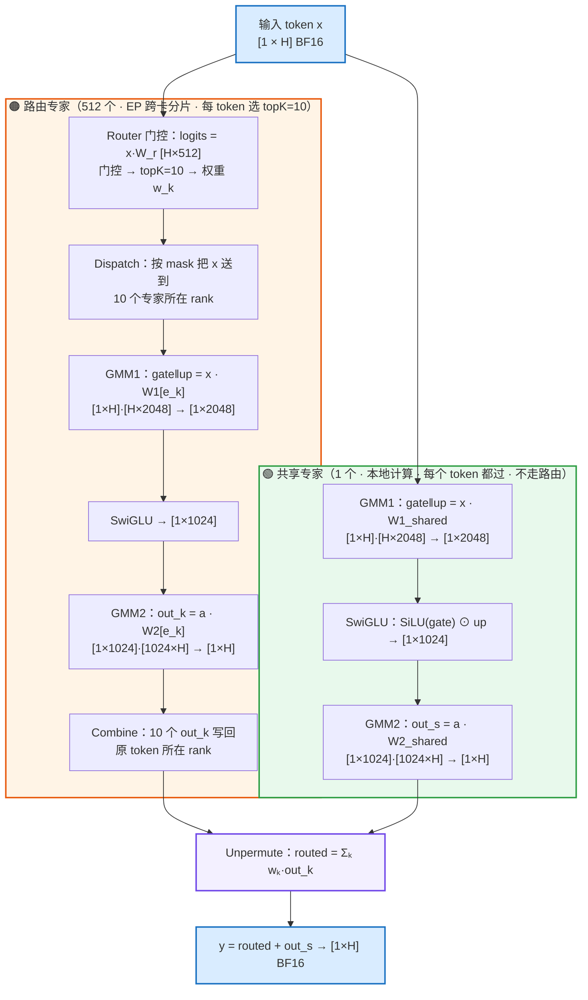

### 14.9 原理五：为什么共享专家「本地算」、路由专家「跨卡算」

关键区别是数据流是否**数据相关**：

- **路由专家**：token 去哪个专家由 router 分数决定，**每个 token 不同**。EP 下 512 个专家被分片到多张卡，所以必须「先路由、再跨卡送 token」——这正是笔记里 mask 广播 → Dispatch → GMM → Combine 那条链。
- **共享专家**：**每个 token 都过同一个专家，与路由无关**。于是每张卡只要存一份完整的共享专家权重，对「本卡自己的 token」本地算即可，**零跨卡流量**。

这也解释了 mega_moe 里共享专家的位置（下节）：它不参与 mask 广播 / Dispatch / Combine，只在本地 AIC/AIV 上做两次 GMM。

### 14.10 在 mega_moe 算子里的落地（共享专家的位置）

笔记 §13.2 的 `ProcessWave` 五阶段里，共享专家被拆成两次、插在路由专家前后，正好把「本地算共享专家」当成填充流水空隙的活儿：

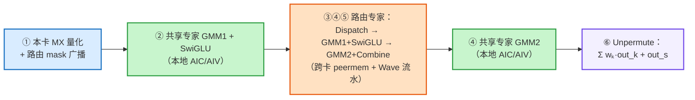

**关键区别一句话总结：**

| | 路由专家 | 共享专家 |
|---|---|---|
| 数量 | 512 | 1 |
| 触发条件 | 被 topK=10 门控选中 | **每个 token 都过** |
| 是否需要门控 | 是（`topk_ids` / `topk_weights`） | 否 |
| 是否需要跨卡 | 是（② mask 广播 → ③ Dispatch → ⑤ Combine） | **否，本地 GMM1+GMM2** |
| 数据流位置 | 阶段③④⑤（核心 Wave 流水） | 阶段②（GMM1）和阶段④（GMM2），夹在路由专家前后 |

所以带共享专家的 Qwen3.5-397B 的完整计算 = **1 条「本地共享专家 FFN」路径 + 10 条「跨卡路由专家 FFN」路径，最后在 Unpermute 里加权求和并相加**。

> 补充说明：`H`（hidden_size）笔记里没给，因此图上用符号表示；如果你有 Qwen3.5-397B-A17B 的 config.json，可以把 H 代进去把每个专家的参数量、单 token 的 MAC 数、以及 397B/17B 的精确拆解全部算成具体数字。

---

## 15. 专题：阶段④ GMM1 + SwiGLU + 再量化 详解

**原问题：**

> 请仔细讲解一下「阶段④ GMM1 + SwiGLU + 再量化」具体都做了什么。

**回答：**

这个阶段是 mega_moe 整个算子里**计算密度最高、类型转换最密集**的一步：它把一个专家收到的所有 token（`X_e`）依次过「第一层矩阵乘 → SwiGLU 门控激活 → 再把中间结果重新量化成 MXFP8」，为下一阶段的 GMM2 备好输入。下面按「输入输出 → GMM1 → SwiGLU → 再量化」四层拆开讲，代码依据都标了 `文件:行号`。

### 15.1 这个阶段在整条链上的位置与职责

```
阶段③ Dispatch 结束 ──► dispatchRevData(量化token) + dispatchRevScale + metaInfo
                                │
                    ┌───────────▼───────────┐
                    │  阶段④（本节）          │
                    │  GMM1 + SwiGLU + 再量化 │
                    └───────────┬───────────┘
                                │ activationQuantData(FP8) + activationQuantScale(E8M0)
                    ┌───────────▼───────────┐
                    │  阶段⑤ GMM2 + Combine   │
                    └───────────────────────┘
```

对应代码：

- **阶段编排入口**：`stage/mega_moe_gmm1_activation.h`（`RunGmm1Generic` / `RunGmm1A8W4`）
- **SwiGLU + 量化（epilogue）**：`blaze/epilogue/block_epilogue_activation_mx_quant.h`
- **激活函数内核**：`blaze/epilogue/activation/*.h`（swiglu / situglu / swigluoai）
- **MX 量化原语**：`mc2/common/op_kernel/quantize_functions.h` + `common/mega_moe_mxfp8_utils.h`
- **硬件 MMAD 与 prologue**：`blaze/gemm/block/block_mmad_mx_fp8fp4.h` + `blaze/prologue/block_prologue_mx_fp8fp4.h`

### 15.2 输入输出总览（一张图）

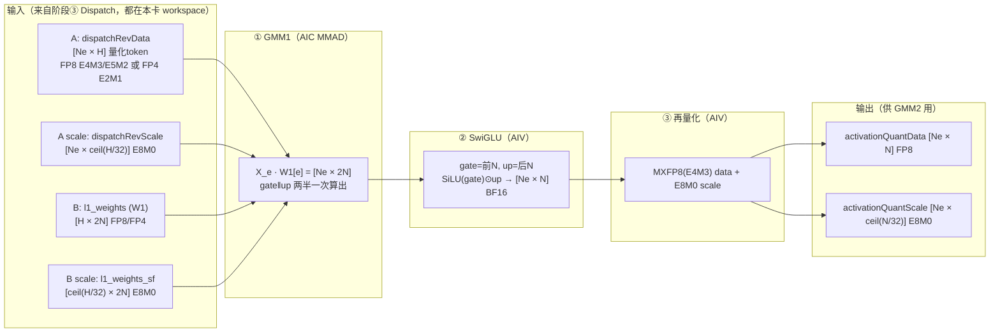

`Ne` 是该专家收到的 token 数，`H` 是 hidden 维，`N` 是专家中间维（Qwen3.5-397B 里 N=1024，2N=2048）。

### 15.3 第 1 步：GMM1 = X_e · W1，一次算出 gate/up 两半

#### 数学：为什么 W1 是 [H × 2N]

SwiGLU 把普通 FFN 的两个矩阵换成三个，其中前两个投影（gate 与 up）输入相同、输出宽度相同，可以**拼成一个大矩阵一次乘完**：

$$
W_1 = \begin{bmatrix} W_{gate} & W_{up} \end{bmatrix} \in \mathbb{R}^{H \times 2N}
$$

$$
X_e \cdot W_1 = \big[\, \underbrace{X_e W_{gate}}_{gate} \;\big|\; \underbrace{X_e W_{up}}_{up} \,\big] \in \mathbb{R}^{N_e \times 2N}
$$

好处：**一次 GEMM、激活量只读一次**，比分别做两次 `[Ne×H]·[H×N]` 更省带宽、更能打满 AIC。之后 epilogue 里 `chunk` 成两半做 `SiLU(gate)⊙up`。

#### 三种量化场景，GMM1 走三条不同实现

| 场景 | 激活 A | 权重 W1 | GMM1 实现 | 入口 |
|---|---|---|---|---|
| **A8W8-FP** | FP8 E4M3/E5M2 | FP8 E4M3/E5M2 | `RunGmm1Generic`（`GroupedMatmulWithScaleMx`，FP8×FP8） | `mega_moe_wave_a8w8.h:283` |
| **A8W4-FP** | FP8 E4M3 | FP4 E2M1 | `RunGmm1A8W4`（`MatmulMxFp8Fp4DynamicKL1TailResplit`，prologue 先把 W4→W8） | `mega_moe_wave_a8w4.h:108` |
| **A4W4-FP** | FP4 E2M1 | FP4 E2M1 | `RunGmm1Generic`（generic A4W4，FP4×FP4） | `mega_moe_wave_a4w4.h:109` |

三种路径的差异主要体现在两个模板开关上（`mega_moe_gmm_common.h:60-96` 的 `Config`）：

```cpp
using DispatchPolicy = Std::conditional_t<IsA8W4,
        Blaze::Gemm::MatmulMxFp8Fp4DynamicKL1TailResplit,   // A8W4：专用动态K策略
        Blaze::Gemm::GroupedMatmulWithScaleMx<>>;           // A8W8 / A4W4：generic 分组矩阵乘
using BlockPrologue = Std::conditional_t<IsA8W4,
        Blaze::Gemm::Prologue::BlockPrologue<...>, void>;    // 只有 A8W4 需要 W4→W8 的 prologue
```

#### A / B / scale 的地址怎么来：`UpdateMoeExpertGmm1GlobalBuffer`

每个专家在算之前，先把它的 A、B、scale 以及各种同步 flag 的地址从 workspace 里定位出来（`mega_moe_gmm1_activation.h:742-814`）：

```cpp
// 激活 A：从 Dispatch 紧凑区按 expert 起始行取，FP4 时每字节 2 元素
gmmAddrInfo.aGlobal = workspace.dispatchRevDataPtr
                    + globalTokenStartIndex * k / ActivationElementsPerByte * sizeof(ActivationType);
gmmAddrInfo.aScaleGlobal = workspace.dispatchRevScalePtr
                         + globalTokenStartIndex * scaleK * sizeof(QuantScaleType);
// 权重 B：按 expertIdx 从逐专家权重 list 取
gmmAddrInfo.bGlobal = GetExpertWeightAddr<WeightType>(weights.weight1, ..., state.expertIdx, ...);
gmmAddrInfo.bScaleGlobal = GetExpertWeightAddr<QuantScaleType>(weights.weightScales1, ...);
```

其中 `scaleK = CeilDiv(k, 64) * 2`（`mega_moe_gmm_common.h:299`），含义见 §15.5 的 MX 量化说明。

#### gate/up 拼接的关键常量：`ACTIVATION_N_HALF = 2`

`mega_moe_constants.h:103` 定义 `ACTIVATION_N_HALF = 2`。这个「2」贯穿 GMM1 全程，因为 GMM1 的 N 维是「中间维 N 的 2 倍」：

- `BuildGmm1ProblemConfig`（`mega_moe_gmm_common.h:304-316`）：
  ```cpp
  config.n = Get<N_VALUE>(problemShape);        // = 2N（gate+up 总宽）
  config.outputN = config.n / ACTIVATION_N_HALF; // = N（SwiGLU 之后只剩一半宽）
  config.schedulerN = config.n;                  // 调度按完整 2N 走
  ```
- 每个 MMAD tile 实际只算「一半宽」：`Gmm1AicMmadTileToGmGeneric`（`mega_moe_gmm1_activation.h:82-91`）里 `Get<N_VALUE>(singleShape) /= ACTIVATION_N_HALF;`，权重 B 也按 `nLoc / 2` 去切片。
- A8W4 的 prologue 与 `copy_gmm1_concat.h` 里还有专门的 gate/up 拼接搬运 `CopyGmm1WeightConcatToUb`：把 NZ 分形布局里「gate 块」和「up 块」拼成一个连续窗口再做反量化（`copy_gmm1_concat.h:72-85`）。

> 一句话：**逻辑上 W1 是 [H×2N] 一个大矩阵，但 kernel 内部把 N 维对半处理，gate 半片和 up 半片共享同一段计算/搬运逻辑**，这正是 `ACTIVATION_N_HALF` 存在的意义。

#### A8W4 的 prologue：W4 → W8 反量化

A8W4 场景权重是 FP4（E2M1），但 **AIC 的 MMAD 不能直接算 FP4×FP8**（`block_mmad_mx_fp8fp4.h:61` 注释明确写了 "AIC does not support direct FP4E2M1 -> FP8E4M3 conversion"）。所以 AIV0 要先把 FP4 权重**反量化成 FP8 E4M3**，再交给 Cube。

`block_prologue_mx_fp8fp4.h` 做的是一个三段流水：

```
GM(FP4) ──MTE2──> UB(FP4,4缓冲) ──Vector: ShiftW4ToW8──> UB(FP8,4缓冲) ──MTE3──> L1(FP8,双缓冲)
```

关键函数 `WeightAntiQuantComputeNzNk`（`block_prologue_mx_fp8fp4.h:398-410`）核心就一行：

```cpp
Blaze::Gemm::Tile::ShiftW4ToW8<OutType, InType>(weight4BitTensor, weight8BitTensor);
// InType=__fp4e2m1x2 (打包FP4)，OutType=__fp8e4m3
```

它把每 2 个 FP4 元素（1 字节）解包成 2 个 FP8（E4M3）元素。prologue 的调用点在 `Gmm1Aiv0PrologueA8W4`（`mega_moe_gmm1_activation.h:373-387`），它和 AIC 的 MMAD 通过 `CrossCoreSetFlag/WaitFlag` 握手。

> 对比：A8W8 / A4W4 走 generic 路径，**不需要**这个 prologue（A8W8 权重本来就是 FP8；A4W4 是 FP4×FP4，但那是 generic QGMM 内部自己处理，不靠这个 prologue）。

#### AIC 侧 MMAD 硬件执行（以 A8W4 为例）

`block_mmad_mx_fp8fp4.h` 是 A8W4 的 Cube 侧实现，核心在 `operator()`（`:520-572`）和 `ProcessTileL1`（`:295-344`）：

```cpp
// L1 → L0（A/B/scale 双缓冲），再发 MMAD
asc::te::mmad(asc::te::mmad_atom<...MmadTraitMX...>{}.with(params),
              tensorL0C, tensorAL0, tensorBL0);
// params.init_with_zero = isFirstGmK && l1KOffset==0  → 首块清零累加
// params.unit_flag = 最后一块 enable_update，否则 enable_keep
```

值得注意的两个 A8W4 专属设计（类顶部注释 `:59-82`）：

1. **动态 kL1/kL0 切分**：`CalcDynamicKBlock` 按 `mL1Size` 是否 < `nL1Size` 决定 A/B 的 K 搬运窗口（256 或 512），小 M 时把 A 搬得更细，跟 B/prologue 窗口重叠。
2. **scale 用 4096K 大窗口**：`scaleA/scaleB` 用 `MX_FP8FP4_SCALE_K_L1_SIZE=4096` 粒度搬，卡在 128B cacheline 对齐上，减少 scale 搬运轮数（`mega_moe_gmm_common.h:69` 的注释）。

L1 内存布局固定成两段（`block_mmad_mx_fp8fp4.h:216-241`）：

```
Segment1 [0~256KB]: | B B0(64K) | scaleA0(32K) | scaleB0(32K) | A(128K) |
Segment2 [256~512K]:| A(128K)   | B B1(64K)    | scaleA1(32K)  | scaleB1(32K)|
L0 [64KB]:          | B0(32K) | B1(32K) |
```

#### AIC / AIV 的分工，以及三组同步

阶段④在「1C2V」的 block 里是这样分工的（由 `Gmm1ExecGeneric` / `Gmm1ExecA8W4` 按 `g_coreType` 和 `GetSubBlockIdx()` 分派）：

| 路径 | AIC(Cube) | AIV0 | AIV1 |
|---|---|---|---|
| **A8W8**（generic，非 prefetch） | MMAD，结果写 **UB** ping-pong | 消费 UB tile 做 SwiGLU+量化 | **提前退出**（去忙下一 Wave 的 Dispatch） |
| **A8W4** | MMAD，结果写 **GM** | prologue：W4→W8 | 从 GM 读回 tile 做 SwiGLU+量化 |
| **A4W4** | MMAD（FP4×FP4） | —（generic 无 prologue） | 从 GM 读回 tile 做 SwiGLU+量化 |

三条同步链（对应 `mega_moe_arch35.h` 里的 flag 语义）：

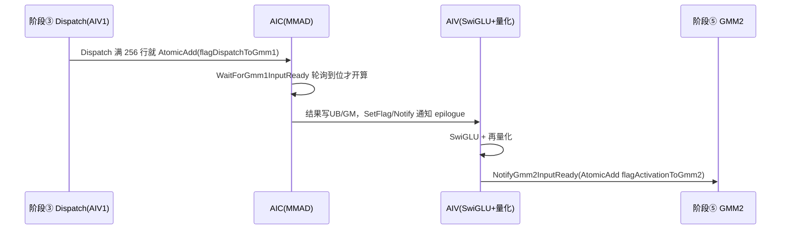

- **Dispatch → GMM1**：`WaitForGmm1InputReady`（`mega_moe_gmm1_activation.h:32-43`）用 `WaitUntilGmFlagEquals` 轮询 `flagDispatchToGmm1Ptr` 对应 tile 的计数。
- **GMM1 → epilogue**：非 prefetch 用 `Gmm1UbActivationSync`（ping-pong 事件），prefetch 用 `Gmm1GmActivationSync`（GM 状态/硬件通知）。
- **epilogue → GMM2**：`NotifyGmm2InputReady`（`:60-69`）对 `flagActivationToGmm2Ptr` 做 `AtomicAdd`。

### 15.4 第 2 步：SwiGLU

#### 公式

GMM1 输出的 `[Ne × 2N]` 被从中间劈成两半，前半是 `gate`，后半是 `up`：

$$
\mathrm{SwiGLU}(gate, up) = \mathrm{SiLU}(gate) \odot up = \Big( gate \cdot \sigma(gate) \Big) \odot up
$$

其中 `σ` 是 sigmoid。epilogue 里这一步在 `block_epilogue_activation_mx_quant.h:304-334` 的 `RunGatedActivationTile` 分派，具体根据 `actMode` 选不同的激活内核：

```cpp
if (actMode == ActMode::SITU)         asc_vf_call<RunSiTUGLU<...>>(...);
else if (actMode == ActMode::SWIGLU_STEP) asc_vf_call<RunSwiGLU<..., true>>(...);
else if (actMode == ActMode::SWIGLU_OAI)  asc_vf_call<RunSwiGLUOAI<...>>(...);
else                                   asc_vf_call<RunSwiGLU<..., false>>(...);  // 默认 SWIGLU
```

四种模式（`mega_moe_constants.h:22-27`）与对应参数 `clampLimit / alpha / beta` 都来自 host tiling，这里只是择一执行。Qwen 这类模型默认是 `SWIGLU`。

#### gate/up 在 UB 里怎么拆

`BuildGatedActivationContext`（`block_epilogue_activation_mx_quant.h:281-302`）把输入按「半宽」切成两个指针：

```cpp
gatedActivationContext.gate = ubPointers.firstInput;   // 前 N 列 = gate
gatedActivationContext.up   = ubPointers.secondInput;  // 后 N 列 = up
gatedActivationContext.inputRowStrideElements = validColumnCount * ACTIVATION_N_HALF; // 一行 = gate|up
```

`validColumnCount` 是**单侧半宽**（=N），所以 gate 和 up 各是 `[M × N]` 的连续半块。

#### Reg 级逐行实现（`swiglu_activation.h`）

SwiGLU 真正逐元素的 SIMD 实现是 `ComputeSwiGluRegFlow`（`swiglu_activation.h:45-65`），全程在 FP32 寄存器上算：

```cpp
if constexpr (!IsStep) {
    Reg::Mins(gateFp32Reg, gateFp32Reg, clampLimit, computeMask);   // gate clamp 到上界
}
Reg::Mins(upFp32Reg, upFp32Reg, clampLimit, computeMask);           // up clamp 上界
Reg::Maxs(upFp32Reg, upFp32Reg, -clampLimit, computeMask);          // up clamp 下界

Reg::Muls(negReg, gateFp32Reg, -1.0F, ...);        // -gate
Reg::Exp(expReg, negReg, ...);                     // e^{-gate}
Reg::Adds(denominatorReg, expReg, 1.0F, ...);      // 1 + e^{-gate}
Reg::Div(sigmoidReg, gateFp32Reg, denominatorReg, ...);  // gate / (1+e^{-gate}) = gate·σ(gate) = SiLU(gate)
Reg::Mul(outputFp32Reg, sigmoidReg, upFp32Reg, ...);     // SiLU(gate) ⊙ up
```

对应数学：`SiLU(gate) = gate·σ(gate) = gate/(1+e^{-gate})`，正好用一次 `Exp` + 一次 `Div` 算出。结果 `outputFp32Reg` 再 `Cast` 成 BF16 写回 UB（`StoreSwiGluFp32AsBf16`，`:36-42`）。

`RunSwiGLU`（`:68-148`）是外层循环：按行、按向量寄存器宽度切主循环，尾部不足一个向量宽度的用 `UpdateMask` 做 tail mask，`TopkWeightsPrefetch` 时还会顺手乘上预取的 topk 权重（`Reg::Mul(outputFp32Reg, outputFp32Reg, weightReg, ...)`，把「加权」提前到专家结果落 UB 前做掉，减少 Combine 的通信/计算量）。

### 15.5 第 3 步：再量化（MXFP 逐组量化）

#### 为什么要再量化

SwiGLU 出来的是 BF16 的 `[Ne × N]`，但下一阶段的 GMM2 输入要求是 MXFP8（E4M3）。所以要把这批中间激活**再量化成 FP8 + E8M0 scale**。这就是文档里「SwiGLU 输出再次 MX 量化」的含义。

`RunMxQuantTile`（`block_epilogue_activation_mx_quant.h:337-356`）就是这步，三步走：

```cpp
Quant::ComputeMaxExp<bfloat16_t>(activationOutput, maxExp, dataCount);        // ① 每组求最大指数
Quant::ComputeScale<DataTypeOut>(maxExp, quantScale, inverseMxScale, scaleCount); // ② 生成 E8M0 scale + 倒数
// ③ 用倒数 scale 把 BF16 缩放到 [−1,1) 再 cast 成 FP8/FP4
Quant::ComputeFp8Data<...>(activationOutput, inverseMxScale, quantOutput, dataCount);
// 或 ComputeFp4Data<...>（A4W4 输入时）
```

注意 `DataTypeOut` 是模板参数，A8W8/A8W4 输出 FP8 E4M3，A4W4 输出会被**提升成 FP8 E4M3**（`mega_moe_arch35.h:160` 的 `ActivationQuantOutType`），避免两段都用 FP4 损失过大。

#### MX 量化的核心：逐组共享一个 E8M0 指数

这是「再量化」区别于普通 per-tensor 量化的关键。MX（Microscaling）格式按 **group = 32** 个元素共享一个 8-bit 的共享指数 scale（E8M0），量化公式：

$$
x_{fp8} = \mathrm{cast}_{E4M3}\!\Big( x_{bf16} \cdot 2^{\,shared\_exp} \Big), \qquad
shared\_exp = -\!\max_{32\text{ 组内}} \lfloor \log_2|x| \rfloor
$$

分三步实现（`quantize_functions.h`）：

**① `ComputeMaxExp`（`:81-138`）**：对 BF16 数据，提取指数位（`Reg::And` 上 `MAX_EXP_FOR_BF16=0x7f80`），对每 32 个元素做 `ReduceDataBlock<MAX>`，得到「组内最大指数」。`blockPerReg = 256/32 = 8`，即每个向量寄存器算出 8 个组的 max exp，对应 group=32。

**② `ComputeScale`（`:172-243`）**：把「组内最大指数」转成两个值——
- `mxScale`：E8M0 格式的共享指数（`Reg::Sub(sharedExp, xMaxExp, maxExpValue)` 再右移 7 位、pack 成 1 字节）；FP8 E4M3 的 `maxExpValue = FP8_E4M3_MAX_EXP = 0x0400`。
- `recipScale`：缩放用的**倒数** `2^{-shared_exp}`（`Reg::Sub(scaleBias, sharedExp)`），存在 `inverseMxScale` 里。

**③ `ComputeFp8Data`（`:353-434`）**：`x_bf16 × recipScale`（`Reg::Mul`），再 `Cast` 成 FP8 E4M3（`castTraitB32ToB80` 等，带 `CAST_RINT` 四舍五入），最后把 2 个 FP8 pack 进 1 字节存储。

`ComputeFp4Data`（`:464-518`）逻辑类似，只是目标类型是 `fp4x2_e2m1_t`（2 元素/字节）。

> 顺带说明 `MXFP_DIVISOR_SIZE=64`、`MXFP_MULTI_BASE_SIZE=2` 这两个常量（`mega_moe_constants.h:68-70`）：它们是**scale 的存储布局**参数，不是 group 大小。group 仍是 32（每个 E8M0 管 32 个元素），但 scale 在 tensor 里是**成对**存的（2 个 E8M0 = 16 bit 当一个 uint16 搬运，对应注释 "E8M0 scales are stored in 64-K pairs"）。所以 `scaleK = ceil(k/64)*2` 表示「按 64 元素一对、算出来再 ×2 得 E8M0 个数」，对 k 为 32 的倍数时正好等于 `ceil(k/32)`。

#### 输出写回与 layout

`StoreQuantTile`（`block_epilogue_activation_mx_quant.h:359-372`）把量化结果写回 GM：

- `StoreQuantOutput`（`:375-394`）：写 FP8 data；FP8 时 `blockLen=singleN`（256），FP4 时 `blockLen=singleN/2`、`offset>>1`（因为 2 元素/字节）。
- `StoreQuantScaleCompact`（`:397-410`）：写 E8M0 scale，每行 `ceil(N/64)*2` 个 scale 元素，**compact 布局**直接 copy，省掉原来的 `TransMxScaleLayout` 重排。

整个 epilogue 的 `operator()`（`:413-431`）主流程是：

```cpp
PrepareTileExecutionContext(...)  // 定位 UB 各 buffer + ping-pong
RunGatedActivationTile(...)      // SwiGLU
RunMxQuantTile(...)              // MX 量化
SetFlag/WaitFlag(V_MTE3 / MTE3_V / MTE3_S)  // 用事件串起「算完→搬出」
StoreQuantTile(...)              // 写 GM
```

### 15.6 一个带数字的完整例子

以 Qwen3.5-397B-A17B 的一个路由专家为例（H 用符号表示，N=1024，2N=2048），假设该专家收到 `Ne=256` 个 token，A8W8-FP 场景：

```text
输入 A   : dispatchRevData     [256 × H]    FP8 E4M3  +  scale [256 × ceil(H/32)] E8M0
权重 W1  : l1_weights          [H × 2048]   FP8 E4M3  +  l1_weights_sf
────────────────────────────────────────────────────────────
① GMM1   : AIC 把 [256×H]·[H×2048] 切成 tile 算，L1 tile = 256×256
           输出 C = [256 × 2048] BF16
           ├─ 前 1024 列 = gate
           └─ 后 1024 列 = up

② SwiGLU : AIV 逐行读 gate/up → FP32 寄存器
           SiLU(gate) = gate/(1+e^{-gate})
           out = SiLU(gate) ⊙ up        → [256 × 1024] BF16

③ 再量化 : 每 32 个元素一组求 max exp
           scale = E8M0(shared_exp)      → 1024/32 = 32 个 scale/行 → 共 256×32
           data  = cast_bf16→E4M3(out · 2^{-shared_exp})  → [256 × 1024] FP8(1B)
────────────────────────────────────────────────────────────
输出     : activationQuantData  [256 × 1024] FP8 E4M3
           activationQuantScale [256 × 32]    E8M0
           → 交给阶段⑤ GMM2 = activationQuantData · W2[1024 × H]
```

一个 tile 层面的流水示意（256 行 = 1 个 M group）：

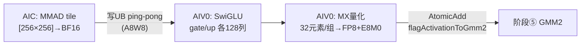

### 15.7 小结

阶段④本质上是**「一个分组 GEMM + 一个逐元素门控 + 一次逐组量化」的紧凑融合**，在单个 kernel 内完成、中间结果全程走 workspace/UB 不落回 host：

| 步骤 | 做什么 | 谁干 | 关键代码 |
|---|---|---|---|
| **GMM1** | `X_e·W1[e]`，gate/up 一次算出 `[Ne×2N]`，按 A8W8/A8W4/A4W4 三路 | AIC MMAD（A8W4 时 AIV0 先 W4→W8） | `mega_moe_gmm1_activation.h`、`block_mmad_mx_fp8fp4.h`、`block_prologue_mx_fp8fp4.h` |
| **SwiGLU** | `SiLU(gate)⊙up`，`[Ne×2N]→[Ne×N]` | AIV（A8W8 用 AIV0，A8W4/A4W4 用 AIV1） | `swiglu_activation.h`、`block_epilogue_activation_mx_quant.h` |
| **再量化** | BF16 → MXFP8(E4M3) + E8M0，group=32 | AIV | `quantize_functions.h`（ComputeMaxExp/Scale/Fp8Data） |

几个最值得记住的「设计点」：

1. **`ACTIVATION_N_HALF = 2`**：把「2N 总宽」和「N 半宽」的换算显式化成常量，gate/up 共享同一套 MMAD/prologue/epilogue 逻辑。
2. **A8W4 必须 prologue**：AIC 不会 FP4→FP8 转换，AIV0 先 `ShiftW4ToW8` 反量化，这是 A8W4 和 A8W8 最本质的实现差异。
3. **MX 量化贯穿**：输入是 MX、SwiGLU 输出也是 MX，反量化（scale 相乘）被隐式地藏进 MMAD 的 scale 通道 / prologue / epilogue 里，而不是显式 materialize 出 BF16 大矩阵。
4. **流水握手**：`flagDispatchToGmm1 → (AIC↔AIV) → flagActivationToGmm2` 三组信号，让「Dispatch 搬 tile」「GMM1 算」「SwiGLU+量化」三件事以 256 行粒度重叠推进。

（可继续下钻：A8W4 prologue 里 `ShiftW4ToW8` 的位操作细节、`GroupedMatmulWithScaleMx` 的 scale 反量化在 MMAD 里如何被消费、prefetch（GM 中转）路径为何比 UB ping-pong 更适合动态 Wave。）

---

## 16. 专题：阶段⑤ GMM2 + Combine 详解

**原问题：**

> 请仔细讲解一下「阶段⑤ GMM2 + Combine」具体都做了什么。

**回答：**

这个阶段做两件事：**① GMM2 = A·W2 把中间激活投影回 hidden 维，得到专家输出 `O_e`；② Combine = 按 Dispatch 时记下的「来历三元组」，把 `O_e` 的每一行写回它原来那个 token 所在 rank 的通信窗口**。它是 mega_moe 里「第二次 AlltoAll（结果回收）」的实现，同样不是显式 send/recv，而是 peermem 对称窗口直写。

代码核心在 `stage/mega_moe_gmm2_combine.h`，编排入口是 `RunGmm2CombineForExpert`（`mega_moe_arch35.h:639-687`）。

### 16.1 输入输出总览

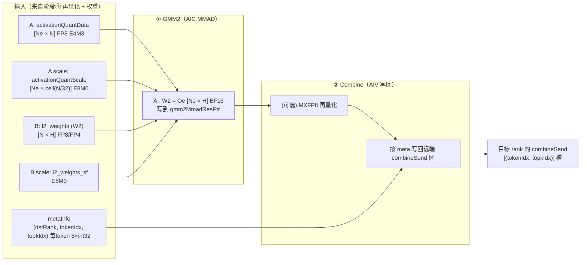

对比阶段④：**GMM1 的输入是「Dispatch 拉来的量化 token」，GMM2 的输入是「GMM1 自己再量化出来的激活」**；GMM1 输出宽 `2N`，GMM2 输出宽 `H`（回到 hidden 维）。所以 GMM2 的 K 维 = N（= GMM1 输出宽的一半），N 维 = H。

### 16.2 第 1 步：GMM2 = A·W2

#### 数学与三种场景

$$
O_e = \mathrm{DQ}_{\mathrm{MX}}(\hat{A}_e, S_{A,e}) \cdot \mathrm{DQ}_{\mathrm{MX}}(W_{2,e}, S_{2,e}), \qquad [N_e \times N] \cdot [N \times H] \to [N_e \times H]
$$

| 场景 | 激活 A | 权重 W2 | GMM2 实现 |
|---|---|---|---|
| **A8W8-FP** | FP8 E4M3/E5M2 | FP8 E4M3/E5M2 | `RunGmm2Generic`（FP8×FP8） |
| **A8W4-FP** | FP8 E4M3 | FP4 E2M1 | `RunGmm2A8W4`（prologue W4→W8） |
| **A4W4-FP** | FP8 E4M3 | FP4 E2M1 | `RunGmm2A8W4`（**复用 A8W4**，因阶段④已把激活提升成 FP8） |

关键点：**A4W4 场景下 GMM1 是 A4W4，但 GMM2 一定是 A8W4**——因为阶段④的再量化把激活输出从 FP4 提升成了 FP8 E4M3（`mega_moe_arch35.h:160` 的 `ActivationQuantOutType`）。所以 `RunGmm2CombineForExpert` 里统一调 `RunGmm2A8W4`（`mega_moe_arch35.h:653-656`）：

```cpp
RunGmm2A8W4<ActivationQuantOutType, MoeWeightType, bfloat16_t, QuantScaleOutType, QuantScaleOutType, ...>(
    sliceProblemShape, gmmAddrInfo, startBlockIdx, gmmExecutionConfig_.blockJob, expertTokenCount,
    tokenStartIndexInExpert, &params_);
```

#### A / B / scale 地址来源：`UpdateMoeExpertGmm2GlobalBuffer`

`mega_moe_gmm2_combine.h:969-1008` 把 GMM2 的 A、B、scale、输出、flag 地址定位出来：

```cpp
gmmAddrInfo.gmm2OutGlobal = workspace.gmm2MmadResPtr
                          + globalTokenStartIndex * tokenHiddenDim * sizeof(bfloat16_t);   // 输出 C
gmmAddrInfo.aGlobal = workspace.activationQuantDataPtr
                    + globalTokenStartIndex * activationOutputWidth / ... * sizeof(ActivationOutType); // A=阶段④输出
gmmAddrInfo.aScaleGlobal = workspace.activationQuantScalePtr + ...;
gmmAddrInfo.bGlobal = GetExpertWeightAddr<WeightType>(weights.weight2, ..., state.expertIdx, ...);  // W2
gmmAddrInfo.bScaleGlobal = GetExpertWeightAddr<QuantScaleType>(weights.weightScales2, ..., ...);
```

注意 `activationOutputWidth = gmm1OutputDim / ACTIVATION_N_HALF = 2N / 2 = N`（`:983`），这就是 GMM2 的 K 维。

#### GMM2 的 tile 并行 + prologue（与 GMM1 对称）

GMM2 用和 GMM1 完全一样的 tile 并行模型：

- **AIC 算 MMAD**：`Gmm2AicMmadA8W4`（`:659-716`）/ `Gmm2AicMmadGeneric`（`:548-614`），循环 `loopIdx += config.blockNum` 把 256×256 tile 轮流摊给所有 AIC。
- **AIV0 做 W4→W8 prologue**：`Gmm2Aiv0PrologueA8W4`（`:719-731`），A8W4/A4W4 场景把 FP4 权重反量化成 FP8 再喂给 Cube。
- **AIV1 做 Combine**（见下一节）。

唯一的区别是「等谁」：GMM2 等的是**阶段④ 的激活量化结果**，由 `WaitForGmm2InputReady`（`mega_moe_gmm2_combine.h:492-516`）轮询 `flagActivationToGmm2` 计数：

```cpp
WaitUntilGmFlagEquals(flagValueAddr, static_cast<int32_t>(targetLoops));
```

这个 flag 正是阶段④ epilogue 末尾 `NotifyGmm2InputReady`（`mega_moe_gmm1_activation.h:60-69`）用 `AtomicAdd` 累加的——**阶段④ 的「再量化」和阶段⑤ 的「GMM2」以 256 行粒度握手**。

### 16.3 第 2 步：Combine = 把专家结果按「来历」送回原 token 所在 rank

#### 数据依据：Dispatch 时写下的 meta 三元组

Combine 能「原路送回」，全靠阶段③ Dispatch 时每搬一个 token 就写的一条 meta（8×int32），前三个字段就是返回地址：

```cpp
struct CombineTokenRoute {   // mega_moe_gmm2_combine.h:44-48
    uint32_t dstRankId;      // 这个 token 原来在哪张卡
    uint32_t tokenIdx;       // 原来是该卡的第几个 token
    uint32_t topkIdx;        // 是它 topK 选择里的第几个槽
};
```

`GetCombineDstRowIndex`（`:60-63`）把三元组映射成目标 rank 的紧凑行号：

```cpp
return tokenIdx * params.tilingData->topK + topkIdx;
```

即目标 rank 的 `combineSend` 区按 `(token, topk槽)` 展开：

```text
combineSend 区:
  [ token0 的 k=0 | token0 的 k=1 | ... | token0 的 k=topK-1 ]
  [ token1 的 k=0 | ... ]
  ...
行号 = tokenIdx * topK + topkIdx
```

#### 写到哪里：远端 rank 的 peermem 窗口

目标地址 = `winRankAddr[dstRankId] + combineSendPtr`（相对偏移 `combineSendPtr - rankSyncInWorldPtr`）：

```cpp
uint64_t gmRemoteBaseOffset = params.peermemInfo.combineSendPtr - params.peermemInfo.rankSyncInWorldPtr;
gmRemoteD.SetGlobalBuffer(GetRankWinAddrWithOffset(route.dstRankId, gmRemoteBaseOffset));
uint64_t gmDstOffset = GetCombineDstRowIndex(route, params) * n + nLoc;
DataCopyPad(gmRemoteD[gmDstOffset], l0cOutUbGMM2[tileIdx * ubTileN], ub2GmParams);   // 直写远端
```

**没有显式 alltoall/send**：本卡 AIC 算出 `O_e` 后，AIV 直接 `DataCopyPad` 写到目标卡窗口的对应槽位，配合 GM flag 同步。这就是文档说的「通过 RDMA peermem 将结果按目标 Rank 的专家偏移地址写入远端」。

#### 两种 Combine 模式

**非量化 Combine（`combine_quant_mode = 0`）**：直接发 BF16。用 **AIC↔AIV1 的 tile 级一对一同步** `Gmm2CombineSync`（`mega_moe_gmm_epilogue_sync.h:293-325`）：

```cpp
WaitForCombine()/NotifyCombine()  (AIC 侧，带 pendingTiles_ 额度=16)
WaitForGmm2()/NotifyGmm2()        (AIV1 侧)
```

AIV1 侧 `CombineTokenRange`（`mega_moe_gmm2_combine.h:620-656`）**重放 AIC 同一个 scheduler**，逐 tile：

```cpp
gmmAddrInfo.gmm2CombineSync->WaitForGmm2();        // 等这个 tile 算完
copy(GM→UB, tensorBlockGm);                        // 把 [256×256] tile 拉进 UB
DataCopy(metaInfoTensor, metaInfoGm[mLoc*8]);      // 读本 tile 各行对应的 meta
CombineImpl::CombineTokens<...>(nLoc, n, metaInfoTensor, tileUb, ...);  // 逐行写回远端
gmmAddrInfo.gmm2CombineSync->NotifyGmm2();         // 归还额度
```

`CombineTokens`（`:67-86`）内层对 tile 的每一行：`LoadCombineTokenRoute` 读 meta → 算远端地址 → `DataCopyPad` 把这一行 `[nLoc, nLoc+256)` 片段写到远端对应行。**GMM2 的 N 维是 H，可能跨多个 N tile，所以 Combine 按 (tile, 行) 分片直写，逐列补齐一行。**

**量化 Combine（`combine_quant_mode = 3/4`）**：先把 `O_e` 再量化成 MXFP8（E5M2/E4M3）再发送，接收端（阶段⑥ Unpermute）反量化。入口 `RunWaveCombineStage`（`:1124-1150`）+ `SendWaveCombineToken`（`:417-452`）：

```cpp
if constexpr (CombineMode == COMBINE_NO_QUANT) {
    CombineImpl::SendCombineTokenRow<bfloat16_t>(...);
} else {
    Mxfp8::QuantMxFp8<CombineMode, bfloat16_t>(quantUb, rowUb, ..., tokenHiddenDim);  // MXFP8 量化
    CombineImpl::SendCombineTokenRow<Fp8Type>(...);   // 发 FP8 数据 + E8M0 scale
}
```

量化 Combine 的同步不走 tile 级一对一，而是 **「等所有 AIC 算完这个专家」再集中发**：AIC 用 `NotifyWaveGmm2Ready` 写完成标记，AIV 用 `WaitWaveGmm2Ready`（`:1091-1122`）`ReduceSum` 轮询所有核就绪，然后才消费。

#### 一个完整流程串起来

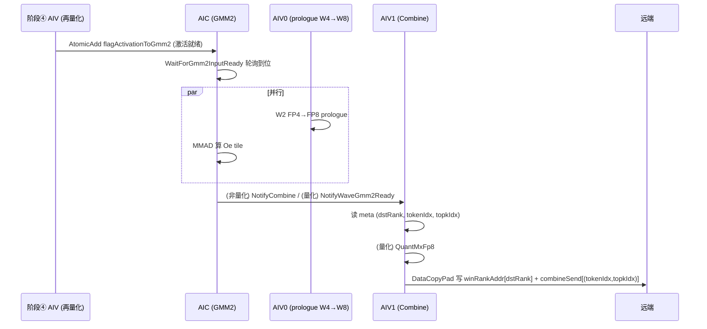

### 16.4 带数字的完整例子（Qwen3.5-397B）

沿用阶段④ 的例子：某专家收到 `Ne=256` token，`N=1024`，`H`（hidden）用符号表示，`topK=10`，非量化 Combine：

```text
输入 A  : activationQuantData   [256 × 1024]  FP8 E4M3 + scale E8M0   ← 阶段④ 再量化产物
权重 W2 : l2_weights            [1024 × H]    FP4 E2M1 (A8W4) 或 FP8
────────────────────────────────────────────────────────────
① GMM2  : AIC 把 [256×1024]·[1024×H] 切成 256×256 tile，摊给所有 AIC 并行算
          输出 Oe = [256 × H] BF16，写到 gmm2MmadResPtr
          AIV0 同时把 W2 的 FP4 反量化成 FP8（A8W4 场景）

② Combine: AIV1 逐 tile 读回 Oe，对每个 token 行 i：
          meta[i] = (dstRank, tokenIdx, topkIdx)     ← Dispatch 时记的来历
          dst 行 = tokenIdx * 10 + topkIdx           ← 目标卡 combineSend 的槽
          DataCopyPad( winRankAddr[dstRank] + combineSendPtr + dst行*H, Oe[i,:] )
────────────────────────────────────────────────────────────
结果    : 目标卡的 combineSend[(tokenIdx, topkIdx)] 槽里放好了这 256 行专家输出
          → 阶段⑥ Unpermute 读回，算 Σ w_k * O[π(i,k)] 加权求和
```

### 16.5 小结

| 步骤 | 做什么 | 谁干 | 关键代码 |
|---|---|---|---|
| **GMM2** | `A·W2[e]`，`[Ne×N]→[Ne×H]`，回到 hidden 维；A8W8 走 generic、A8W4/A4W4 走 `RunGmm2A8W4`（A4W4 复用 A8W4） | AIC MMAD + AIV0 prologue | `mega_moe_gmm2_combine.h:659-716`、`719-731` |
| **Combine** | 按 meta 三元组把 `O_e` 每行直写回原 token 所在 rank 的 `combineSend[(tokenIdx,topkIdx)]` 槽 | AIV1 | `CombineTokens`/`SendCombineTokenRow` `:67-103` |

几个最值得记住的设计点：

1. **meta 是 Combine 的「通行证」**：阶段③ Dispatch 顺手写的 `(dstRank, tokenIdx, topkIdx)` 三元组，让 Combine 不需要再算一次路由，直接定位「这行结果送回哪」。
2. **Combine 只搬数据、不做算术**：写回的是原始专家输出行，加权求和留到阶段⑥ Unpermute（若开了 `TopkWeightsPrefetch`，权重已在阶段④ SwiGLU 里预先乘进激活，Combine 更是纯搬运）。
3. **同步方式随 Combine 是否量化而不同**：非量化走 `Gmm2CombineSync` 的 AIC↔AIV1 tile 级一对一（额度 16 反压）；量化走「等全部 AIC 完成」的 `WaitWaveGmm2Ready` 集中消费。
4. **A4W4 的 GMM2 是 A8W4**：阶段④ 已把激活提升为 FP8 E4M3，所以第二层矩阵乘天然是 FP8×FP4，避免两段都用 FP4 精度损失过大。

至此，五个阶段（① 量化 → ② mask 广播 → ③ Dispatch → ④ GMM1+SwiGLU+再量化 → ⑤ GMM2+Combine → ⑥ Unpermute）串起来就是 mega_moe 的一次完整前向。

### 16.6 补充：为什么量化 Combine 走专家级屏障、非量化走 tile 级一对一

**原问题：**

> 16.3 中提到「量化 Combine 的同步不走 tile 级一对一，而是『等所有 AIC 算完这个专家』再集中发（`WaitWaveGmm2Ready` ReduceSum 轮询所有核就绪）」，为什么量化是这样做的？为什么和非量化不同？

**回答：**

**一句话结论**：根本原因是「输出单位」不同——非量化 Combine 的输出单位是「tile 的一列片段」（BF16 原始数据，可碎片化直写）；量化 Combine 的输出单位是「一条完整的 token 记录 = 整行 FP8 数据 + 整行 E8M0 scale」（连续一块），必须先凑齐整行 H 个元素才能量化、才能作为一个自包含记录发出，而 GMM2 把这一行切成跨多个 N-tile 的碎片、又被 swizzle 调度摊给所有 AIC，所以凑齐任意一行就等价于「等所有核算完」。

#### 两种 Combine 的「输出单位」根本不同

非量化 `CombineTokens`（`mega_moe_gmm2_combine.h:67-86`）只写 `[nLoc, nLoc+256)` 列片段：

```cpp
uint64_t gmDstOffset = GetCombineDstRowIndex(route, params) * n + nLoc;   // nLoc = 本 tile 列起点
ub2GmParams.blockLen = Get<N_VALUE>(actualBlockShape) * sizeof(...);       // 只搬本 tile 的 256 列
DataCopyPad(gmRemoteD[gmDstOffset], l0cOutUbGMM2[tileIdx * ubTileN], ub2GmParams);
```

远端 `combineSend[row]` 是纯 BF16，同一行由不同 N-tile 片段「列补齐」，谁算完谁写、互不依赖，所以能做成 GMM2 tile 循环里的一对一消费（`CombineTokenRange`，`:620-656`）。

量化 `SendWaveCombineToken`（`:417-452`）先读**整行**再量化：

```cpp
DataCopyPad(rowUb, gmm2OutGm[tokenLocal * common.tokenHiddenDim], {1, bufferConfig.rowBytes}, ...); // 搬整行 H
Mxfp8::QuantMxFp8<CombineMode, bfloat16_t>(quantUb, rowUb, ..., common.tokenHiddenDim);             // 整行 MX 量化
CombineImpl::SendCombineTokenRow<Fp8Type>(bufferConfig.quantRowElements, ..., quantSendUb, params); // 发整块记录
```

而记录是连续、按 token 对齐的一块（`CreateQuantTokenBufferConfig`，`:352-360`）：

```cpp
uint32_t tokenStorageBytes = CeilAlign(tokenHiddenDim, ALIGN_256);   // 整行 FP8 数据
uint32_t storedScaleBytes  = CeilAlign(nScale, 2U);                    // 整行 E8M0 scale
uint32_t quantTokenSizeBytes = CeilAlign(tokenStorageBytes + storedScaleBytes, ALIGN_32); // 拼成一条记录
```

`QuantMxFp8`（`mega_moe_mxfp8_utils.h:30-50`）把 `processLen = H` 一起 `ComputeMaxExp → ComputeScale → ComputeFp8Data`，产出「数据+scale」连续一块，没法按 256 列拆开发。

#### 为什么「整行」就等价于「等所有 AIC」

三个事实叠加：

1. **GMM2 的 N 维就是 H，H 远大于 256**：`L1_TILE_N=256`（`mega_moe_constants.h:101`），H 下限 `MIN_H=1024`（`mega_moe_tiling.cpp:62`），所以每行 = `ceil(H/256) ≥ 4` 个 N-tile。
2. **swizzle 调度把 tile 交错摊给所有 AIC**（`BlockSchedulerSwizzle` 的 `SwizzleOffset=3`），同一行的相邻 N-tile 几乎必然落在不同核上。
3. 于是凑齐任意一行，就潜在地依赖所有 AIC 的产出 → 一个全局屏障最简单正确。

代码里：AIC 用 `NotifyWaveGmm2Ready`（`:1078-1088`）各写一个独占 cacheline 标记，AIV 用 `WaitWaveGmm2Ready`（`:1091-1122`）`ReduceSum` 轮询 `sum >= totalJobs`。`slotIdx = state.expertIdx`，即屏障按专家。

#### 架构层面：非量化是「融合的」，量化是「分离的阶段」

`RunGmm2CombineForExpert`（`mega_moe_arch35.h:639-687`）：

```cpp
RunGmm2A8W4<...>(...);                       // 先跑 GMM2

if constexpr (CombineQuantMode == COMBINE_NO_QUANT) {
    return;   // 非量化：AIV1 已在上面的 GMM2 调用里逐 tile 消费完
}

// 量化：跨 Wave 的专家必须等最后一个 slice 完成后再消费
if (tokenStartIndexInExpert + sliceTokenCount < expertTokenCount) return;
NotifyWaveGmm2Ready(...);                    // 等全部 AIC 完成
RunWaveCombineStage<CombineQuantMode>(...);  // 再统一按行读回、量化、发送
```

- **非量化**：`CombineTokenRange` 内联进 `Gmm2ExecGeneric`/`Gmm2ExecA8W4`（`:786-791`、`:847-850`），AIV1 与 AIC 共用同一 scheduler，逐 tile 一对一。
- **量化**：Combine 是独立后置阶段，GMM2 全算完才按行消费。

配套的反压粒度也不同：

| | 非量化 | 量化 |
|---|---|---|
| 同步粒度 | tile 级一对一（`Gmm2CombineSync`） | 专家级屏障（`WaitWaveGmm2Ready`） |
| 反压 | `pendingTiles_` 额度 16，限制在途 tile | 整专家输出先落 GM，算完统一读回 |
| 为什么能这样 | 碎片可独立发送 | 必须凑整行，只能等整专家就绪 |

#### 一张图对比两种同步模型

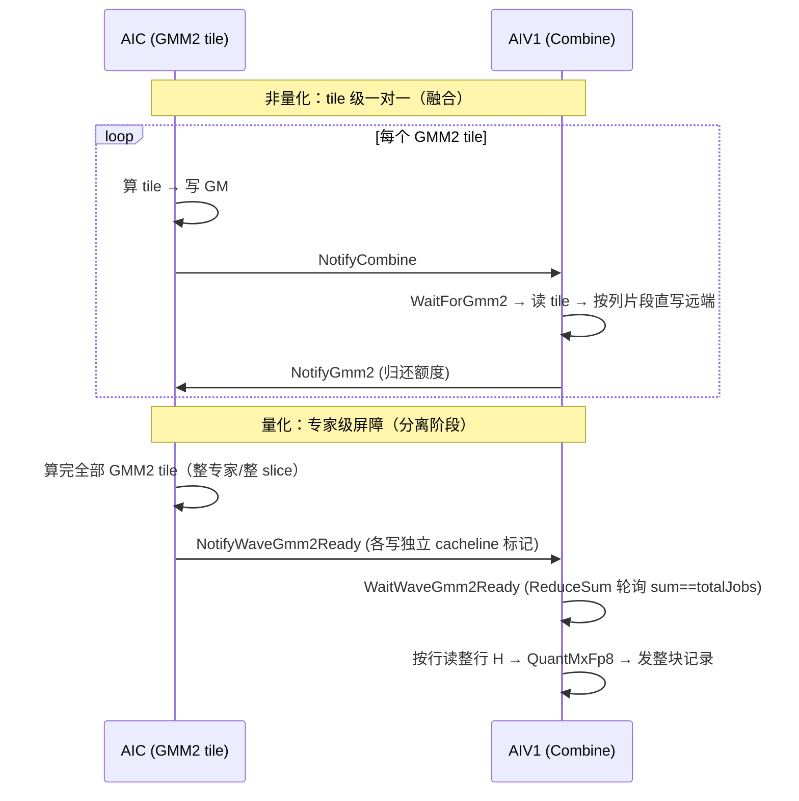

#### 小结

量化 Combine 之所以「等所有 AIC 再集中发」，是三个事实层层推出：① 量化输出是「整行记录」（数据+scale 连续），非量化 BF16 是可碎片化的；② MX 量化按行进行、记录按 token 对齐，必须凑齐整行 H；③ GMM2 的 N 维是 H，一行被切成 ≥4 个 N-tile，且被 swizzle 摊给所有核。本质是**「量化必须整行」这一硬约束，把同步粒度从 tile 级抬升到了专家级**；非量化没有这个约束，所以能享受更细粒度的 tile 级流水和 16 额度反压。

---

## 17. 专题：阶段⑥ Unpermute 详解

**原问题：**

> 请仔细讲解一下「阶段⑥ Unpermute」具体都做了什么。

**回答：**

这个阶段是 mega_moe 的**最后一步收尾**：把 Combine 阶段写回本卡的「按 (token, topK 槽) 展开的专家结果」读回来，**反量化（若量化 Combine）→ 乘门控权重 → 累加 topK 个路由专家 → 再加共享专家输出 → cast 回 BF16**，最终得到和输入 `x` 同形状的 `y`。

代码核心在 `stage/mega_moe_unpermute.h`，只在 **AIV** 上执行。它对应文档公式的第四阶段：

$$Y[i] = \sum_{k=0}^{topK-1} W[i,k]\cdot O\big[\pi(i,k)\big] + \sum_s O_s^{shared}[i]$$

### 17.1 调用入口与前置跨卡同步

`ProcessWave` 的「阶段 5」（`mega_moe_arch35.h:832-840`）：

```cpp
// 阶段 5：所有 rank 完成 Combine 结果发送后，AIV 执行输出聚合。
if constexpr (g_coreType == AIV) {
    CrossRankSyncInWorldSize(params_.peermemInfo.rankSyncInWorldPtr, rankId_, worldSize_, aivJob_);  // 跨卡软同步
    MegaMoeUnpermuteBufferConfig unpermuteBufferConfig = InitTokenUnpermuteBuffers();
    UnpermuteTokens<CombineQuantMode, TopkWeightsType, TopkWeightsPrefetch, GMM1_TILE_M>(
        tokenUnpermuteConfig_, commonConfig_, params_, tokenUnpermuteScratch_, unpermuteBufferConfig);
}
```

两点：① **先 `CrossRankSyncInWorldSize` 跨卡软同步**——本卡 token 的 topK 个专家结果是别的 rank 在阶段⑤写回的，必须等所有 rank 写完；② **只在 AIV 上跑**——反量化 + 乘加是纯向量运算，AIC 此时已下班。

### 17.2 输入输出总览

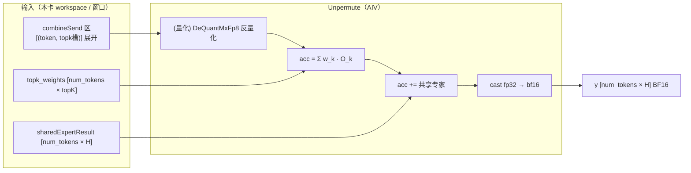

### 17.3 执行结构：token 分片 + 逐 token 累加

`UnpermuteTokens`（`mega_moe_unpermute.h:273-302`）先按 AIV 均分 token：

```cpp
if constexpr (g_coreType == AIC) return;   // AIC 不参与
WorkRange tokenRange = TilingByJobContext(common.tokenNum, job.jobIndex, job.totalJobs, 1U);
GlobalTensor<bfloat16_t> expandedX; expandedX.SetGlobalBuffer(combineSendPtr);  // 读 combine 结果
GlobalTensor<bfloat16_t> output;   output.SetGlobalBuffer(y2GmAddr);            // 写最终 y
for (batchTokenOffset = 0; ...; batchTokenOffset += tokensPerBatch) {
    ProcessTokenUnpermuteBatch<...>(...);   // 分批处理（受限 UB）
}
```

`ProcessTokenUnpermuteBatch`（`:178-210`）对批内每个 token：

```cpp
AccumulateMoeExpertsForToken<...>(...);          // ① 累加 topK 个路由专家
for (sharedExpertIdx in 0..sharedExpertNum-1)
    AccumulateSharedExpertForToken<...>(...);    // ② 累加共享专家
Cast(dataResTensor, dataResFp32Tensor, CAST_RINT, H);   // ③ fp32 → bf16
DataCopy(output[tokenIdx * H], dataResTensor, H);       // 写 y[tokenIdx]
```

累加中间态全程用 **FP32**（`dataResFp32Tensor`），最后才 cast 成 BF16，保证求和精度。

### 17.4 核心：`AccumulateMoeExpertsForToken`（topK 专家加权累加）

`mega_moe_unpermute.h:95-134`：

```cpp
for (expertIdx in 0..topK-1) {
    expertInputIndex = tokenIdx * topK + expertIdx;   // ← 该 token 第 k 个专家结果在 combineSend 的行号
    LoadMoeExpertInput<CombineMode>(...);             // 搬入 UB + 反量化 → FP32

    if (expertIdx == 0) {
        float expertScale = topKWeightsTensor[localIdx * topK + expertIdx];
        Muls(dataResFp32Tensor, dataInFp32, expertScale, H);   // 乘权重初始化累加器
    } else {
        float expertScale = topKWeightsTensor[localIdx * topK + expertIdx];
        Muls(dataInFp32, dataInFp32, expertScale, H);          // 乘权重
        Add(dataResFp32Tensor, dataResFp32Tensor, dataInFp32, H);  // 累加
    }
}
```

关键：**行号 `tokenIdx * topK + expertIdx` 与阶段⑤ Combine 的 `GetCombineDstRowIndex`（`tokenIdx * topK + topkIdx`）完全一致**——Combine 怎么放、Unpermute 就怎么取。加权（`Muls` 乘 `topk_weights[i,k]`）就在这里做。

反量化在 `LoadMoeExpertInput`（`:70-92`）：非量化 Combine 直接 `DataCopy` BF16 → `Cast` FP32；量化 Combine 用 `DeQuantMxFp8`（`mega_moe_mxfp8_utils.h:115-144`）三步反量化——E8M0 scale → BF16 → FP32，再 `FP8 token × scale → FP32`。

### 17.5 共享专家累加：`AccumulateSharedExpertForToken`

`mega_moe_unpermute.h:137-176`。共享专家是本卡本地算的（不走 Dispatch/Combine），所以：

```cpp
WaitUntilGmFlagEquals(counterAddr, gmm2NTilesPerGroup);   // 等共享专家 GMM2 算完
DataCopy(dataInBf16, sharedResult[(sharedExpertIdx * tokenNum + tokenIdx) * H], H);
Cast(dataInFp32, dataInBf16, CAST_NONE, H);
Add(dataResFp32Tensor, dataResFp32Tensor, dataInFp32, H);   // acc += O_s^shared
```

**共享专家无权重、无条件相加**。

### 17.6 `TopkWeightsPrefetch` 的差异

| 模式 | 加权发生在哪 | Unpermute 做什么 |
|---|---|---|
| 非 Prefetch（默认） | Unpermute：`Muls` 乘 `topk_weights[i,k]` | 读权重、乘、累加 |
| Prefetch（`topk_weights_type=1`） | 阶段④ SwiGLU 里已预乘进激活（`swiglu_activation.h` 的 `Reg::Mul`） | 直接累加，不再乘权重 |

Prefetch 把「乘 topk 权重」提前到阶段④，减少 Unpermute 读权重开销、并让 combine 少传一次权重。

### 17.7 一张图串起 Unpermute 数据流

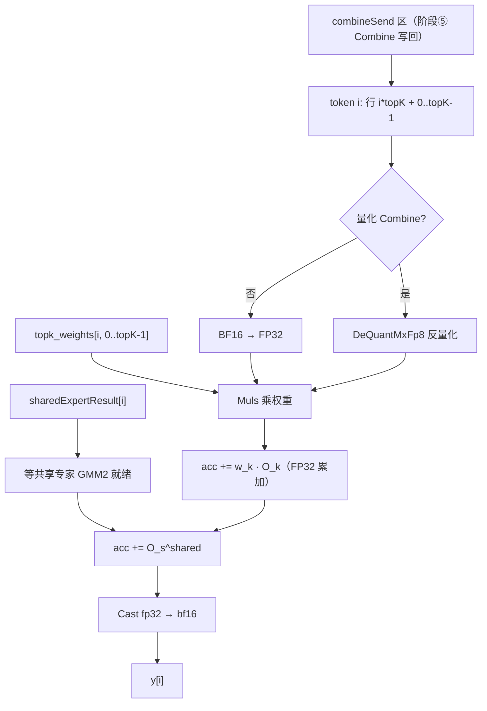

### 17.8 带数字的例子（Qwen3.5-397B）

某 token `t`（`topK=10`，1 个共享专家，量化 Combine）：

```text
combineSend 区里 token t 占了 10 行（行号 = t*10 + 0..9），
每行是某个专家 e_k 对 t 的量化结果（FP8 数据 + E8M0 scale）

① 对 k = 0..9:
    读 combineSend[t*10 + k] 的量化记录
    DeQuantMxFp8 反量化 → FP32 向量 O_k [1×H]
    acc += topk_weights[t,k] * O_k        ← 乘门控权重累加

② 读共享专家结果 sharedResult[sharedIdx * num_tokens + t]（BF16）
    Cast 到 FP32，acc += O_shared          ← 无条件相加

③ y[t] = Cast_bf16(acc)                   ← FP32 累加器 → BF16 输出
```

最终 `y[t] = Σ_{k=0}^{9} w[t,k]·O_{e_k}(t) + O_shared(t)`，与文档公式完全一致。

### 17.9 小结

| 步骤 | 做什么 | 关键代码 |
|---|---|---|
| 跨卡同步 | 等所有 rank 的 Combine 写完 | `CrossRankSyncInWorldSize`（`mega_moe_arch35.h:835`） |
| token 分片 | 每个 AIV 处理一段连续 token | `TilingByJobContext`（`mega_moe_unpermute.h:281`） |
| 路由专家累加 | 读 combineSend 行 → 反量化 → 乘权重 → 累加 | `AccumulateMoeExpertsForToken`（`:95-134`）、`LoadMoeExpertInput`（`:70-92`） |
| 共享专家累加 | 等共享 GMM2 就绪 → 无条件相加 | `AccumulateSharedExpertForToken`（`:137-176`） |
| 写回 | FP32 累加器 cast 成 BF16 写 `y` | `ProcessTokenUnpermuteBatch`（`:200-205`） |

几个最值得记住的设计点：

1. **行号对称**：Unpermute 用 `tokenIdx * topK + expertIdx` 读，和 Combine 的 `GetCombineDstRowIndex` 写用同一个公式——「Combine 怎么放、Unpermute 怎么取」。
2. **「Unpermute」名字的由来**：Dispatch 把 token 按专家「permute（重排）」打散到各卡，Combine 把结果按 (token, topK) 紧凑「unpermute」摆回本卡，Unpermute 就是把这堆乱序结果按 token 顺序还原成最终输出。
3. **加权求和在这里做**（除非 `TopkWeightsPrefetch` 提前到阶段④）：路由专家乘门控权重，共享专家无条件相加。
4. **全程 FP32 累加**、最后才 cast BF16，避免多次乘加累积精度损失。
5. **只在 AIV 上跑**：反量化 + 乘加是纯向量运算，Cube 核此时已退出。

至此六个阶段（① 本卡量化 → ② mask 广播 → ③ Dispatch → ④ GMM1+SwiGLU+再量化 → ⑤ GMM2+Combine → ⑥ Unpermute）全部串完——一个 token 从 BF16 输入，绕一圈 Dispatch/Combine，最终以 BF16 输出回到原地，中间所有结果都不出 kernel、不落回 Python。
