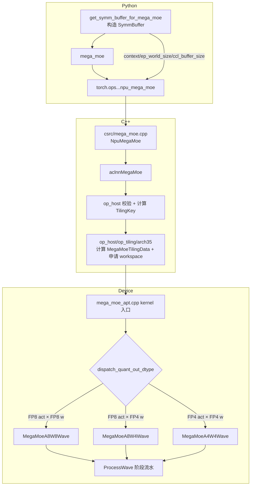
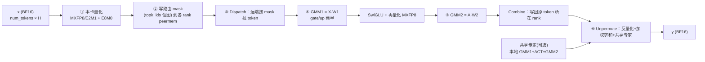
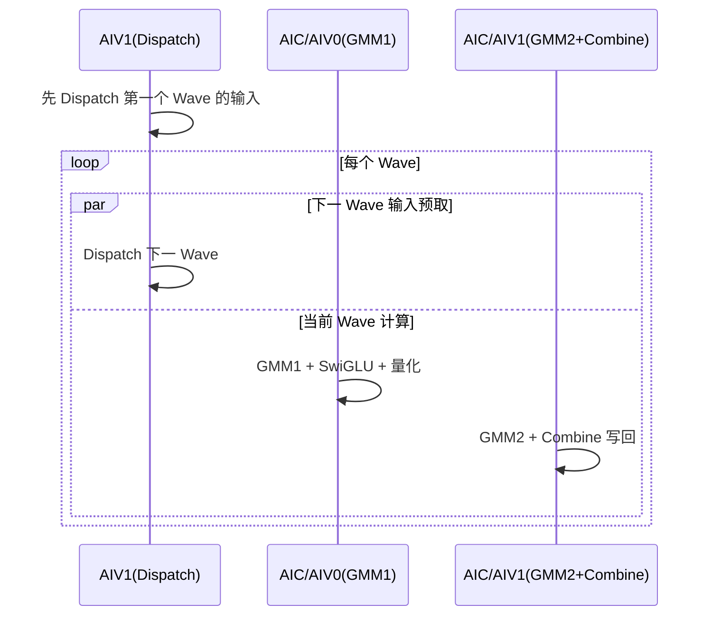
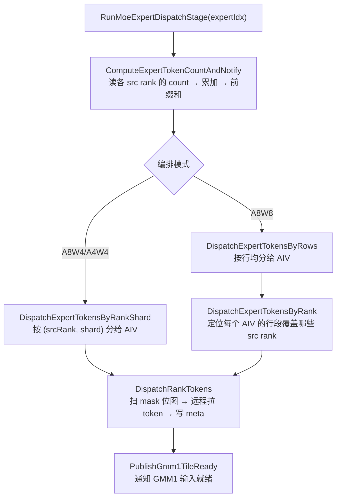
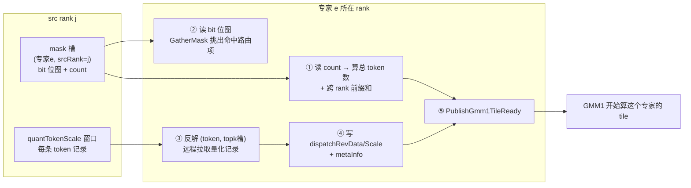
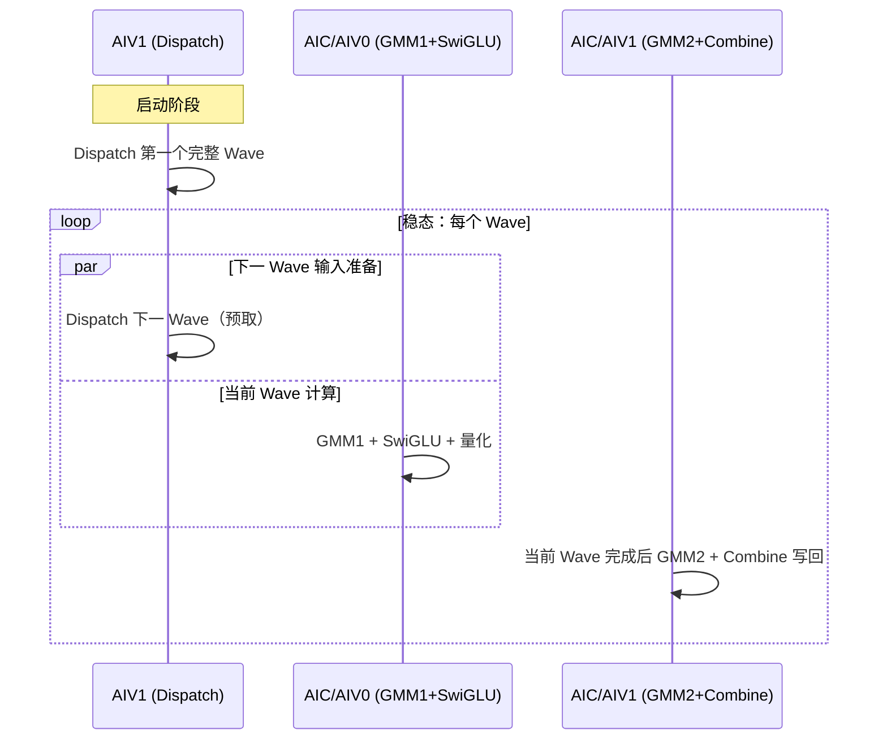

# A5 路径 mega_moe 算子实现原理笔记

> 本笔记聚焦 **A5（Ascend 950PR / 950DT）路径**下 mega_moe 算子的实现过程，结合
> `C:\Code\cann\ops-transformer\torch_extension\cann_ops_transformer\docs\zh\mega_moe.md` 与
> `C:\Code\cann\ops-transformer` 下的代码讲解。
>
> 与同目录 `mega_moe笔记.md`（哨兵 token / vLLM 集成向）互补，本文聚焦**算子内核实现**。

## 目录

1. [问题与总述](#问题与总述)
2. [先定位 A5 路径](#0-先定位a5-路径在哪)
3. [整体架构与调用链](#1-整体架构与调用链)
4. [端到端数据流总览](#2-端到端数据流总览)
5. [peermem 对称窗口（A5 通信底座）](#3-peermem-对称窗口a5-通信底座)
6. [核角色划分（1 Block = 1C2V）](#4-核角色划分1-个-block--1c2v)
7. [五个阶段逐步拆解](#5-五个阶段逐步拆解)
8. [Wave 流水编排（通信与计算重叠的核心）](#6-wave-流水编排通信与计算重叠的核心)
9. [三种 A5 场景的数据类型流对照](#7-三种-a5-场景的数据类型流对照)
10. [一张图串起某 token 的一生](#8-一张图串起某-token-的一生)
11. [小结（A5 实现的本质）](#9-小结a5-实现的本质)
12. [专题：阶段② 路由 mask 广播详解](#10-专题阶段-路由-mask-广播详解)
13. [专题：AIV 数量与 topK / decode 搬运](#11-专题aiv-数量与-topk--decode-搬运)
14. [专题：阶段③ Dispatch 详解](#12-专题阶段-dispatch-详解)
15. [专题：MegaMoeA4W4Wave 流程 / tile 划分 / AIV 数量](#13-专题megamoea4w4wave-流程--tile-划分--aiv-数量)

---

## 问题与总述

**原问题：**

> 请你结合文件 `C:\Code\cann\ops-transformer\torch_extension\cann_ops_transformer\docs\zh\mega_moe.md`
> 以及 `C:\Code\cann\ops-transformer` 文件夹下的代码，详细解释一下 A5 路径下 mega moe 算子的实现过程是怎么样的。需要图文结合说明。

**回答：**

Mega MoE 算子将 MoE 层专家 FFN 的完整计算流程及前后数据通信
（**Dispatch + Linear1 + SwiGLU + Linear2 + Combine**）融合为单个算子，实现通信与计算掩盖。
本文从「接口 → 编译分派 → 阶段流水 → 三种量化场景」的层次，图文结合讲清 A5 上的实现。

---

## 0. 先定位 A5 路径在哪

代码里架构分层是 `arch22`（A2/A3）和 `arch35`（A5/950）。A5 的 mega_moe 全部落在：

- Kernel 主体：`mc2/mega_moe/op_kernel/arch35/`
- Host tiling：`mc2/mega_moe/op_host/op_tiling/arch35/mega_moe_tiling.cpp`
- 内核入口：`op_kernel/arch35/mega_moe_apt.cpp`
- 三个阶段编排：`op_kernel/arch35/stage/*`
- 通信窗口：`op_kernel/arch35/common/mega_moe_peermem.h`
- 内存布局：`op_kernel/arch35/common/mega_moe_workspace.h`

A5 与 A2/A3 最本质的区别：

| | A2/A3（arch22） | A5（arch35） |
|---|---|---|
| 通信协议 | kfc / HCCL | **UB Memory / MTE（peermem 对称窗口直写）** |
| 支持量化场景 | A16W16、A8W8-INT、A8W4-INT | **A8W8-FP、A8W4-FP、A4W4-FP** |
| 量化方式 | 逐 token INT8 / MSD INT4 | **MX 逐组量化（group=32，E8M0 scale）** |
| 权重布局 | 逐专家二维 TensorList | 逐专家二维 / 三维堆叠两种 |
| token 数 | 各卡 `num_tokens` 一致 | **各卡 token 数可以不同（按 `num_max_tokens_per_rank` 上界）** |
| buffer | 用户算 `ccl_buffer_size` | **接口自动算并申请** |

---

## 1. 整体架构与调用链


### 1.1 Python 侧 `SymmBuffer` 干了什么（`torch_extension/mega_moe.py`）

`get_symm_buffer_for_mega_moe` 其实就做三件事：

1. 通过 `_get_mega_moe_ccl_buffer_size`（C++ 里 `GetMegaMoeCclBufferSize`，A5 分支 `CalcHalfBufferSizeMBA5`）按 peermem 窗口公式算出通信 buffer 大小；
2. 用 `CommContextManager`（950 上 `backend="channel"`）创建 EP 通信域上下文 `context`；
3. 把 `context / ep_world_size / ccl_buffer_size / num_max_tokens_per_rank / dispatch_quant_mode / ...` 打包进 `SymmBuffer`。

调用 `mega_moe` 时，这些元数据通过 `torch.ops.cann_ops_transformer.npu_mega_moe(...)` 透传给 C++，再进 `aclnnMegaMoe`。

### 1.2 内核入口与模板分派（`mega_moe_apt.cpp`）

`__global__ void mega_moe(...)` 从 `tilingGM` 读 `MegaMoeTilingData`，按 TilingKey 里的 `CommModeType` / `DispatchQuantOutType` 选择具体实现：

```cpp
if constexpr (CommModeType == TILINGKEY_TPL_MTE) {   // A5 走 MTE
    if constexpr (DispatchQuantMode == DISPATCH_QUANT_MODE_MXFP) {  // A5 恒为 4
        ...
        MegaMoeImpl::MegaMoeMteWave<...> op;   // 再按 dtype 落到三个 Wave 之一
        op.Init(...); op.Process();
    }
}
```

`MegaMoeMteWave` 通过模板特化映射到三个场景：

| 组合 | 实例化的类 | 说明 |
|---|---|---|
| FP8 激活 × FP8 权重 | `MegaMoeA8W8Wave` | A8W8-FP |
| FP8 E4M3 × FP4 E2M1 | `MegaMoeA8W4Wave` | A8W4-FP |
| FP4 E2M1 × FP4 E2M1 | `MegaMoeA4W4Wave` | A4W4-FP |

三种 Wave 共享基类 `MegaMoe`（在 `mega_moe_arch35.h`）里的阶段边界，只重写 `ProcessMoeExpertStages` 编排方式。

---

## 2. 端到端数据流总览



**关键点**：Dispatch 与 Combine 不是显式的 send/recv，而是通过 **peermem 对称窗口直写**——每个 rank 直接往「目标 rank 的 HBM 窗口」里写数据，用软件 flag/counter 同步。这样才把通信和计算重叠起来。

---

## 3. peermem 对称窗口（A5 通信底座）

`mega_moe_peermem.h` 是 host/device 共用的唯一布局来源。每个 rank 把自己的 `epHcclBuffer[rank]` 当窗口，窗口布局对所有 rank **逐字节一致**：

```text
rankSyncInWorldPtr (base)
│
├─ [0 .. 60KB)                rankSyncInWorld  跨卡软同步区
├─ [60KB .. +maskRecvSize)    maskRecv         (localExpert, srcRank) 的 mask 槽
│                              每个槽 = mask 位图 + 末尾 32B count
├─ [.. +quantTokenScaleSize)  quantTokenScale  本卡量化后的 token 记录
│                              每 token = Align256(量化数据) + E8M0 scale (+ 可选 topk 权重)
└─ [.. +combineSendSize)      combineSend      按 (token, topk) 展开的专家结果区
```

关键函数：

- `CalcDispatchMaskAlignSizeBy`：路由数按 256B 对齐后，每路由 1 bit → mask 字节数。
- `CalcQuantTokenScaleBytes`：单 token 量化记录字节（量化数据 + E8M0 scale，prefetch 时再拼 topk 权重）。
- `CalcCombineTokenBytes`：combine 单 token 记录字节（量化 combine 时是 FP8 数据 + scale）。
- `CalcPeermemLeastSize`：`60KB + maskRecv + quantTokenScale + combineSend`，与 C++ `CalcHalfBufferSizeMBA5` 一一对应。

`PeermemInfo` 构造函数在 device 侧把这些偏移按同样顺序装配成指针，kernel 里 `winRankAddr_[i] = mc2Context_->epHcclBuffer[i]`，从而可以 `winRankAddr[dstRank] + offset` 直接访问任意 rank 的窗口。

---

## 4. 核角色划分（1 个 Block = 1C2V）

A5 上每个 block 是「1 个 Cube（AIC）+ 2 个 Vector（AIV0 / AIV1）」：

| 核 | 职责 |
|---|---|
| **AIC（Cube）** | GMM1 / GMM2 的矩阵乘（MMAD） |
| **AIV0** | GMM1 权重 prologue（FP4→FP8 解包）+ 非 prefetch 时消费 AIC tile 做 SwiGLU/量化 |
| **AIV1** | Dispatch 计数/搬运、Combine 发送、部分 epilogue、Unpermute |

同步靠 `SetFlag/WaitFlag`（核内/核间事件）+ GM 里的 `AtomicAdd` 计数器 + `WaitUntilGmFlagEquals` 轮询实现，例如：

- `flagDispatchToGmm1Ptr`：Dispatch 就绪 → GMM1
- `flagActivationToGmm2Ptr`：SwiGLU/量化就绪 → GMM2
- `gmm2CombineSyncCounterPtr`：GMM2 就绪 → Combine

---

## 5. 五个阶段逐步拆解

### 阶段① 本卡输入 MX 量化（`stage/mega_moe_token_quant.h`）

`QuantizeLocalTokens` 由各 AIV 分工，把本卡 BF16 输入 `x` 按 32 元素一组量化成 FP8（E4M3/E5M2）或 FP4（E2M1），并生成 E8M0 共享指数 scale：

```text
BF16 token [1 × H]
      │  Mxfp8::ComputeFp8Token  (或 ComputeFp4Data)
      ▼
量化数据 [H×1B(FP8) / H×0.5B(FP4)]  +  E8M0 scale [ceil(H/32)]
      │  双 buffer，DataCopyPad 写回
      ▼
peermem.quantTokenScalePtr  （本卡窗口的量化 token 区）
```

`QuantOutType` 由 `QuantMode` 决定：`E5M2_QUANT→fp8_e5m2`、默认→`fp8_e4m3fn`、`E2M1_QUANT→fp4x2_e2m1`。可选 `TopkWeightsPrefetch` 时，还会把该 token 的 topk 权重一并塞进记录（用于 combine 阶段减通信）。

### 阶段② 路由 mask 广播（`stage/mega_moe_send_mask.h`）

`GatherAndSendExpertMasks` 把本卡 `topk_ids` 转成「每个全局专家一张 bit 位图」，直接写到对应专家所在 rank 的窗口：

```text
本卡 topk_ids (bs × topK)
   │  按 expert 遍历，CompareScalar 生成 0/1 mask，GatherMask 计数
   ▼
mask 槽[(localExpertId, srcRank)] = 位图(每路由1bit) + count(32B)
   │  写 winRankAddr[dstRank] + maskWinOffset + ...
   ▼
远端某 rank 的 maskRecvPtr
```

这里 `dstRank = globalExpertId / moeExpertPerRank`，`localExpertId = globalExpertId % moeExpertPerRank`——即每个专家被 EP 分片到固定 rank。

### 阶段③ Dispatch（`stage/mega_moe_token_dispatch.h`）

三层结构：`RunMoeExpertDispatchStage` → `DispatchExpertTokensByRankShard/Rows` → `DispatchRankTokens`。

- `ComputeExpertTokenCountAndNotify`：读远端各 src rank 的 mask count，累加得本专家收到的 token 数，做跨 rank 前缀和（`cumsumInfo`），发布就绪 flag；
- `DispatchRankTokens`：`DataCopy` 拉 mask → `GatherMask` 得到命中的全局路由索引 → `CopyTokensAndMetaForDispatch` 从 `winRankAddr[remoteRank] + quantWinOffset` 把量化 token、scale、meta 搬进本地 `dispatchRevDataPtr/dispatchRevScalePtr/metaInfoPtr`；
- 每次搬一个 token 都写一条 **meta（8×int32）**：`(srcRank, srcTokenId, topkIdx[, 预取权重])`，这是后面 Combine 能「原路送回」的关键。

```text
远端 rank 的 quantTokenScale 区 ──(远程读)──> 本卡 dispatchRevData + scale + meta
```

A8W4/A4W4 动态 Wave 用 `DispatchExpertTokensByRankShard` 把「(源 rank, 分片)」分给多个 core；A8W8 全量 Wave 用 `DispatchExpertTokensByRows`。

### 阶段④ GMM1 + SwiGLU + 再量化（`stage/mega_moe_gmm1_activation.h` + `blaze/`）

以专家为单位做分组矩阵乘：

```text
Xe [Ne × H]  ·  W1[e] [H × 2N]
   =  [Ne × 2N]  (gate/up 两半)
   │  AIC: MMAD  (A8W8/FP8×FP8 或 A8W4/FP8×FP4)
   │  AIV: epilogue
   ▼
SwiGLU(gate, up)  →  A [Ne × N]
   │  再次 MX 量化
   ▼
activationQuantData (FP8) + activationQuantScale (E8M0)
```

`BlockEpilogueActivationMxQuant`（`blaze/epilogue/`）在向量侧完成激活（swiglu / swiglustep / swigluoai / situglu）并 MX 量化，`actMode/actSubMode/alpha/beta/clamp` 都来自 tiling。

三种场景的 GMM1 差异：

| 场景 | A | W1 | GMM1 实现 |
|---|---|---|---|
| A8W8-FP | FP8 E4M3/E5M2 | FP8 E4M3/E5M2 | `RunGmm1Generic`（ND 或 NZ） |
| A8W4-FP | FP8 E4M3 | FP4 E2M1 | `RunGmm1A8W4`，prologue 把 W4→W8 |
| A4W4-FP | FP4 E2M1 | FP4 E2M1 | `RunGmm1GenericByWeightFormat`（generic a4w4），SwiGLU 输出**提升为 FP8 E4M3** |

### 阶段⑤ GMM2 + Combine（`stage/mega_moe_gmm2_combine.h`）

```text
A [Ne × N]  ·  W2[e] [N × H]  →  Oe [Ne × H]
   │  AIC: MMAD（A8W4 时 prologue 解包 W2）
   ▼
Combine：按 meta 把 Oe 的每一行写回 原 token 所在 rank 的 combineSend 区
   dst = winRankAddr[meta.rankId] + combineSendPtr
   dstRow = meta.tokenId * topK + meta.topkIdx
```

- 非量化 Combine：直接搬 BF16。
- 量化 Combine（`combine_quant_mode=3/4`）：先 `QuantMxFp8` 量化成 E5M2/E4M3，再发送，接收端反量化。

### 阶段⑥ Unpermute（`stage/mega_moe_unpermute.h`）

`UnpermuteTokens` 在 AIV 上按 token 顺序完成「还原 + 加权求和」：

```text
对每个 token i:
  acc = 0
  for k in 0..topK-1:
      row = combineSend[i*topK + k]      // 该 token 第 k 个专家的结果
      val = DeQuant(row) 或直接 BF16
      acc += topk_weights[i,k] * val
  for s in 0..sharedExpertNum-1:
      acc += sharedResult[s][i]          // 共享专家输出
  y[i] = cast_bf16(acc)
```

这是文档公式第四阶段的直接实现：

$$Y[i]=\sum_{k} W[i,k]\cdot O[\pi(i,k)]+\sum_s O_s^{shared}[i]$$

---

## 6. Wave 流水编排（通信与计算重叠的核心）

三种 Wave 都围绕「把专家按 256 行 M group 切成 Wave，GMM1 和 GMM2 流水推进」：



- **A8W8（`MegaMoeA8W8Wave`）**：先 `DispatchAllExpertTokens` 一次性分派完所有专家，再按 `mGroupsPerWave_` 把专家/token 切 Wave，交替跑 GMM1 Wave 和 GMM2 Wave，`ProcessCombineExperts` 在 AIV1 上回收结果。适合 FP8×FP8。
- **A8W4 / A4W4（`MegaMoeA8W4Wave` / `MegaMoeA4W4Wave`）**：继承 `MegaMoe` 的 `ProcessWave`，用**动态 Wave**——AIV1 交错执行「下一 Wave 的 Dispatch」和「当前 Wave 的 Activation」，当前 Wave 一结束立刻启动 GMM2/Combine，不需要等所有专家 GMM1 完成。这更激进地把 dispatch 与 matmul 重叠起来。

`CalcMGroupsPerWave`（host）根据 `aicNum` 和 GMM1/GMM2 的 N tile 数算每个 Wave 消费几个 M group，保证每个核有足够的 tile 打满。

---

## 7. 三种 A5 场景的数据类型流对照

| 场景 | 数据流 | GMM1 | GMM2 |
|---|---|---|---|
| **A8W8-FP** | `BF16 → MXFP8(E4M3/E5M2) → A8W8 → MXFP8 → A8W8 → BF16` | FP8 × FP8 | FP8 × FP8 |
| **A8W4-FP** | `BF16 → MXFP8(E4M3) → A8W4 → MXFP8(E4M3) → A8W4 → BF16` | FP8 × FP4（prologue W4→W8） | FP8 × FP4 |
| **A4W4-FP** | `BF16 → MXFP4(E2M1) → A4W4 → MXFP8(E4M3) → A8W4 → BF16` | FP4 × FP4 | FP8 × FP4 |

关键实现细节（对应 `mega_moe_arch35.h` 的编译期常量）：

- `ENABLE_A8W4 = (W1==fp4 && QuantOut==fp8)` → GMM1 走 A8W4 prologue。
- `ENABLE_A4W4 = (W1==fp4 && QuantOut==fp4)` → GMM1 走 generic a4w4，但 **GMM2 复用 A8W4**（避免两段都用 a4w4 精度损失过大）。
- A4W4 时 `ActivationQuantOutType` 被提升为 `fp8_e4m3fn`（`mega_moe_arch35.h:160`），正好对应文档里「SwiGLU 输出提升为 MXFP8 E4M3」。

权重 scale（`l1_weights_sf/l2_weights_sf`）是 E8M0，shape 带 `CeilDiv(K,64)` 和末尾 `2`，因为 MX scale 按 64 个 K 元素一组、成对存储；kernel 里 `scaleK = CeilDiv(k,64)*2`。

---

## 8. 一张图串起某 token 的一生

```text
Rank A 上的 token t（BF16 [1×H]）
  └─ 选专家 e1(在 Rank P)、e2(在 Rank Q)，门控 w1,w2

① Rank A 量化 t → [FP8 data | E8M0 scale] 写入 A 自己的 quantTokenScale 区
② Rank A 把 t 的 topk_ids 转成 mask，写 Rank P/Q 的 maskRecv 槽
③ Rank P/Q 扫描 mask，远程读 Rank A 的量化 token + scale，落本地 dispatchRev，
    并记录 meta=(srcRank=A, tokenId=t, topkIdx=k)
④ Rank P/Q 对各自专家 e1/e2 做 GMM1+SwiGLU+GMM2，得到结果行 Oe1、Oe2
⑤ Rank P/Q 按 meta 把 Oe1/Oe2 写回 Rank A 的 combineSend[(t,0)/(t,1)]
⑥ Rank A 的 Unpermute 读回两行，算 w1*Oe1 + w2*Oe2 (+共享专家)，写 y[t]
```

---

## 9. 小结（A5 实现的本质）

1. **单一融合算子**：Dispatch + Linear1 + SwiGLU + Linear2 + Combine 全部在一个 kernel 内完成，中间结果走 workspace，不回到 Python。
2. **MX 量化贯穿全程**：输入、SwiGLU 输出都可按 group=32 量化为 FP8/FP4，scale 用 E8M0，反量化在 matmul prologue/epilogue 里隐式完成。
3. **通信靠 peermem 对称窗口直写**：mask、量化 token、combine 结果都写对方窗口；用 GM flag + AtomicAdd 同步，去掉显式 alltoall，实现通信与计算重叠。
4. **Wave 流水**：按 256 行 M group 切 Wave，A8W4/A4W4 用动态 Wave 让「下一 Wave 的 Dispatch」和「当前 Wave 的 GMM」并发。
5. **硬件定制 GEMM**：`blaze/gemm` 的 `block_mmad_mx_fp8fp4.h` 提供 MX FP8×FP8 和 FP8×FP4 的 MMAD，A8W4 通过 prologue 把 FP4 权重解包成 FP8 再乘。

---

## 10. 专题：阶段② 路由 mask 广播详解

**原问题：**

> 请你结合 `C:\Code\cann\ops-transformer` 文件夹的代码内容，也可以辅助进行一些网络知识的搜索，回答以下问题：请详细解释一下上面的问题中提到的阶段② 路由 mask 广播具体在做什么？比如 topk_ids 是什么？路由 mask 是什么？每个全局专家一张 bit 位图具体存放的是什么？

**回答：**

这个阶段是 mega_moe 里「**用一张 bit 位图替换第一次 AlltoAll 里的『路由表交换』**」的关键设计。下面结合 `mega_moe_send_mask.h`、`mega_moe_token_dispatch.h` 和 host tiling 详细拆解。

### 10.1 三个名词

#### topk_ids 是什么

就是**每个 token 选中的专家编号矩阵**，mega_moe 入参之一，shape `[num_tokens, num_topk]`，`int32`。

对应文档里的 $\mathbf{E}$：

$$\mathbf{E}[i,k] = e_{i,k} \in \{0,\dots,num\_experts-1\}$$

含义：**第 i 个 token 的第 k 个 topK 专家，是全局专家 $e_{i,k}$**。

在代码里它叫 `params.expertIdxGmAddr`，`send_mask.h` 里直接读它：

```cpp
GlobalTensor<int32_t> topkIdsGm;
topkIdsGm.SetGlobalBuffer((__gm__ int32_t *)params.expertIdxGmAddr);
```

注意是**全局专家编号**，范围 `[0, num_experts)`，不是某个 rank 上的局部编号。EP 场景下 `num_experts` 是全局专家数，会被 `ep_world_size` 切分。

#### 路由 mask 是什么

是一个**位图**，用来回答一个问题：

> 在当前 rank 的 `topk_ids` 里，**哪些「(token, topK槽)」组合指向了某个特定专家 e？**

它把「这个 rank 的每个 token 要不要去专家 e」这个信息，压缩成一张 bit 位图，跨卡写到**专家 e 所在的 rank** 上。专家 e 所在 rank 之后只需看这张位图，就知道要从当前 rank 拉哪几行 token。

#### 「每个全局专家一张 bit 位图」具体存放什么

每个 bit 对应一个 **「路由项（route item）」**。路由项定义：

```text
route item r  =  token t 的第 k 个 topK 选择，其中 r = t * topK + k
```

也就是把 `topk_ids` 按行展开、扁平化后，第 r 个元素。

所以这张 bit 位图：

```text
bit[r] = 1   ⇔   topk_ids[t, k] == 全局专家 e   （其中 r = t*topK + k）
bit[r] = 0   ⇔   topk_ids[t, k] != e
```

**它不存专家编号本身，也不存 token 数据，只存「是不是去这个专家」这个 0/1 答案。** token 数据本身在阶段①已经量化好、放在本卡自己的窗口里，等对方来拉。

### 10.2 mask 槽的布局（谁发给谁、放在哪）

在 peermem 窗口的 `maskRecv` 区，每个 rank 为**每个 (localExpert, srcRank) 对**开一个独立槽位：

```text
maskRecv 区 = 按 (localExpertId, srcRankId) 二维排列的槽
每个槽 maskSlotSize 字节：
   ├─ [0 .. maskAlignSize)    bit 位图（每条路由 1 bit，32B 对齐）
   └─ [maskAlignSize .. +32B) count 计数（int32，末尾 32B）
```

对应 `mega_moe_peermem.h`：

```cpp
int64_t CalcMaskRecvSize(int64_t maskAlignSize, int64_t moeExpertPerRank, int64_t epWorldSize) {
    int64_t maskSlotSize = maskAlignSize + ALIGN_32;   // 位图 + 32B count
    return CeilAlign(moeExpertPerRank * epWorldSize * maskSlotSize, ALIGN_512);
}
```

以及 `send_mask.h` 的注释：

```cpp
// 发送侧按 (专家, 目标卡) 往对端 peermem 窗口写 mask 槽：
// 槽内先是按 32B 对齐的 mask 位图（每条候选路由 1 bit），末尾是 32B 的 count 区。
```

**槽是按「专家 e 的本地编号 × 源 rank」组织的，而不是按发送者聚合。** 这样专家 e 所在的 rank，可以分别从每个 src rank 拿到「这个 rank 有多少 token 来我这、分别是哪些」。

`maskAlignSize`（位图区字节数）由 `CalcDispatchMaskAlignSizeBy` 算：

```cpp
sendTotalNum = numMaxTokensPerRank * topK;               // 最多可能的路由项数
alignedRouteCount = CeilAlign(sendTotalNum * 4, 256) / 4; // 路由数按 256B 对齐
return CeilAlign(alignedRouteCount / 8, 32);              // 每路由 1 bit → /8 得字节，再 32B 对齐
```

注意它用的是**上界 `numMaxTokensPerRank`**（全卡一致），不是本卡真实 `num_tokens`——因为窗口布局必须各 rank 逐字节一致，即使某卡真实 token 更少，mask 槽大小也要按上界开。

### 10.3 发送方具体怎么做（`GatherAndSendExpertMasks`）

这是 `stage/mega_moe_send_mask.h` 的核心，分两层。

#### 任务分片：每个 AIV 负责一组全局专家

```cpp
int32_t totalExperts = worldSize * moeExpertPerRank;    // 全局专家总数
int32_t jobIndex = aivCoreIdx_;                          // 当前 AIV 的编号
int32_t totalJobs = blockAivNum_;                        // 所有 AIV 总数
// 每个 AIV 负责的专家编号：jobIndex, jobIndex+totalJobs, jobIndex+2*totalJobs, ...
int32_t ownedExpertNum = CeilDiv(totalExperts - jobIndex, totalJobs);
```

内层循环：

```cpp
for (ownedIdx in 0..ownedExpertNum-1):
    globalExpertId = jobIndex + ownedIdx * totalJobs;
    dstRank       = globalExpertId / moeExpertPerRank;   // 专家在哪张卡
    localExpertId = globalExpertId % moeExpertPerRank;   // 专家在该卡的局部编号
```

这就是 EP 分片映射：**全局专家 id → (dstRank, localExpertId)**。

#### 对每个负责的专家：逐批生成 mask 并推送

因为路由项总数可能很大（`numMaxTokensPerRank * topK`），按 batch 处理：

```cpp
for (batchIdx in 0..routeBatchCount-1):
    GatherAndSendExpertMaskBatch(...)
```

每个 batch（`GatherAndSendExpertMaskBatch`）：

1. **取本批 topk_ids 片段**：从 `topkIdsGm[batchStart]` 搬 `routeItemsPerBatch` 个 int32 到 UB；
2. **比较生成 0/1**：对每个负责的专家 `globalExpertId` 执行

   ```cpp
   CompareScalar(maskBuf, topkIdsTensor, globalExpertId, CMPMODE::EQ, routeItemsPerBatch);
   ```

   结果即「本批每个路由项 == 这个专家？」的 0/1 位图；
3. **计数**：`GatherMask` 统计本批有多少个 1（多少 token 去这个专家），累加到 `sendCntAccTensor`；
4. **推送位图**：

   ```cpp
   dstOffset = maskWinOffset
             + (localExpertId * worldSize + rankId) * maskSlotSize
             + batchStart / 8;                       // 本批在 bit 位图里的字节偏移
   dstMaskGm.SetGlobalBuffer(winRankAddr[dstRank] + dstOffset);
   DataCopyPad(dstMaskGm, maskBuf, {1, pushBytes, ...});
   ```

5. **末批额外写 count**：

   ```cpp
   if (isLastBatch) {
       maskBuf.ReinterpretCast<int32_t>().SetValue(sliceBytes/4, expertMatchedRouteCount);
   }
   ```

`pushBytes` 的细节（`send_mask.h:78-85`）：普通批只推 `sliceBytes = routeItemsPerBatch/8` 字节的位图；**最后一个 batch** 推 `sliceBytes + 4`，多出来的 4 字节就是 count。

### 10.4 一个具体例子把 bit 位图看清楚

假设（为直观用很小的数）：

- `num_tokens = 4`，`topK = 2` → 路由项总数 `F = 8`
- 全局专家 4 个：`e0 e1 e2 e3`
- EP 世界大小 = 2，`moeExpertPerRank = 2`（rank0 放 e0/e1，rank1 放 e2/e3）

`topk_ids`（本卡）：

```text
token0 → [e1, e3]    即 topk_ids[0] = [1, 3]
token1 → [e0, e1]    即 topk_ids[1] = [0, 1]
token2 → [e3, e0]    即 topk_ids[2] = [3, 0]
token3 → [e1, e2]    即 topk_ids[3] = [1, 2]
```

展开成 8 个路由项：

```text
r=0: token0 的第0个选择 → e1
r=1: token0 的第1个选择 → e3
r=2: token1 的第0个选择 → e0
r=3: token1 的第1个选择 → e1
r=4: token2 的第0个选择 → e3
r=5: token2 的第1个选择 → e0
r=6: token3 的第0个选择 → e1
r=7: token3 的第1个选择 → e2
```

「专家 e1 的 bit 位图」（bit r = 1 表示路由项 r 去 e1）：

```text
bit位:  0  1  2  3  4  5  6  7
e1:     1  0  0  1  0  0  1  0
        ↑        ↑        ↑
       t0k0     t1k1     t3k0
```

「专家 e0 的 bit 位图」：

```text
bit位:  0  1  2  3  4  5  6  7
e0:     0  0  1  0  0  1  0  0
```

每个全局专家 e 都有一张长度为 F 的位图，`bit[r]=1` 表示「本卡的第 r 个路由项属于专家 e」。配套 count（写入槽尾）：

```text
e0 的 count = 2   （t1k0, t2k1）
e1 的 count = 3   （t0k0, t1k1, t3k0）
e2 的 count = 1   （t3k1）
e3 的 count = 2   （t0k1, t2k0）
```

发送时位图和 count 写到**专家 e 所在 rank 的 `(localExpertId, srcRank)` 槽**：

- e1 → dstRank = `1 / 2 = 0`，localExpertId = `1 % 2 = 1` → 写 rank0 的 `(e1_local, 本卡)` 槽；
- e3 → dstRank = `3 / 2 = 1`，localExpertId = `1` → 写 rank1 的 `(e1_local, 本卡)` 槽。

### 10.5 接收方怎么用这张位图（阶段③ Dispatch）

代码在 `mega_moe_token_dispatch.h`。接收方（专家 e 所在 rank）做两件事。

#### 先读 count：知道「这个 src rank 给专家 e 送了多少 token」

```cpp
countSrcGlobal = maskRecvPtr
               + localExpertId * worldSize * maskSlotSize
               + maskAlignSize;                 // 跳到槽尾的 count 区
// 用 stride 从每个 src rank 的槽里各取一个 int32
DataCopyPad(sendCntTensor, countSrcGlobal, {worldSize, 4, maskSlotSize-4, ...});
```

然后累加所有 src rank 的 count，得到专家 e 一共收到多少 token，并做跨 rank 前缀和（`cumsumInfo`），确定专家 e 在本地紧凑接收序列里的起始行。

#### 再读位图：用 `GatherMask` 取出「哪些路由项命中」

```cpp
remoteRankMaskGlobal = maskRecvPtr
                     + (localExpertId * worldSize + remoteRankIdx) * maskSlotSize
                     + batchRouteBegin / 8;
DataCopy(maskBatchTensor, remoteRankMaskGlobal, maskSliceBytes);

CreateVecIndex(topkIndexTensor, batchRouteBegin, routeItemsPerBatch);  // 本批路由项索引 0,1,2,...
GatherMask(validTopkIndexTensor, topkIndexTensor, maskBatchU32Tensor, true, validRouteCount, ...);
```

`GatherMask` 根据位图里为 1 的位，把对应路由项索引挑出来。于是 `validTopkIndexTensor` 得到「本 src rank 里，哪些 (token, topK槽) 要送到专家 e」。然后按这些索引去 `winRankAddr[remoteRank]` 的量化 token 区拉数据：

```cpp
tokenIndex = topkIndex / topK;    // 反解出 token 行
topkIdx    = topkIndex % topK;    // 反解出 topK 槽
```

### 10.6 为什么这么做：mask 广播的本质

对比传统 MoE 的第一次 AlltoAllV：

| | 传统 AlltoAllV | mega_moe 的 mask 广播 |
|---|---|---|
| 交换什么 | 直接把 **token 数据** 搬过去 | 先只交换 **「谁要谁」的 bit 位图**（很小） |
| 数据量 | 大（token × H） | 极小（每路由 1 bit） |
| token 数据去哪 | 随 AlltoAll 一起走 | 留在本卡窗口，由对方**按位图远程拉取** |
| 效果 | 显式 send/recv | 接收方按需 pull，通信与 GMM 可重叠 |

**bit 位图 + count 就是「压缩后的路由表」**：它不搬 token，只告诉目标 rank「你该从我这拉哪些行」，从而把「token 数据的跨卡搬运」和「专家计算」解耦，让 dispatch 可以与后面的 GMM 流水重叠（这正是 A5 上 Wave 流水能掩盖通信的原因）。

一句话总结这个阶段：

> 阶段②把本卡 `topk_ids` 对每个全局专家展开成一张「第 r 个路由项是否属于专家 e」的 bit 位图，按 (localExpert, srcRank) 槽写到专家所在 rank 的 peermem 窗口，并在槽尾附一个 count；对方据此在阶段③用 `GatherMask` 反推出「要拉哪些 token」。

### 10.7 相关代码位置速查

- 槽布局/尺寸：`op_kernel/arch35/common/mega_moe_peermem.h`（`CalcMaskRecvSize`、`CalcDispatchMaskAlignSizeBy`）
- 发送侧：`op_kernel/arch35/stage/mega_moe_send_mask.h`（`GatherAndSendExpertMasks`、`GatherAndSendExpertMaskBatch`）
- 接收侧：`op_kernel/arch35/stage/mega_moe_token_dispatch.h`（`ComputeExpertTokenCountAndNotify`、`DispatchRankTokens`）
- host 侧批网格/UB 预算：`op_host/op_tiling/arch35/mega_moe_tiling.cpp`（`CalcSendMaskBufferConfig`、`CalcDispatchBufferConfig`）

---

## 11. 专题：AIV 数量与 topK / decode 搬运

**原问题：**

> 1. 上面提到的任务分片，每个 AIV 负责一组全局专家，那 A5 中共有多少个 AIV 呢？
> 2. qwen3.5-397B 的 topK 取值是多少？如果 numMaxTokensPerRank = 2048，而每次 decode 阶段只有一个 token，也需要搬运 numMaxTokensPerRank * topK 个路由项到 UB 吗？

**回答：**

### 11.1 结论速览

1. **A5 上 AIV 数量不是算子写死的，而是运行时从平台读出来的**。代码里 `blockAivNum = GetCoreNumAiv()`，AIC(AI Cube)=`GetCoreNumAic()`，且按 **AIC:AIV = 1:2** 配比组织成「1 个 Cube + 2 个 Vector」的 block。具体数值随 SoC/SKU 变化：950PR 约 56/64 个 AIV，950DT 约 56/64/72 个 AIV（对应 AIC 一半）。参与「路由 mask 广播」的 AIV 数就是 `blockAivNum`。
2. **Qwen3.5-397B 的 topK = 10**（再加 1 个共享专家，共 11 个活跃专家），对应模型名是 Qwen3.5-397B-A17B。
3. **decode 只有 1 个 token 时，不会搬 `numMaxTokensPerRank × topK` 个路由项**。它只会搬 `实际 num_tokens × topK = 1 × topK = 10` 个路由项到 UB。`numMaxTokensPerRank` 决定的是「mask 槽的**网格尺寸/布局**」（保证各卡字节对齐一致），不是「每次实际搬运量」；真实搬运量由本卡 `num_tokens` 决定，kernel 里有 `validLen` 夹紧逻辑。

### 11.2 A5 中一共有多少个 AIV

#### 代码依据：AIV 数是平台动态给的

host tiling 入口（`op_host/op_tiling/arch35/mega_moe_tiling.cpp:1960-1965`）：

```cpp
auto ascendcPlatform = platform_ascendc::PlatformAscendC(context->GetPlatformInfo());
uint32_t aivNum = ascendcPlatform.GetCoreNumAiv();   // 向量核 AIV 数
uint32_t aicNum = ascendcPlatform.GetCoreNumAic();   // 立方核 AIC 数
tilingData->aicNum = aicNum;
tilingData->blockAivNum = aivNum;
```

所以算子**不硬编码核数**，`blockAivNum` 就是 `GetCoreNumAiv()` 的返回值。

#### AIC 与 AIV 是 1:2 配比

kernel 侧（`mega_moe_arch35.h:131-135`）：

```cpp
uint32_t blockNum_    = GetBlockNum();          // 逻辑 block 数（=AIC 数）
uint32_t blockAivNum_ = GetBlockNum() * 2;       // AIV 数 = block 数 × 2
uint32_t blockIdx_    = GetBlockIdx() / GetTaskRation();
uint32_t aivCoreIdx_  = GetBlockIdx();           // 直接就是 AIV 编号
```

也就是每个 block 是 **1C2V**：1 个 AIC(Cube) + 2 个 AIV(Vector)。

```text
block 0:  [ AIC0 , AIV0, AIV1 ]
block 1:  [ AIC1 , AIV2, AIV3 ]
block 2:  [ AIC2 , AIV4, AIV5 ]
...
```

host 侧也用 `CalcTschBlockDim` 按这个配比设 block 数（`mega_moe_tiling.cpp:1978`）：

```cpp
context->SetBlockDim(ascendcPlatform.CalcTschBlockDim(aivNum, aicNum, aivNum));
```

通用工具函数 `mc2/common/op_host/op_tiling/mc2_calc_num_blocks.h` 也写明了配比原则：

```cpp
// 根据 ascendc 提供的 aic aiv 数量，按照 aic:aiv=1:2 比例设置逻辑核数量
uint64_t numBlocks = std::min(aicNum, aivNum / 2);
```

即 `block 数 = min(aicNum, aivNum/2)`，而 `AIV 数 = block 数 × 2`。

#### 具体数量（按 SKU）

代码里没有硬编码数字，按硬件平台动态返回。综合公开的昇腾 950 架构规格信息，AIC:AIV=1:2，常见 SKU 数值如下：

| 产品 | AIC（Cube）数量 | AIV（Vector）数量 |
|---|---|---|
| Ascend 950PR | 28 / 32 | 56 / 64 |
| Ascend 950DT | 28 / 32 / 36 | 56 / 64 / 72 |

（`/` 表示不同 SKU/配置档位）

> ⚠️ 这些是公开规格资料里的档位数值，实际以设备运行时 `GetCoreNumAiv()` 返回为准——mega_moe 的 tiling 就是拿那个返回值当 `blockAivNum`。

#### 「任务分片」里到底用了多少 AIV

回到任务分片：

```cpp
int32_t totalExperts = worldSize * moeExpertPerRank;   // 全局专家数
int32_t totalJobs   = blockAivNum_;                     // = 参与的所有 AIV 数
// 每个 AIV 负责的全局专家：jobIndex, jobIndex+totalJobs, ...
```

「一组全局专家」就是把 `totalExperts` 个全局专家**均摊给全部 `blockAivNum` 个 AIV**，步长是 `blockAivNum`：

```text
AIV0  → globalExpert 0, blockAivNum, 2*blockAivNum, ...
AIV1  → globalExpert 1, blockAivNum+1, ...
...
AIV{blockAivNum-1} → globalExpert {blockAivNum-1}, ...
```

如果全局专家数 < AIV 数，会有部分 AIV 分不到专家（`ownedExpertNum = 0` 直接返回）。

### 11.3 qwen3.5-397B 的 topK，以及 decode 是否要搬满 2048×topK

#### topK 取值

Qwen3.5-397B 是 MoE 模型（全名 **Qwen3.5-397B-A17B**），关键配置：

| 项 | 值 |
|---|---|
| 专家总数 `num_experts` | **512** |
| 每 token 路由专家数 `num_experts_per_tok`（=topK） | **10** |
| 共享专家 | 有（+1） |
| MoE 中间维度 `moe_intermediate_size` | 1024 |

所以 **topK = 10**，每个 token 激活 10 个路由专家 + 1 个共享专家。

（顺带纠正：没有「397B-A3B」这个模型，A3B 对应的是 Qwen3.6-35B-A3B。）

#### decode 只搬 `num_tokens × topK`，不是 `numMaxTokensPerRank × topK`

**结论：不用搬满。** `numMaxTokensPerRank = 2048` 只是用来**确定网格尺寸和槽位布局**的上界，真实搬运量由**本卡真实 `num_tokens`** 决定。

**证据 1：批网格按上界，但装载长度按真实 token 数夹紧**

host 侧 `CalcSendMaskBufferConfig`（`mega_moe_tiling.cpp:777-787`）：

```cpp
// 发送批网格按上界 numMaxTokensPerRank*topK 划分，保证每张卡的批数和 mask 推送字节数一致，
// 对端 mask 槽才能被完整覆盖；本卡真实路由数 bs*topK 可能小于网格，装载长度在 kernel 内逐批夹紧
uint64_t sendTotalNum = numMaxTokensPerRank * topK;
...
bufferConfig.routeBatchCount = CeilDiv(sendTotalNum, routeItemsPerBatch);
```

它把「网格」按 `numMaxTokensPerRank * topK` 划分，是为了**所有 rank 用同一套 slot 布局**。但这只是「网格覆盖范围」，不等于「实际要处理的数据量」。

**证据 2：kernel 里 `validLen` 把真实数据量夹紧**

`GatherAndSendExpertMaskBatch`（`mega_moe_send_mask.h:72-92`）：

```cpp
int32_t realSendTotalNum = static_cast<int32_t>(common.tokenNum * common.topK); // 本卡真实路由项数
int32_t realRemain = realSendTotalNum - batchStart;
int32_t validLen = bufferConfig.routeItemsPerBatch;
if (realRemain < validLen) {
    validLen = realRemain > 0 ? realRemain : 0;   // 关键：按真实剩余量夹紧
}
...
if (validLen > 0) {
    DataCopyPad(topkIdsTensor, topkIdsGm[batchStart], {1, validLen*sizeof(int32_t), ...});
}
```

`common.tokenNum` 就是本卡真实 token 数（= x.shape[0]），decode 时是 **1**。所以：

```text
decode: realSendTotalNum = 1 * topK = 10
        → 只 DataCopy 10 个 int32 到 UB，只对 10 个路由项做 CompareScalar / GatherMask
        → 不是 2048*10 = 20480 个
```

**证据 3：只有末批额外写一个 count**

```cpp
if (isLastBatch) {
    maskBuf.ReinterpretCast<int32_t>().SetValue(sliceBytes/4, expertMatchedRouteCount);
}
```

count 也是「本卡真实命中这个专家的 token 数」，而不是 `numMaxTokensPerRank`。

#### 用图对比：上界 vs 真实数据量

```text
numMaxTokensPerRank = 2048, topK = 10  →  网格覆盖 = 20480 个路由项（用于 mask 槽字节数/对齐）
────────────────────────────────────────────────────────────
prefill（假设本卡 2048 个 token）:
   真实路由项 = 2048 * 10 = 20480  →  逐批装满，搬满整个网格

decode（本卡 1 个 token）:
   真实路由项 = 1 * 10 = 10      →  只搬 10 项
   [batch0: 10 项有效] [batch1..: validLen=0，仅推 0 掩码保证槽覆盖]
```

- `numMaxTokensPerRank` 决定的是 **mask 槽的几何尺寸**（`maskAlignSize`、`routeBatchCount`、各卡字节对齐一致性）；
- `num_tokens`（真实）决定的是 **kernel 实际搬运/比较的路由项数量**。

#### 为什么还要按上界开网格

因为 peermem 窗口是**跨卡对称的**，每个 rank 的 `maskRecv` 槽布局必须**逐字节一致**，否则 rank A 写到 rank B 的某个偏移，rank B 会读错位置。

所以即使某卡 decode 只有 1 个 token，它的 mask 槽仍按 `numMaxTokensPerRank` 的尺寸开，但**槽里大部分位是 0**，kernel 实际只填它那 10 个有效位 + 一个 count。接收方读 count 后就知道「这个 src rank 只来了 N 个 token」，只按 count 拉数据，不会去处理那些空位。

#### 顺带：这正是 decode 场景的优化点

decode 时虽然只搬 10 个路由项，但**mask 槽的空间和「推空掩码覆盖」的固定开销还在**（因为布局按上界对齐）。这也解释了为什么：

- 前面的 **dummy/sentinel token 补齐** 有意义——它不是为了把 UB 搬满，而是为了通信对齐/避免各卡负载严重不均；
- `num_max_tokens_per_rank` 建议设置成「sym_buffer 复用期间的最大单卡 token 数」（prefill 大、decode 小），decode 复用同一个 buffer 时实际工作量随 `num_tokens` 自动下降。

### 11.4 参考来源

- A5 AIC/AIV 数量与 1:2 配比（公开规格资料）：[华为 昇腾 950 NPU 架构参数 规格书](https://www.16rd.com/forum.php?mod=viewthread&tid=647843&page=1&authorid=143687)、[面向 Ascend 950 CANN 技术架构的变与不变](https://m.it168.com/article_6924056.html)、[CANN NEXT 面向 950 架构详解](https://gitcode.csdn.net/69d8aa7f0a2f6a37c59e5e95.html)
- AIV 平台信息获取 API：[GetCoreNumAiv - PlatformAscendC](https://www.hiascend.com/document/detail/zh/CANNCommunityEdition/910/API/ascendcopapi/docs/api/Utils-API/%E5%B9%B3%E5%8F%B0%E4%BF%A1%E6%81%AF%E8%8E%B7%E5%8F%96/PlatformAscendC/GetCoreNumAiv.md)
- Qwen3.5-397B-A17B 的专家数 / topK 配置：[Qwen3.5-397B-A17B Model Card](https://huggingface.co/vincentzed-hf/Qwen3.5-397B-A17B-NVFP4)、[SGLang Qwen3.5-397B-A17B 部署文档](https://docs.sglang.io/docs/hardware-platforms/ascend-npus/model-deployment/tutorials/qwen3_5_397b)

---

## 12. 专题：阶段③ Dispatch 详解

**原问题：**

> 请详细解释一下上面的问题中提到的阶段③ Dispatch 在做什么？

**回答：**

### 12.1 一句话总结

**阶段③ Dispatch 就是「专家 e 所在的 rank，根据阶段②广播过来的 mask 位图 + count，从各个源 rank 的量化 token 窗口里，把『发给专家 e 的那些 token』远程拉取到本地，按专家紧凑排好，并记下每条 token 的来历（meta），最后通知 GMM1 可以开算」。**

它是 mega_moe 里「第一次 AlltoAll（token 分发）」的**接收侧**实现——但注意，它不靠显式 AlltoAllV，而是**接收方主动按 mask 去 pull**。

### 12.2 定位：Dispatch 在哪个文件、输入输出是什么

核心文件：`mc2/mega_moe/op_kernel/arch35/stage/mega_moe_token_dispatch.h`

它的「输入」有两类：

| 输入 | 在哪 | 内容 |
|---|---|---|
| 远端 mask | 各 src rank 的 `maskRecvPtr` | 每个 (localExpert, srcRank) 槽：bit 位图 + count |
| 远端量化 token | 各 src rank 的 `quantTokenScalePtr` | 每 token 一条量化记录（FP8/FP4 数据 + E8M0 scale，可选 topk 权重） |

它的「输出」写在本地 workspace：

| 输出 | 指针 | 内容 |
|---|---|---|
| 专家输入数据 | `dispatchRevDataPtr` | 每个专家收到的 token 数据，**按专家紧凑堆叠** |
| 专家输入 scale | `dispatchRevScalePtr` | 对应每 token 的 MX scale |
| 元信息 | `metaInfoPtr` | 每条 token 的 `(srcRank, tokenId, topkIdx[, 权重])` |
| 专家 token 数 | `expertRevTokenNumsPtr` / `cumsumInfo` | 每个专家收到多少 token、在紧凑序列里的偏移 |
| GMM1 就绪标志 | `flagDispatchToGmm1Ptr` | 通知 AIC「这个专家的输入到齐了」 |

### 12.3 总览：Dispatch 的分层结构

代码是明显的**三层**：

```text
RunMoeExpertDispatchStage                 ← 第 1 层：对一个专家，算 count 后选择分片策略
   │
   ├─ ComputeExpertTokenCountAndNotify    ← 先算「专家 e 一共收到多少 token」
   │
   ├─ DispatchExpertTokensByRows          ← A8W8 用：按「行」均分给所有 AIV
   │      └─ DispatchExpertTokensByRank   ← 定位每个 AIV 的行段落在哪些 src rank
   │             └─ DispatchRankTokens    ← 扫 mask → 拉 token → 写 meta
   │
   └─ DispatchExpertTokensByRankShard     ← A8W4/A4W4 用：按「(源rank, 分片)」分给 AIV
          └─ DispatchRankTokens
```



### 12.4 第 1 步：算「专家 e 收到多少 token」+ 前缀和

函数：`ComputeExpertTokenCountAndNotify`（`mega_moe_token_dispatch.h:511-562`）

#### 它读什么

每个 src rank 在阶段②已经把「发给专家 e 的 token 数」写进了 `(localExpertId, srcRank)` 槽末尾的 count 区。这里一次用 strided copy 把 **worldSize 个 count** 都读进来：

```cpp
countSrcGlobal = maskRecvPtr
               + localExpertId * worldSize * maskSlotSize   // 定位到专家 e 的槽组
               + maskAlignSize;                              // 跳到 count 区
DataCopyExtParams countCopyParams{worldSize, sizeof(int32_t), maskSlotSize - sizeof(int32_t), 0, 0};
DataCopyPad(sendCntTensor, countSrcGlobal, countCopyParams, countPad);
// 相当于：sendCntTensor[rankIdx] = 专家e 从 src rank `rankIdx` 收到的 token 数
```

#### 它算什么

累加所有源 rank 的 count，得到专家 e 的总 token 数，并维护**跨 rank 前缀和**：

```cpp
for (rankIdx = 0; rankIdx < worldSize; ++rankIdx) {
    rankCount = sendCntTensor.GetValue(rankIdx * countStrideI32);
    sendCnt += rankCount;                            // 专家 e 总 token 数
    cumsumRevCntInRank += rankCount;
    cumsumInfoTensor.SetValue(localExpertId * worldSize + rankIdx, cumsumRevCntInRank);
}
```

`cumsumInfoTensor[localExpertId * worldSize + rankIdx]` 的含义：

```text
从专家 0 到专家 localExpertId，截止到 src rank `rankIdx`，本卡一共累计收到多少 token
```

#### 它做什么

1. 把专家 e 的总数写到 workspace（`expertRevTokenNumsPtr`）；
2. 用 `AtomicAdd` 打一个 `flagSendCntCalToUpdParams` 标志，告诉 GMM1「这个专家的 token 数已经算好了」。

有了这个前缀和，`GetExpertGlobalRowBegin` 就能算出专家 e 在「本地紧凑接收序列」里的**起始行**：

```cpp
// localExpertId==0 恒为 0；否则 = 前一个专家(所有 rank 累计后)的总数
return cumsumInfoTensor.GetValue(localExpertId * worldSize - 1);
```

```text
紧凑接收序列（dispatchRevData 的布局）：
[ 专家0 的所有 token ][ 专家1 的所有 token ][ 专家2 的所有 token ]...
 ↑                     ↑                     ↑
 rowBegin(0)=0         rowBegin(1)=专家0总数   rowBegin(2)=专家0+专家1总数
```

### 12.5 第 2 步：把专家 e 的行分给多个 AIV

#### A8W8：`DispatchExpertTokensByRows`（按行均分）

```cpp
uint32_t dispatchCoreCount = blockJob.totalJobs;   // = blockNum（AIC 数 / 参与核数）
int32_t rowsPerCore = CeilDiv(dispatchRowCount, dispatchCoreCount);
int32_t coreDispatchRowBegin = blockJob.jobIndex * rowsPerCore;
int32_t coreDispatchRowEnd   = coreDispatchRowBegin + rowsPerCore;
```

即：**专家 e 的 `N_e` 行，均分给所有参与核**，每个核处理 `[coreBegin, coreEnd)` 这一段行。

然后 `FindDispatchExpertRankRange` 用 `cumsumInfoTensor` 定位：这一段行区间落在哪些 src rank 的段里（因为专家 e 的 token 是按 src rank 顺序拼接的）。

```cpp
// 对当前核负责的行段 [coreExpertRowBegin, coreExpertRowEnd)，
// 找到第一个/最后一个与它相交的 src rank，以及起始 offset
FindDispatchExpertRankRange(worldSize, scratch, localExpertId,
                            expertGlobalRowBegin, coreExpertRowBegin, coreExpertRowEnd);
```

#### A8W4/A4W4：`DispatchExpertTokensByRankShard`（按 (源 rank, 分片) 分）

```cpp
uint32_t rankShardCount = countWorkspace.blockNum / worldSize;   // 每个 src rank 再切几片
for (dispatchShardIdx = blockJob.jobIndex; dispatchShardIdx < worldSize*rankShardCount;
     dispatchShardIdx += blockJob.totalJobs) {
    remoteRankIdx = dispatchShardIdx / rankShardCount;   // 哪个 src rank
    rankShardIdx  = dispatchShardIdx % rankShardCount;   // 该 rank 的第几片
    ...
}
```

即：把「(src rank, 分片)」这个二维任务摊给所有核，更细粒度，适配 A8W4/A4W4 动态 Wave 的负载平衡。

### 12.6 第 3 步：扫 mask → 拉 token → 写 meta（核心）

函数：`DispatchRankTokens`（`mega_moe_token_dispatch.h:315-377`）

它对一个「源 rank」的 mask 位图分批扫描：

```cpp
for (batchIdx in 0..routeBatchCount-1):
    remoteRankMaskGlobal = maskRecvPtr
                         + (localExpertId * worldSize + remoteRankIdx) * maskSlotSize
                         + batchRouteBegin / 8;        // 本批 bit 位图的字节偏移
    DataCopy(maskBatchTensor, remoteRankMaskGlobal, maskSliceBytes);
```

然后：

```cpp
CreateVecIndex(topkIndexTensor, batchRouteBegin, routeItemsPerBatch);
// topkIndexTensor = [batchRouteBegin, batchRouteBegin+1, batchRouteBegin+2, ...]

GatherMask(validTopkIndexTensor, topkIndexTensor, maskBatchU32Tensor, true, validRouteCount, ...);
```

`GatherMask` 的作用：**从 `topkIndexTensor` 里，挑出那些 mask 位为 1 的路由项索引**。

于是 `validTopkIndexTensor` 就是「本 src rank 里，哪些 `(token, topk槽)` 要送到专家 e」的索引列表。

#### 从路由项索引反解出 token 行和 topk 槽

```cpp
tokenIndex = topkIndex / topK;    // 第几个 token
topkIdx    = topkIndex % topK;    // 该 token 的第几个 topK 槽
```

#### 远程拉取 token 数据（`FetchDispatchTokenAndMetaInfo`）

```cpp
remoteCopyOffset = tokenIndex * quantTokenScaleAlignBytes;   // 该 token 在远端窗口的记录偏移
DataCopy(copyTmpTensor, remoteRankGlobalTensor[remoteCopyOffset], quantTokenScaleAlignBytes);
```

`remoteRankGlobalTensor` 指向 `winRankAddr[remoteRankIdx] + quantWinOffset`，也就是**远端 rank 的量化 token 窗口**。

这条 `DataCopy` 搬的是**一条完整的量化记录**：量化数据 + E8M0 scale（prefetch 时还带 topk 权重）。

#### 写入本地紧凑区 + meta（`StoreDispatchTokenAndMetaInfo`）

```cpp
DataCopyPad(tokenRevGlobalTensor[copyIdx * revTokenElemCnt], tokenScaleBuffer, ...);   // 数据
DataCopyPad(scaleRevGlobalTensor[copyIdx * revScaleElemCnt], scaleBuffer, ...);        // scale
DataCopy(metaInfoGlobalTensor[copyIdx * INT32_PER_256B], metaInfoTensor[bufferIdx * INT32_PER_256B], INT32_PER_256B);
```

写入的 meta 是一条 **8×int32**（`META_INFO_SIZE = 8`）：

```cpp
metaInfoTensor.SetValue(RANK_ID,     remoteRankIdx);   // 这条 token 来自哪个 src rank
metaInfoTensor.SetValue(TOKEN_ID,    tokenIndex);      // 原来是哪个 token 行
metaInfoTensor.SetValue(TOPK_INDEX,  topkIndex % topK); // 是第几个 topK 槽
// prefetch 时还会写 WEIGHT_INDEX：该 token 的 topk 权重位
```

**这条 meta 就是后面 Combine 阶段「把专家结果送回原 token」的通行证。**

#### ring buffer 软流水

`CopyTokensAndMetaForDispatch` 用 `bufferCount` 个 copy 槽 + 事件做软流水（`EVENT_ID0..EVENT_ID5`）：

```text
copyTmp 槽 0..bufferCount-1：
   槽 = 量化 token 记录（远端拉取后暂存 UB）
   meta 槽一一对应
用 MTE3/MTE2/S 事件把「拉取→写 GM→写 meta」流水起来
```

这样「远端 DMA 拉 token」和「写本地 GM」可以重叠。

### 12.7 第 4 步：通知 GMM1 输入就绪

`DispatchRankTokens` 末尾调用：

```cpp
PublishGmm1TileReady(syncLayout, params, localExpertId, gmm1TileRowCount,
                     segmentExpertRowBegin, segmentExpertRowEnd);
```

它按 `gmm1TileRowCount`（=GMM1_TILE_M=256）把「已就绪的行」拆成 tile，用 `AtomicAdd` 累加到 `flagDispatchToGmm1Ptr` 的对应计数：

```cpp
AtomicAdd(gmm1TileReadyCount + tileIdx * INT_CACHELINE, overlapRowEnd - overlapRowBegin);
```

GMM1 侧（AIC）在 `WaitForGmm1InputReady` 里轮询这个计数，达到目标值才开始算该 tile：

```cpp
WaitUntilGmFlagEquals(flagValueAddr, targetValue);
```

这就是「**Dispatch 与 GMM1 的流水握手**」：Dispatch 搬够一个 256 行 tile，GMM1 就能先算这一块，不用等整个专家搬完。

### 12.8 一张图串起整个 Dispatch 数据流



### 12.9 用一个具体例子走一遍

沿用前面 mask 广播的例子：4 token，topK=2，4 专家，2 rank，本卡 `topk_ids` 里专家 e1 命中：

```text
路由项:  r0→e1  r1→e3  r2→e0  r3→e1  r4→e3  r5→e0  r6→e1  r7→e2
专家 e1 的 bit 位图 = 1 0 0 1 0 0 1 0
专家 e1 的 count    = 3
```

专家 e1 所在 rank 的 Dispatch 做：

1. 读 e1 在各 src rank 的 count（本例一个 src rank = 3），总 token 数 `N_e = 3`；
2. `GatherMask` 用位图 `1 0 0 1 0 0 1 0` 挑出命中索引：`{0, 3, 6}`；
3. 反解：
   - `0 → (token0, k0)`
   - `3 → (token1, k1)`
   - `6 → (token3, k0)`
4. 远程拉取 token0、token1、token3 的量化记录，写进 `dispatchRevData` 第 0、1、2 行；
5. 写 meta：
   - `(srcRank, 0, 0)`、（srcRank, 1, 1）、（srcRank, 3, 0）；
6. 发布 ready，通知 GMM1 可以用这 3 行去算 `X_e1 · W1[e1]`。

### 12.10 和传统 AlltoAll 对比，Dispatch 的特别之处

| | 传统 AlltoAllV | mega_moe 的 Dispatch |
|---|---|---|
| 数据流向 | 发送方主动推 | **接收方按 mask 主动 pull** |
| 先交换什么 | 直接搬 token | 先广播极小 mask，再按需拉 token |
| 顺序 | 一次性收齐才计算 | **边搬边算**（tile 级就绪通知） |
| 元数据 | 额外算路由表 | 拉取时顺手写 `metaInfo`，直接供 Combine 复用 |
| 与 GMM 重叠 | 较难 | `PublishGmm1TileReady` + Wave 流水实现重叠 |

一句话总结：

> **Dispatch 是 mega_moe 里「第一次 AlltoAll」的 pull 化实现**：它用阶段②广播的 bit 位图定位「要拉哪些 token」，把远端量化记录拉进本地并紧凑排好，同时写 meta 和发布 GMM1 tile 就绪标志，从而把「跨卡数据搬移」和「专家 GMM 计算」流水化、重叠化。

---

## 13. 专题：MegaMoeA4W4Wave 流程 / tile 划分 / AIV 数量

**原问题：**

> 1. 请详细解释一下上面的问题中提到的 MegaMoeA4W4Wave 的过程和每个过程的实现原理是什么？
> 2. 既然是流水，就要划分 tile，这个划分 tile 的依据是什么？
> 3. 核角色划分中只是说明了有 AIV0 和 AIV1 这两个角色，并不是说明 A5 上有多少个 AIV，对吗？那 950 上有多少个 AIV 呢？

**回答：**

### 13.1 先定位 A4W4 在整套实现里的位置

A4W4 是 Ascend 950 上的三种量化场景之一，数据流是：

```text
BF16 → MXFP4(E2M1) → A4W4 GMM1 → MXFP8(E4M3) → A8W4 GMM2 → BF16
```

关键点（代码里反复强调）：**A4W4 场景下 GMM1 走 generic A4W4（FP4×FP4），但 GMM2 复用 A8W4（FP8×FP4）**，因为 SwiGLU 输出会被提升成 FP8 E4M3，避免两段都用 FP4 导致精度损失过大。

对应类型在 `mega_moe_wave_a4w4.h:81-116` 的两个函数里：

- `RunGmm1ActivationForExpert` → 调 `RunGmm1GenericByWeightFormat`（generic a4w4）
- `RunGmm2CombineForExpert` → 调 `RunGmm2A8W4`

### 13.2 MegaMoeA4W4Wave 的整体过程

A4W4Wave 继承自 `MegaMoe` 基类，复用 `ProcessWave` 的阶段骨架，只重写 `ProcessMoeExpertStages`（MoE 专家部分）。

`mega_moe_arch35.h:574-620` 的 `ProcessWave` 是**所有 Wave 共用的五阶段边界**：

```text
阶段1  ProcessInputPreparationStage   本卡量化 + mask 广播 + 清同步区 (+ 共享专家输入准备)
阶段2  ProcessSharedExpertGmm1        可选：共享专家 GMM1 + SwiGLU
阶段3  derived.ProcessMoeExpertStages A4W4Wave 自己的 Dispatch/GMM1/GMM2/Combine 编排
阶段4  ProcessSharedExpertGmm2        可选：共享专家 GMM2
阶段5  UnpermuteTokens                本卡加权求和还原输出
```

而 `MegaMoeA4W4Wave` 的核心就在 `ProcessMoeExpertStages`（`mega_moe_wave_a4w4.h:126-236`）。

#### A4W4 的「动态 Wave」是什么

注释（`mega_moe_wave_a4w4.h:118-125`）把思想写得很清楚：

> 按专家顺序将 token 划分为连续 Wave。Wave 以 256 行 M group 为单位，根据 GMM1 的 N tile 数控制总负载；空间不足时可在专家内部切分，但同一 Wave 的 GMM1 和 GMM2 始终处理相同的 token 范围。
> Dispatch 预取用于提前准备下一 Wave 的 GMM1 输入。启动阶段先 Dispatch 第一个完整 Wave；稳态阶段由 AIV1 准备下一 Wave，同时 AIC/AIV0 执行当前 Wave 的 GMM1/Activation。当前 Wave 完成后执行其 GMM2/Combine，再切换到已经准备好的下一 Wave。



**核心思想**：不让 GMM 等 Dispatch，也不让 GMM2 等所有 GMM1 完成。`AIV1` 一边给「下一 Wave」准备输入，`AIC/AIV0` 一边算「当前 Wave」的 GMM1，两者交错推进。

#### `ProcessMoeExpertStages` 三个部分

**① 启动阶段（`mega_moe_wave_a4w4.h:148-162`）**

AIV1 先把**第一个完整 Wave** 的输入 Dispatch 好：

```cpp
if (GetSubBlockIdx() == 1U) {
    uint32_t dispatchedWaveMGroupCount = 0U;
    while (IsPositionWithinWave(dispatchPosition, dispatchedWaveMGroupCount)) {
        expertTokenCount = (tokenIndexInExpert == 0)
            ? DispatchMoeExpert(dispatchPosition.expertIdx)   // 新专家：算 count + 拉 token
            : GetExpertTokenCountFromWorkspace(...);          // 同一专家继续：直接读已有 count
        AdvanceExpertTokenPositionInWave<GMM1_TILE_M>(expertTokenCount, mGroupsPerWave_,
                                                      dispatchedWaveMGroupCount, dispatchPosition);
    }
}
```

**② 稳态：交错推进 Dispatch 与 GMM1（`mega_moe_wave_a4w4.h:164-211`）**

外层 `while (gmm1Position.expertIdx < moeExpertPerRank)` 按 Wave 迭代；内层 `while (currentWaveNeedsGmm1 || nextWaveNeedsDispatch)` 里：

- **AIV1**：如果下一 Wave 还需要输入，就继续 `DispatchMoeExpert` 推进 `dispatchPosition`；
- **AIC/AIV0**：推进当前 Wave 的 `gmm1Position`，每推进一个 slice 就调 `RunGmm1ActivationForExpert` 算 GMM1+SwiGLU。

```cpp
while (currentWaveNeedsGmm1 || nextWaveNeedsDispatch) {
    // AIV1 逐专家准备下一 Wave；AIC/AIV0 同时推进当前 Wave 的 GMM1/Activation。
    if (AIV1 && nextWaveNeedsDispatch) { DispatchMoeExpert(...); ... }

    if (currentWaveNeedsGmm1) {
        if (tokenIndexInExpert == 0) PrepareGmmExpertState<true>(gmm1State, ...);
        sliceTokenCount = AdvanceExpertTokenPositionInWave<GMM1_TILE_M>(
            expertTokenCount, mGroupsPerWave_, currentWaveMGroupCount, gmm1Position);
        if (sliceTokenCount != 0)
            RunGmm1ActivationForExpert(gmm1State, gmm1AddrInfo, gmm1RuntimeState,
                                       sliceTokenStartIndexInExpert, sliceTokenCount, gmm1TilesPerMGroup);
        ...
    }
}
```

**③ 当前 Wave 完成后立刻 GMM2/Combine（`mega_moe_wave_a4w4.h:213-230`）**

对当前 Wave 覆盖的专家区间 `[waveBegin, waveEnd)`，逐专家执行：

```cpp
for (expertIdx = waveBeginPosition.expertIdx; expertIdx < waveGmm2ExpertEndExclusive; ++expertIdx) {
    sliceTokenStartIndexInExpert = (expertIdx == waveBegin) ? waveBegin.tokenIndex : 0;
    ...
    sliceTokenCount = sliceTokenEndIndex - sliceTokenStartIndex;
    if (sliceTokenCount != 0)
        RunGmm2CombineForExpert(gmm2State, gmm2AddrInfo, startBlockIdx, gmTileSequence,
                                sliceTokenStartIndexInExpert, sliceTokenCount);
}
```

注意注释里强调的：**Wave 在专家内部结束时，这个专家要完整包含进 GMM2 区间**（`waveEndPosition.tokenIndexInExpert != 0` 时专家 end 要 +1），保证 GMM1 和 GMM2 处理的是同一段 token 范围。

### 13.3 每个过程（函数）的实现原理

#### `RunGmm1ActivationForExpert`（A4W4 的 GMM1 + SwiGLU）

```cpp
UpdateMoeExpertGmm1GlobalBuffer<ActivationType, Weight1Type, ActivationQuantOutType, ...>(...);
// 构造这个专家 slice 的 A/B/scale/C 地址

Get<M_VALUE>(sliceProblemShape) = sliceTokenCount;
RunGmm1GenericByWeightFormat<QuantOutType, ActivationQuantOutType, ...>(...);
```

- 输入 A = `dispatchRevData`（FP4 E2M1 激活）+ `dispatchRevScale`；
- 权重 B = `l1_weights`（FP4 E2M1）+ `l1_weights_sf`（E8M0）；
- 走 generic GMM1：FP4×FP4 的 MMAD；
- epilogue `BlockEpilogueActivationMxQuant` 里完成 **SwiGLU + 输出量化**，因为 A4W4 下 `ActivationQuantOutType = fp8_e4m3fn`（`mega_moe_arch35.h:160`），所以 SwiGLU 输出被提升为 **MXFP8 E4M3** 存到 `activationQuantDataPtr`。

#### `RunGmm2CombineForExpert`（A8W4 的 GMM2 + Combine）

```cpp
UpdateMoeExpertGmm2GlobalBuffer<Weight1Type, ActivationQuantOutType, QuantScaleOutType, ...>(...);
Get<M_VALUE>(sliceProblemShape) = sliceTokenCount;
RunGmm2A8W4<CombineQuantMode, ActivationQuantOutType, Weight1Type, ...>(...);
ScheduleQuantizedMoeExpertCombine<CombineQuantMode>(...);
```

- 输入 A = SwiGLU 量化结果（FP8 E4M3）+ scale；
- 权重 B = `l2_weights`（FP4 E2M1），在 A8W4 prologue 里解包成 FP8 再乘；
- 得到专家输出 `gmm2OutGlobal`；
- 然后 `ScheduleQuantizedMoeExpertCombine` 按 meta 把结果行写回原 token 所在 rank（Combine 阶段）。

#### 三态交错的关键：`gmm1RuntimeState` 与 `startBlockIdx`

A4W4 里 `gmm1RuntimeState` 持有 `{startBlockIdx, vecSetSyncCom, gmTileSequence, pingpongIdx}`，这些游标被 GMM1 反复更新。因为同一 Block 的 1C2V 各自持有游标，但必须**按相同调用顺序推进**，否则 AIC/AIV 对 tile 的分配会错位（`mega_moe_wave_a4w4.h:136-137` 的注释）。

### 13.4 为什么切 tile，划分依据是什么

#### 切 tile 的根本目的

流水要「细粒度重叠」，就必须把大 GEMM 切成小块：

1. **填充所有核**：一个大 GEMM 切成很多 tile，才能让所有 block/核都有活干；
2. **通信计算重叠**：Dispatch 搬够一个 tile 的输入，GMM1 就能先算这个 tile，不用等整个专家搬完；
3. **UB 容量限制**：一个 tile 的数据要能装进 UB，才能算；
4. **Wave 负载均衡**：把「M 方向（token 行）」按固定粒度切成 group，才能量化地控制每个 Wave 做多少。

#### 三层「tile」概念

A4W4 里其实有三层粒度，别混：

| 层级 | 粒度 | 谁定 | 代码 |
|---|---|---|---|
| **M group（Wave 划分单位）** | 256 行 token | `GMM1_TILE_M = L1_TILE_M_256 = 256` | `mega_moe_constants.h:76` |
| **GMM tile（调度单位）** | 256×256（M×N） | `L1_TILE_N = 256` | `block_scheduler_swizzle.h` |
| **MMAD L1/L0 tile** | 更小，由硬件 MMAD 决定 | `L0_TILE_K = 128`，L1 params 自适应 | `mega_moe_gmm_common.h` |

#### Wave 的 M 方向划分依据（token 行）

Wave 大小 = `mGroupsPerWave` 个 M group，每个 group 256 行 token。

`AdvanceExpertTokenPositionInWave`（`mega_moe_utils.h:302-317`）是核心划分函数：

```cpp
template <uint32_t TileM>   // TileM = 256
uint32_t AdvanceExpertTokenPositionInWave(uint32_t expertTokenCount,
                                          uint32_t waveMGroupTarget,   // = mGroupsPerWave
                                          uint32_t &waveMGroupCount,   // 当前 Wave 已用的 group 数
                                          ExpertTokenPosition &position)
{
    uint32_t expertRemainingTokenCount = expertTokenCount - position.tokenIndexInExpert;
    uint32_t waveRemainingTokenCapacity = (waveMGroupTarget - waveMGroupCount) * TileM;
    uint32_t sliceTokenCount = min(expertRemainingTokenCount, waveRemainingTokenCapacity);
    waveMGroupCount += CeilDiv(sliceTokenCount, TileM);   // 向上取整：不足 256 行也算 1 个 group
    position.tokenIndexInExpert += sliceTokenCount;
    if (position.tokenIndexInExpert >= expertTokenCount) { ++position.expertIdx; position.tokenIndexInExpert = 0; }
    return sliceTokenCount;
}
```

含义：

- 每个 Wave 最多装 `mGroupsPerWave × 256` 行 token；
- **专家边界不跨 group 共享**：不同专家权重不同，所以专家不足 256 行的尾块也单独占一个 group（`GetMGroupCountForRows` 的注释）。
- 一个专家 token 很多时，会在专家内部被切成多个 slice。

#### 为什么 `mGroupsPerWave` 是这个值（N 方向依据）

`mGroupsPerWave` 是 host tiling 根据「每个核至少要处理多少个 N tile」反推出来的，让核都打满。

host 侧 `CalcMGroupsPerWave`（`mega_moe_tiling.cpp:78-96`）：

```cpp
uint64_t gmm1LogicalTilesPerMGroup = CeilDiv(hiddenDim, GMM_TILE_N);      // 一个 M group 里的 N tile 数
uint64_t gmm2TilesPerMGroup        = CeilDiv(h, GMM_TILE_N);             // GMM2 的 N tile 数
uint64_t gmm1RequiredMGroups = CeilDiv(aicNum * GMM1_MIN_LOGICAL_TILES_PER_CORE,
                                       gmm1LogicalTilesPerMGroup);
uint64_t gmm2RequiredMGroups = CeilDiv(aicNum, gmm2TilesPerMGroup);
return max(gmm1RequiredMGroups, gmm2RequiredMGroups);
```

其中 `GMM1_MIN_LOGICAL_TILES_PER_CORE = 4`（`mega_moe_tiling.cpp:76`）。逻辑是：

```text
每个 AIC 至少要有 4 个独立 N tile 才能并行打满
→ 反推一个 Wave 至少需要多少个 M group
→ mGroupsPerWave = max(GMM1 需求, GMM2 需求)
```

在 A4W4 kernel 侧，`gmm1TilesPerMGroup`（每个 M group 对应的 N tile 数）是：

```cpp
const uint32_t gmm1TilesPerMGroup =
    CeilDiv(commonConfig_.gmm1OutputDim / ACTIVATION_N_HALF, L1_TILE_N);
```

`gmm1OutputDim / 2` 是 gate/up 各半的宽度（因为非交织，GMM1 的 N 调度只遍历一半），再除以 `L1_TILE_N=256`。

#### GMM tile 的 M×N 划分依据（GEMM 内部）

`BlockSchedulerSwizzle`（`block_scheduler_swizzle.h`）把一个问题 `[M, N, K]` 按 `tileShape = [256, 256]` 切成 tile：

```cpp
loopFirst_  = ceil(M / 256);   // M 方向 tile 数
loopSecond_ = ceil(N / 256);   // N 方向 tile 数
GetTileNum() = loopFirst_ * loopSecond_;
```

`SwizzleOffset=3` 做 **swizzle**（锯齿形/交错调度），让相邻 tile 尽量分到不同 block，改善访存局部性和负载均衡。`GetBlockCoord(tileIdx)` 返回该 tile 的 `(mLoc, nLoc)` 起始坐标，`GetBlockShape` 处理边界尾块。

所以划分依据可以总结成一句话：

> **tile 按「M 方向 256 行、N 方向 256 列」切；Wave 按「M 方向 256 行的 group」聚合，再按「每个核至少 4 个 N tile」反推一个 Wave 的 group 数。**

### 13.5 「AIV0/AIV1 是角色，不是 A5 上 AIV 总数」——对的

你的理解**正确**。

`AIV0` / `AIV1` 是**一个 Block 内部的两个 Vector 核角色**，不是「A5 上有两个 AIV」。

看 `mega_moe_arch35.h:131-135`：

```cpp
uint32_t blockNum_    = GetBlockNum();          // 逻辑 block 数
uint32_t blockAivNum_ = GetBlockNum() * 2;       // AIV 总数 = block 数 × 2
uint32_t blockIdx_    = GetBlockIdx() / GetTaskRation();
uint32_t aivCoreIdx_  = GetBlockIdx();           // AIV 全局编号
```

结构是 **1C2V**（每个 block = 1 AIC + 2 AIV）：

```text
block 0:  [ AIC0 , AIV0, AIV1 ]   ← AIV0/AIV1 是这两个角色
block 1:  [ AIC1 , AIV2, AIV3 ]
block 2:  [ AIC2 , AIV4, AIV5 ]
...
```

代码里判断角色用 `GetSubBlockIdx()`（0 或 1）：

```cpp
if (GetSubBlockIdx() == 0U) { /* AIV0 的活 */ }
if (GetSubBlockIdx() == 1U) { /* AIV1 的活 */ }
```

所以「AIV0 / AIV1」是**每个 block 里重复出现的两个角色**，而 A5 上 AIV 的总数是 `blockAivNum = GetBlockNum() × 2`。

#### 950 上有多少个 AIV

回到 host tiling 的取值（`mega_moe_tiling.cpp:1960-1965`）：

```cpp
uint32_t aivNum = ascendcPlatform.GetCoreNumAiv();   // 硬件返回，不硬编码
uint32_t aicNum = ascendcPlatform.GetCoreNumAic();
tilingData->aicNum = aicNum;
tilingData->blockAivNum = aivNum;
```

即 A5 的 AIV 总数 = `GetCoreNumAiv()` 的返回值，随 SKU 变化。按公开规格资料，AIC:AIV = 1:2，常见档位：

| 产品 | AIC（Cube）数量 | AIV（Vector）数量 |
|---|---|---|
| Ascend 950PR | 28 / 32 | 56 / 64 |
| Ascend 950DT | 28 / 32 / 36 | 56 / 64 / 72 |

（`/` 表示不同 SKU/配置档位）

> 注意：这是公开规格里的档位值，实际以设备运行时 `GetCoreNumAiv()` 为准。mega_moe 自己不写死核数。

所以：

- **「AIV0 / AIV1」** = 每个 block 里的 2 个角色；
- **「A5 上有多少个 AIV」** = `blockAivNum`，即 950PR 约 56/64、950DT 约 56/64/72（AIC 数的 2 倍）。

### 13.6 参考来源

- A5 AIC/AIV 数量与 1:2 配比（公开规格资料）：[华为 昇腾 950 NPU 架构参数 规格书](https://www.16rd.com/forum.php?mod=viewthread&tid=647843&page=1&authorid=143687)、[面向 Ascend 950 CANN 技术架构的变与不变](https://m.it168.com/article_6924056.html)、[CANN NEXT 面向 950 架构详解](https://gitcode.csdn.net/69d8aa7f0a2f6a37c59e5e95.html)
- AIV 平台信息获取 API：[GetCoreNumAiv - PlatformAscendC](https://www.hiascend.com/document/detail/zh/CANNCommunityEdition/910/API/ascendcopapi/docs/api/Utils-API/%E5%B9%B3%E5%8F%B0%E4%BF%A1%E6%81%AF%E8%8E%B7%E5%8F%96/PlatformAscendC/GetCoreNumAiv.md)
