# 目录

- [第一章 MoE 计算过程](#第一章-moe-计算过程)
  - [1. Qwen3.5-397B 带共享专家的 MoE 简介](#1-qwen35-397b-带共享专家的-moe-简介)
    - [模型配置](#模型配置)
    - [为什么要有MOE？](#为什么要有moe)
    - [为什么要有共享专家？](#为什么要有共享专家)
    - [共享专家与路由专家计算流程](#共享专家与路由专家计算流程)
    - [核心公式](#核心公式)
    - [FFN结构](#ffn结构)
      - [1. 三矩阵 vs 两矩阵](#1-三矩阵-vs-两矩阵)
      - [2. gate 分支 vs up 分支](#2-gate-分支-vs-up-分支)
      - [3. 为什么 gate 用 SiLU，而不是 sigmoid / ReLU](#3-为什么-gate-用-silu而不是-sigmoid-relu)
    - [4. 单 token 的具体计算过程（decode）](#4-单-token-的具体计算过程decode)
    - [5. 在 mega_moe 算子里的落地（总体流程）](#5-在-mega_moe-算子里的落地总体流程)
- [第二章 与算子相关的 A5 知识准备](#第二章-与算子相关的-a5-知识准备)
  - [950中的AIC 与 AIV](#950中的aic-与-aiv)
    - [Ascend 950 分离式 AIC/AIV 架构](#ascend-950-分离式-aicaiv-架构)
    - [与 NVIDIA GPU SM 架构的对比](#与-nvidia-gpu-sm-架构的对比)
    - [950 有多少个 AIC 和 AIV](#950-有多少个-aic-和-aiv)
    - [MegaMoe 中的逻辑 block](#megamoe-中的逻辑-block)
  - [peermem 对称窗口（A5 通信底座）](#peermem-对称窗口a5-通信底座)
- [第三章 整体架构与调用链](#第三章-整体架构与调用链)
  - [1. 整体架构与调用链](#1-整体架构与调用链)
    - [1.1 Python 侧 `SymmBuffer` 干了什么（`torch_extension/mega_moe.py`）](#11-python-侧-symmbuffer-干了什么torch_extensionmega_moepy)
    - [1.2 内核入口与模板分派（`mega_moe_apt.cpp`）](#12-内核入口与模板分派mega_moe_aptcpp)
  - [2. 端到端数据流总览](#2-端到端数据流总览)
- [第四章 算子流程总览](#第四章-算子流程总览)
    - [阶段① 本卡输入 MX 量化（`stage/mega_moe_token_quant.h`）](#阶段①-本卡输入-mx-量化stagemega_moe_token_quanth)
    - [阶段② 路由 mask 广播（`stage/mega_moe_send_mask.h`）](#阶段②-路由-mask-广播stagemega_moe_send_maskh)
    - [阶段③ Dispatch（`stage/mega_moe_token_dispatch.h`）](#阶段③-dispatchstagemega_moe_token_dispatchh)
    - [阶段④ GMM1 + SwiGLU + 再量化（`stage/mega_moe_gmm1_activation.h` + `blaze/`）](#阶段④-gmm1-swiglu-再量化stagemega_moe_gmm1_activationh-blaze)
    - [阶段⑤ GMM2 + Combine（`stage/mega_moe_gmm2_combine.h`）](#阶段⑤-gmm2-combinestagemega_moe_gmm2_combineh)
    - [阶段⑥ Unpermute（`stage/mega_moe_unpermute.h`）](#阶段⑥-unpermutestagemega_moe_unpermuteh)
- [第五章 阶段① 本卡输入 MX 量化](#第五章-阶段①-本卡输入-mx-量化)
  - [三种 A5 场景的量化场景对照](#三种-a5-场景的量化场景对照)
- [第六章 阶段② 路由 mask 广播](#第六章-阶段②-路由-mask-广播)
  - [1. 名词](#1-名词)
    - [topk_ids 是什么](#topk_ids-是什么)
    - [路由项 是什么](#路由项-是什么)
    - [专家位图 是什么](#专家位图-是什么)
    - [mask槽布局](#mask槽布局)
    - [发送方具体怎么做（`GatherAndSendExpertMasks`）](#发送方具体怎么做gatherandsendexpertmasks)
      - [任务分片：每个 AIV 负责一组全局专家](#任务分片每个-aiv-负责一组全局专家)
    - [为什么这么做：mask 广播的本质](#为什么这么做mask-广播的本质)
- [第七章 阶段③ Dispatch](#第七章-阶段③-dispatch)
    - [一句话总结](#一句话总结)
    - [拉取流程总览](#拉取流程总览)
    - [第 1 步：根据「专家 e 收到多少 token」+ 前缀和, 计算出出专家 e 在「本地紧凑接收序列」里的起始行](#第-1-步根据专家-e-收到多少-token-前缀和-计算出出专家-e-在本地紧凑接收序列里的起始行)
    - [第 2 步：把专家 e 的行分给多个 AIV](#第-2-步把专家-e-的行分给多个-aiv)
      - [A8W8：`DispatchExpertTokensByRows`（按行均分）](#a8w8dispatchexperttokensbyrows按行均分)
      - [A8W4/A4W4：`DispatchExpertTokensByRankShard`（按 (源 rank, 分片) 分）](#a8w4a4w4dispatchexperttokensbyrankshard按-源-rank-分片-分)
    - [第 3 步：扫 mask → 拉 token → 写 meta（核心）](#第-3-步扫-mask-拉-token-写-meta核心)
    - [第 4 步：通知 GMM1 输入就绪](#第-4-步通知-gmm1-输入就绪)
- [第八章 Wave 与 tile (核心)](#第八章-wave-与-tile-核心)
    - [MegaMoeA4W4Wave 的整体过程](#megamoea4w4wave-的整体过程)
    - [A4W4 的「动态 Wave」是什么](#a4w4-的动态-wave是什么)
      - [`ProcessMoeExpertStages` 三个部分](#processmoeexpertstages-三个部分)
    - [tile划分依据是什么](#tile划分依据是什么)
      - [切 tile 的根本目的](#切-tile-的根本目的)
      - [三层「tile」概念](#三层tile概念)
      - [第一层 tile概念：M group（Wave 划分单位）](#第一层-tile概念m-groupwave-划分单位)
      - [`mGroupsPerWave` 如何确定](#mgroupsperwave-如何确定)
      - [第二层 tile概念：N tile（调度单位）](#第二层-tile概念n-tile调度单位)
        - [1. 专家串行，空间并行](#1-专家串行空间并行)
        - [2. swizzle 调度的原理、作用、使用位置与 SwizzleOffset=3](#2-swizzle-调度的原理作用使用位置与-swizzleoffset3)
- [第九章 阶段④ GMM1 + SwiGLU + 再量化](#第九章-阶段④-gmm1-swiglu-再量化)
    - [总览](#总览)
    - [第1步 GMM1](#第1步-gmm1)
      - [三种量化场景，GMM1 走三条不同实现](#三种量化场景gmm1-走三条不同实现)
      - [A8W4 的 prologue：W4 → W8 反量化](#a8w4-的-prologuew4-w8-反量化)
      - [AIC / AIV 的分工，以及三组同步](#aic-aiv-的分工以及三组同步)
    - [第 2 步：SwiGLU](#第-2-步swiglu)
      - [公式](#公式)
    - [第 3 步：再量化（MXFP 逐组量化）](#第-3-步再量化mxfp-逐组量化)
      - [为什么要再量化](#为什么要再量化)
    - [一个带数字的完整例子](#一个带数字的完整例子)
- [第十章 阶段⑤ GMM2 + Combine](#第十章-阶段⑤-gmm2-combine)
    - [总览](#总览-1)
    - [第 1 步：GMM2 = A·W2](#第-1-步gmm2-aw2)
      - [数学与三种场景](#数学与三种场景)
      - [GMM2 的 tile 并行 + prologue（与 GMM1 对称）](#gmm2-的-tile-并行-prologue与-gmm1-对称)
    - [第 2 步：Combine = 把专家结果按「来历」送回原 token 所在 rank](#第-2-步combine-把专家结果按来历送回原-token-所在-rank)
      - [数据依据：Dispatch 时写下的 meta 三元组](#数据依据dispatch-时写下的-meta-三元组)
      - [写到哪里：远端 rank 的 peermem 窗口](#写到哪里远端-rank-的-peermem-窗口)
      - [两种 Combine 模式](#两种-combine-模式)
    - [带数字的完整例子（Qwen3.5-397B）](#带数字的完整例子qwen35-397b)
    - [补充：为什么量化 Combine 走专家级屏障、非量化走 tile 级一对一](#补充为什么量化-combine-走专家级屏障非量化走-tile-级一对一)
      - [两种 Combine 的「输出单位」根本不同](#两种-combine-的输出单位根本不同)
      - [为什么「整行」就等价于「等所有 AIC」](#为什么整行就等价于等所有-aic)
      - [一张图对比两种同步模型](#一张图对比两种同步模型)
- [第十一章 阶段⑥ Unpermute](#第十一章-阶段⑥-unpermute)
    - [总览](#总览-2)
    - [执行结构：token 分片 + 逐 token 累加](#执行结构token-分片-逐-token-累加)
    - [共享专家累加：`AccumulateSharedExpertForToken`](#共享专家累加accumulatesharedexpertfortoken)
    - [`TopkWeightsPrefetch` 的差异](#topkweightsprefetch-的差异)
    - [Unpermute 数据流](#unpermute-数据流)
    - [带数字的例子（Qwen3.5-397B）](#带数字的例子qwen35-397b)

# 第一章 MoE 计算过程
讲解示例：
 模型： Qwen3.5-397B 
 设备： A5

## 1. Qwen3.5-397B 带共享专家的 MoE 简介
### 模型配置

| 项 | 值                           |
|---|-----------------------------|
| 路由专家总数 `num_experts` | **512** |
| 每 token 路由专家数 `topK` | **10** |
| 共享专家 | **1**（+1）                   |
| 每 token 活跃专家数 | **11** = 10 路由 + 1 共享       |
| MoE 中间维度 `moe_intermediate_size` | **1024**（gate/up 拼接宽 = 2048） |
| `hidden_size H` | **H** = 512                 |

### 为什么要有MOE？
MoE 的本质是「容量」与「计算」解耦

Dense LLM 里，一层 FFN 的**参数量 = 计算量**，两者绑死：想涨知识容量，推理开销也同步变大。

MoE 把一层 FFN 换成「512 个专家 + 1 个路由器」：

- **总参数量**（知识容量/存储）≈ 512 个专家全部存下来 → 巨大 → 397B；
- **每 token 计算量**（推理开销）只取决于被激活的专家 → topK=10 + 共享 1 = 11 个。

于是「参数规模」和「单 token 算力」被解耦：总参数可以堆到 397B（模型更聪明），推理却只按 17B 激活。这就是 MoE 稀疏激活的核心红利。

###  为什么要有共享专家？
共享专家是「通用能力的兜底」

路由专家是**特长化**的：训练中路由器会把不同类型的 token 分给不同专家，各专家只专精自己的那部分（代码、数学、中文、多语言……）。

但纯路由有两个隐患：

1. **通用能力被稀释**：语法、常识、格式、基础推理这些「每个 token 都需要」的能力，如果也要靠路由专家承载，每个专家都得兼修通识，挤压专业容量；
2. **路由不可靠时需要兜底**：路由器有噪声、会犯错，负载不均时某些 token 可能没被分到最合适的专家。

解法：加 1 个**共享专家**（shared expert，也叫 always-on / common FFN），它对**每个 token 无条件生效、不参与路由**，专门承载「通用知识」，路由专家则放心专精。

类比：共享专家 = 每个学生必上的**通识课**；路由专家 = 按兴趣/特长选修的**专业课**。最终成绩 = 通识课 + 专业课加权和。

这也是为什么公式里共享专家是**单独一项、无条件相加**，而不是参与 topK 加权。DeepSeek-V2/V3、Qwen3、Gemma3 等主流 MoE 都采用了共享专家。


### 共享专家与路由专家计算流程

绿色 = 共享专家，橙色 = 路由专家：

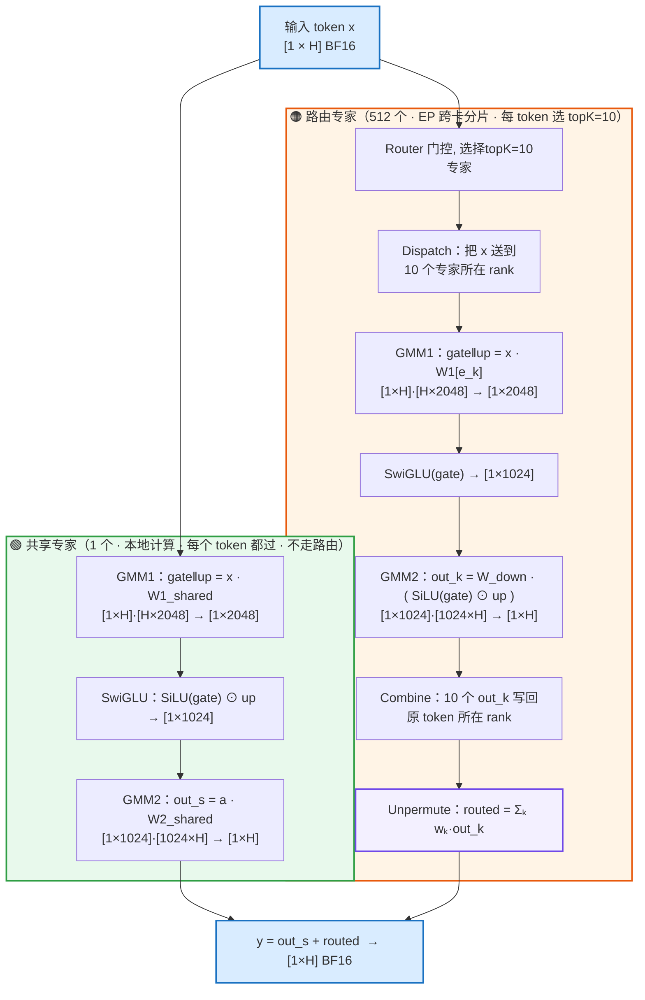
### 核心公式

$$Y[i]=\underbrace{\sum_{k=1}^{10} W[i,k]\cdot O\big[\pi(i,k)\big]}_{\text{10 个路由专家加权和}}+\underbrace{O_s^{shared}[i]}_{\text{1 个共享专家}}$$

其中每个专家（无论路由还是共享）的 FFN 是同一套结构.唯一的区别是：共享专家每个 token 都过、只在本卡本地算；路由专家只有被 topK 选中的 token 才过、且要跨卡 Dispatch/Combine。

**为什么共享专家「本地算」、路由专家「跨卡算」？**

关键区别是数据流是否**数据相关**：

- **路由专家**：token 去哪个专家由 router 分数决定，**每个 token 不同**。EP 下 512 个专家被分片到多张卡，所以必须「先路由、再跨卡送 token」——这正是笔记里 mask 广播 → Dispatch → GMM → Combine 那条链。
- **共享专家**：**每个 token 都过同一个专家，与路由无关**。于是每张卡只要存一份完整的共享专家权重，对「本卡自己的 token」本地算即可，**零跨卡流量**。

这也解释了 mega_moe 里共享专家不参与 mask 广播 / Dispatch / Combine，只在本地 AIC/AIV 上做两次 GMM。

### FFN结构

#### 1. 三矩阵 vs 两矩阵

普通 FFN 是**两个**矩阵 + 一个激活函数：

```text
y = W_down · σ( W_up · x )      # W_up: [H→N], W_down: [N→H]
```

SwiGLU 改造成**三个**矩阵 + 一次逐元素相乘：

```text
gate = W_gate · x        # 门分支，[H→N]
up   = W_up   · x        # 上分支（值分支），[H→N]
y    = W_down · ( SiLU(gate) ⊙ up )
```

`⊙` 是逐元素（Hadamard）相乘。第一层投影被**拆成两个并行线性变换**，一个当门控、一个当内容，相乘后再投影回原维度。

#### 2. gate 分支 vs up 分支

| | gate 分支 | up 分支 |
|---|---|---|
| 计算 | `W_gate · x` | `W_up · x` |
| 再处理 | 过 **SiLU** 激活 | **保持线性，不过激活** |
| 角色 | 输出「门」——每个维度放行多少 | 输出「候选内容」——要被门控的原始值 |

一句话：**up 分支提供「内容」，gate 分支决定「每个维度放行多少」**，逐元素相乘 = 给 up 的每个通道装一个由输入自己设定的「音量旋钮」。


#### 3. 为什么 gate 用 SiLU，而不是 sigmoid / ReLU

GLU 家族的区别就在于 gate 分支用哪个激活：

| 变体 | gate 激活 | 公式 |
|---|---|---|
| GLU | Sigmoid | `(xW₁) ⊙ σ(xW₂)` |
| ReGLU | ReLU | `(xW₁) ⊙ ReLU(xW₂)` |
| GeGLU | GELU | `(xW₁) ⊙ GELU(xW₂)` |
| **SwiGLU** | **Swish / SiLU** | `(xW₁) ⊙ SiLU(xW₂)` |

选 SiLU（`SiLU(x) = x·σ(x) = x·sigmoid(x)`）的原因：

- **sigmoid**：有界 `[0,1]`、两端饱和 → 梯度消失，且只能衰减不能放大；
- **ReLU**：负数段硬截断为 0 → 死神经元、梯度为 0；
- **SiLU**：平滑、**可正可负**（x≈−1.28 附近有微小负值，能翻符号）、正值段无上界（能放大）、处处梯度非零。

所以 SiLU 门控既能抑制、也能放大、还能翻符号，又比 ReLU 平滑。Shazeer 2020《GLU Variants Improve Transformer》里 SwiGLU 与 GeGLU 相当、都优于 ReGLU 和普通 ReLU/GELU 基线；PaLM、LLaMA 的采用让它成为事实标准。

### 4. 单 token 的具体计算过程（decode）

以 decode 的 1 个 token `x ∈ [1×H]` 为例：

**① 门控路由（只属于路由专家路径）**

```text
logits = x · W_router      [1×H]·[H×512] → [1×512]
门控后 topK=10 选择 →  topk_ids [1×10]，门控权重 w [1×10]
```

**② 共享专家（本地，不走门控，每个 token 都算）**

```text
gate‖up = x · W1_shared     [1×H]·[H×2048] → [1×2048]
a       = SwiGLU(gate, up)                   → [1×1024]
out_s   = a · W2_shared     [1×1024]·[1024×H] → [1×H]
```

**③ 路由专家（被选中的 10 个，各自独立、EP 跨卡分片）**

```text
对每个被选中的专家 e_k（k=1..10）：
    gate‖up = x · W1[e_k]   [1×H]·[H×2048] → [1×2048]
    a       = SwiGLU(gate, up)               → [1×1024]
    out_k   = a · W2[e_k]   [1×1024]·[1024×H] → [1×H]
```

**④ 汇总（Unpermute）**

```text
routed = Σ_{k=1..10} w_k · out_k     // 10 个路由专家加权和
y      = routed + out_s              // 再加共享专家
```

### 5. 在 mega_moe 算子里的落地（总体流程）

在 mega_moe 算子的五阶段里，共享专家被拆成两次、插在路由专家前后，正好把「本地算共享专家」当成填充流水空隙的活儿：

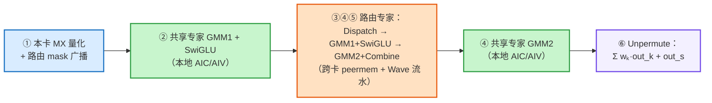
---

# 第二章 与算子相关的 A5 知识准备
## 950中的AIC 与 AIV

### Ascend 950 分离式 AIC/AIV 架构

Ascend 950PR/950DT 采用 **Cube/Vector 分离式架构**。这里的“分离”是指：矩阵计算单元 Cube 和向量计算单元 Vector 不再放在同一个物理核中，而是拆成两类可以独立加载代码、独立执行的核心：
参考：
https://www.hiascend.com/document/detail/zh/CANNCommunityEdition/910/API/ascendcopapi/docs/api/SIMD-API/%E5%9F%BA%E7%A1%80API/%E5%90%8C%E6%AD%A5%E6%8E%A7%E5%88%B6/%E6%A0%B8%E9%97%B4%E5%90%8C%E6%AD%A5/%E6%A0%B8%E9%97%B4%E5%90%8C%E6%AD%A5%E8%83%BD%E5%8A%9B%E6%A6%82%E8%BF%B0.md
- **AIC（AI Cube Core）**：以 Cube 矩阵乘加为中心；
- **AIV（AI Vector Core）**：以 Vector 向量计算、数据重排和搬运为中心；
- 一组 AIC/AIV 在 CANN 编程模型中组合成一个**逻辑 AI Core**。

可以简化表示为：

```text
Ascend 950 NPU
└── 多个逻辑 AI Core / 混合核组
    ├── AIC（AI Cube Core）
    │   ├── Scalar：地址、循环和指令调度
    │   ├── Cube：矩阵乘加
    │   ├── MTE：数据搬运
    │   ├── L1
    │   ├── L0A / L0B：Cube 输入
    │   ├── L0C：Cube 累加结果
    │   └── FixPipe / BT Buffer 等
    │
    └── AIV（AI Vector Core）
        ├── Scalar：地址、循环和指令调度
        ├── Vector：向量、逐元素和数据重排计算
        ├── MTE：GM 与 UB 之间的数据搬运
        ├── UB（Unified Buffer）
        └── Vector Register
```

#### AIC：面向矩阵密集计算

AIC 主要执行规则、计算密集的矩阵乘加，例如：

- GMM1：`X · W_gate/up`；
- GMM2：`Activation · W_down`；
- 其他 GEMM、卷积或 Cube 类计算。

典型 Cube 数据流为：

```text
GM
 ↓ MTE2
L1
 ↓ MTE1
L0A / L0B
 ↓
Cube MMAD
 ↓
L0C
 ↓ FixPipe
GM 或 L1
```

#### AIV：面向向量计算、数据重排和搬运

AIV 主要执行：

- SwiGLU 等逐元素激活；
- 量化、反量化和 scale 处理；
- FP4/FP8 数据展开和格式变换；
- Dispatch、Combine、Unpermute 中的索引与数据组织；
- mask、计数、前缀和等控制类计算；
- GM、UB 和寄存器之间的数据搬运。

典型 Vector 数据流为：

```text
传统 Vector SIMD：GM → UB → Vector → UB → GM

950 Reg Vector：   GM → UB → Register → Vector
                             → Register → UB → GM
```

#### 外层 SPMD，核内异构流水线

Ascend 算子的主流执行模式可以理解为：

```text
外层：多个逻辑 block / AI Core 执行 SPMD
内层：Scalar、Cube、Vector、MTE 多流水线并行
```

Scalar 负责循环、地址计算和指令发射；Cube、Vector、MTE 从各自的指令队列异步执行。存在数据依赖时，需要通过事件、跨核 flag 或 GM 状态进行同步。

这和“让大量 Warp 等待硬件调度”的 GPU 思路不同。Ascend 算子通常更强调：

1. Tiling：把全局 Tensor 切成适配本地存储的 tile；
2. CopyIn：通过 MTE 把数据从 GM 搬进 L1/UB；
3. Compute：由 Cube 或 Vector 计算；
4. CopyOut：通过 MTE/FixPipe 把结果写回；
5. 使用多 Buffer 和事件同步，使搬运与计算形成流水。

#### block 与 subblock

在 Cube/Vector 分离架构的混合 kernel 中，CANN 使用 **block/subblock** 表示 AIC/AIV 的配对关系：

```text
KERNEL_TYPE_MIX_AIC_1_2

一个逻辑 block
├── 1 个 AIC：block
├── 1 个 AIV：subblock 0
└── 1 个 AIV：subblock 1
```

对应的关键接口是：

- `GetBlockNum()`：当前 kernel 配置的逻辑 block 数；
- `GetBlockIdx()`：当前 AIC/AIV 的执行索引；
- `GetTaskRation()`：当前核相对于逻辑 AI Core 的启动比例，AIC 返回 1、AIV 返回 2；
- `GetSubBlockIdx()`：区分同一逻辑 block 内的 AIV0/AIV1。

这正是 MegaMoe 使用 `1 AIC + 2 AIV` 逻辑 block 的硬件和编程模型基础。

### 与 NVIDIA GPU SM 架构的对比

两者都支持大规模并行，也都有矩阵、向量、存储和调度资源，但组织方式不同：

| 对比项 | NVIDIA GPU | Ascend 950 |
|---|---|---|
| 主要并行单元 | SM | 逻辑 AI Core；物理上拆成 AIC/AIV |
| 普通计算 | SM 内的 CUDA Core | AIV 内的 Vector/SIMD 资源 |
| 矩阵计算 | SM 内的 Tensor Core | AIC 内的 Cube Unit |
| 调度中心 | Warp Scheduler 调度就绪 Warp | Scalar 发射 Cube/Vector/MTE 指令，软件显式组织流水 |
| 主要编程模型 | SIMT：Thread → Warp → Block | 外层 SPMD + 内层 Cube/Vector SIMD 流水 |
| 本地存储 | Register、Shared Memory/L1 | AIC 的 L1/L0，AIV 的 UB/Register |
| 数据搬运 | Load/Store、缓存层次、TMA 等 | MTE1/MTE2/MTE3、FixPipe，数据路径更显式 |
| 延迟隐藏 | 多 Warp 驻留和切换 | CopyIn/Compute/CopyOut 多流水线和多 Buffer 重叠 |
| 矩阵/向量关系 | Tensor Core、CUDA Core同处一个 SM | Cube 与 Vector 位于不同物理核 |

可以建立下面的**近似功能映射**：

```text
GPU SM              ≈ Ascend 逻辑 AI Core（仅为粗粒度类比）
GPU Tensor Core     ≈ Ascend Cube Unit
GPU CUDA Core       ≈ Ascend Vector/SIMD 执行资源
GPU Load/Store      ≈ Ascend MTE/FixPipe 数据搬运流水线
```

但不能把 MegaMoe 的逻辑 block 直接等同于 CUDA Thread Block：

| 项目 | CUDA Thread Block | MegaMoe 逻辑 block |
|---|---|---|
| 组成 | 多个 CUDA Thread/Warp | 1 个 AIC + 2 个 AIV |
| 硬件落点 | 整个 Thread Block 驻留在一个 SM | 跨三个异构物理核协作 |
| 内部标识 | `threadIdx`、warp/lane ID | `g_coreType`、`GetSubBlockIdx()` |
| 共享与同步 | Shared Memory、`__syncthreads()` | L1/UB/GM、跨核 flag、原子计数和轮询 |
| 核心含义 | 同构线程工作组 | 异构 Cube/Vector 核工作组 |

所以更准确的说法是：

> MegaMoe 逻辑 block 是 Ascend 950 分离架构下的一个**异构 cooperative workgroup**。它在“把总任务切成多个并行工作份额”这一点上可以弱类比 CUDA Thread Block，但成员不是 Thread/Warp，也不驻留在单个 SM，因此二者不等价。

另外，Ascend 950 的 AIV 本身支持 SIMT Thread/Warp/Thread Block，但那是 AIV 内部 SIMT Vector Function 的线程层次；本章 `GetBlockNum()/GetBlockIdx()` 描述的是外层混合 kernel 的逻辑核层次，两者不能混用。当前 MegaMoe arch35 代码中检查到的 Vector Function，例如 SwiGLU、MXFP8 反量化和专家计数，使用的是 `__simd_vf__`，主执行模型仍然是 AIC/AIV 混合核与 Cube/Vector SIMD 流水，而不是用 SIMT Thread Block 组织整个 MegaMoe。

### 950 有多少个 AIC 和 AIV


| 芯片 | AIC（Cube） | AIV（Vector） |
|---|---|---|
| 950PR | 32（满 die）/ 28（装箱版） | 64 / 56 |
| 950DT | 36 / 32 / 28 | 72 / 64 / 56 |

950PR、950DT 及不同装箱规格的可用核心数不同，因此不应把所有 Ascend 950 统一写成固定的 `36 AIC + 72 AIV`。对 MegaMoe 而言，关键不是写死某个 SKU 的数量，而是：

- host 侧通过 `GetCoreNumAic()` 和 `GetCoreNumAiv()` 动态获取实际可用核心数；
- kernel 明确使用 `KERNEL_TYPE_MIX_AIC_1_2`；
- 在当前支持的 950 配置中，以 `AIC:AIV = 1:2` 组织混合核任务。

### MegaMoe 中的逻辑 block

MegaMoe 的“逻辑 block”具体指 **CANN MIX 1:2 kernel 的异构核组**，其中 AIC 与 AIV 是 1:2 配比；它不是 CUDA Thread Block，也不是 Ascend SIMT VF 内部的 Thread Block。

kernel 入口在 `op_kernel/arch35/mega_moe_apt.cpp:103-112` 明确声明：

```cpp
__global__ __aicore__ void mega_moe(...)
{
    InitSocState();
    KERNEL_TASK_TYPE_DEFAULT(KERNEL_TYPE_MIX_AIC_1_2);
    // ...
}
```

kernel 内部（`op_kernel/arch35/mega_moe_arch35.h:132-135`）：

```cpp
uint32_t blockNum_    = GetBlockNum();          // 逻辑 block 数（=AIC 数）
uint32_t blockAivNum_ = GetBlockNum() * 2;       // AIV 数 = block 数 × 2
uint32_t blockIdx_    = GetBlockIdx() / GetTaskRation();
uint32_t aivCoreIdx_  = GetBlockIdx();           // 直接就是 AIV 编号
```

也就是每个逻辑 block 是 **1C2V**：1 个 AIC（Cube）+ 2 个 AIV（Vector）。

```text
block 0:  [ AIC0 , AIV0, AIV1 ]
block 1:  [ AIC1 , AIV2, AIV3 ]
block 2:  [ AIC2 , AIV4, AIV5 ]
...
```
映射关系可以展开为：

```text
逻辑 block b：

AIC：  GetBlockIdx() = b
       GetTaskRation() = 1
       blockIdx_ = b / 1 = b

AIV0： GetBlockIdx() = 2b
       GetTaskRation() = 2
       GetSubBlockIdx() = 0
       blockIdx_ = 2b / 2 = b

AIV1： GetBlockIdx() = 2b + 1
       GetTaskRation() = 2
       GetSubBlockIdx() = 1
       blockIdx_ = (2b + 1) / 2 = b
```

所以 `GetBlockIdx() / GetTaskRation()` 的作用，是把 AIC/AIV 的物理执行索引归一化成共同的逻辑 block 编号；`GetSubBlockIdx()` 则区分该 block 内的 AIV0 与 AIV1。

host 侧在 `op_host/op_tiling/arch35/mega_moe_tiling.cpp:2385-2401` 动态读取 AIC/AIV 数量，并在 `2415-2418` 通过 `CalcTschBlockDim(...)` 设置逻辑 block 数和 batch schedule，使全部混合核组同时启动。

「AIV0 / AIV1」是每个 block 内的两个 Vector subblock 角色。后面会详细讲分工。

mega moe 核角色划分（1 个 Block = 1C2V）

A5 上每个 block 是「1 个 Cube（AIC）+ 2 个 Vector（AIV0 / AIV1）」。下表是常见的主线分工；具体职责会随 A8W8/A8W4/A4W4、prefetch 开关和当前阶段变化：

| 核 | 职责 |
|---|---|
| **AIC（Cube）** | GMM1 / GMM2 的矩阵乘（MMAD） |
| **AIV0** | GMM1 权重 prologue（FP4→FP8 解包）+ 非 prefetch 时消费 AIC tile 做 SwiGLU/量化 |
| **AIV1** | Dispatch 计数/搬运、Combine 发送、部分 epilogue、Unpermute |

同步靠 `SetFlag/WaitFlag`（核内/核间事件）+ GM 里的 `AtomicAdd` 计数器 + `WaitUntilGmFlagEquals` 轮询实现，例如：

- `flagDispatchToGmm1Ptr`：Dispatch 就绪 → GMM1
- `flagActivationToGmm2Ptr`：SwiGLU/量化就绪 → GMM2
- `gmm2CombineSyncCounterPtr`：GMM2 就绪 → Combine


## peermem 对称窗口（A5 通信底座）

`mega_moe_peermem.h` 是 host/device 共用的唯一布局来源。每个 rank 把自己的 `epHcclBuffer[rank]` 当窗口，窗口布局对所有 rank **逐字节一致**：

```text
rankSyncInWorldPtr (base)
│
├─ [0 .. 60KB)                rankSyncInWorld  跨卡软同步区
├─ [60KB .. +maskRecvSize)    maskRecv         (localExpert, srcRank) 的 mask 槽
│                              每个槽 = mask 位图 + 末尾 32B count
├─ [.. +quantTokenScaleSize)  quantTokenScale  本卡量化后的 token 记录
│                              每 token = Align256(量化数据) + E8M0 scale (+ 可选 topk 权重)
└─ [.. +combineSendSize)      combineSend      按 (token, topk) 展开的专家结果区
```

关键函数：

- `CalcDispatchMaskAlignSizeBy`：路由数按 256B 对齐后，每路由 1 bit → mask 字节数。
- `CalcQuantTokenScaleBytes`：单 token 量化记录字节（量化数据 + E8M0 scale，prefetch 时再拼 topk 权重）。
- `CalcCombineTokenBytes`：combine 单 token 记录字节（量化 combine 时是 FP8 数据 + scale）。
- `CalcPeermemLeastSize`：`60KB + maskRecv + quantTokenScale + combineSend`，与 C++ `CalcHalfBufferSizeMBA5` 一一对应。

`PeermemInfo` 构造函数在 device 侧把这些偏移按同样顺序装配成指针，kernel 里 `winRankAddr_[i] = mc2Context_->epHcclBuffer[i]`，从而可以 `winRankAddr[dstRank] + offset` 直接访问任意 rank 的窗口。

---


# 第三章 整体架构与调用链

## 1. 整体架构与调用链

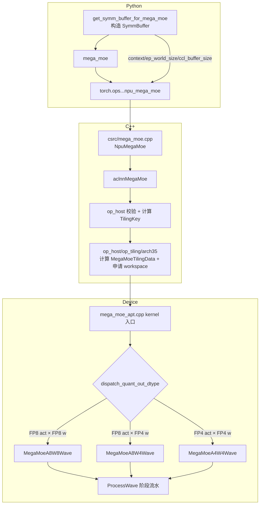
### 1.1 Python 侧 `SymmBuffer` 干了什么（`torch_extension/mega_moe.py`）

`get_symm_buffer_for_mega_moe` 其实就做三件事：

1. 通过 `_get_mega_moe_ccl_buffer_size`（C++ 里 `GetMegaMoeCclBufferSize`，A5 分支 `CalcHalfBufferSizeMBA5`）按 peermem 窗口公式算出通信 buffer 大小；
2. 用 `CommContextManager`（950 上 `backend="channel"`）创建 EP 通信域上下文 `context`；
3. 把 `context / ep_world_size / ccl_buffer_size / num_max_tokens_per_rank / dispatch_quant_mode / ...` 打包进 `SymmBuffer`。

调用 `mega_moe` 时，这些元数据通过 `torch.ops.cann_ops_transformer.npu_mega_moe(...)` 透传给 C++，再进 `aclnnMegaMoe`。

### 1.2 内核入口与模板分派（`mega_moe_apt.cpp`）

`__global__ void mega_moe(...)` 从 `tilingGM` 读 `MegaMoeTilingData`，按 TilingKey 里的 `CommModeType` / `DispatchQuantOutType` 选择具体实现：

```cpp
if constexpr (CommModeType == TILINGKEY_TPL_MTE) {   // A5 走 MTE
    if constexpr (DispatchQuantMode == DISPATCH_QUANT_MODE_MXFP) {  // A5 恒为 4
        ...
        MegaMoeImpl::MegaMoeMteWave<...> op;   // 再按 dtype 落到三个 Wave 之一
        op.Init(...); op.Process();
    }
}
```

`MegaMoeMteWave` 通过模板特化映射到三个场景：

| 组合 | 实例化的类 | 说明 |
|---|---|---|
| FP8 激活 × FP8 权重 | `MegaMoeA8W8Wave` | A8W8-FP |
| FP8 E4M3 × FP4 E2M1 | `MegaMoeA8W4Wave` | A8W4-FP |
| FP4 E2M1 × FP4 E2M1 | `MegaMoeA4W4Wave` | A4W4-FP |

三种 Wave 共享基类 `MegaMoe`（在 `mega_moe_arch35.h`）里的阶段边界，只重写 `ProcessMoeExpertStages` 编排方式。

---

## 2. 端到端数据流总览

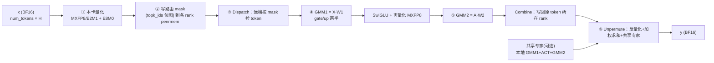

**关键点**：Dispatch 与 Combine 不是显式的 send/recv，而是通过 **peermem 对称窗口直写**——每个 rank 直接往「目标 rank 的 HBM 窗口」里写数据，用软件 flag/counter 同步。这样才把通信和计算重叠起来。


# 第四章 算子流程总览


### 阶段① 本卡输入 MX 量化（`stage/mega_moe_token_quant.h`）

`QuantizeLocalTokens` 由各 AIV 分工，把本卡 BF16 输入 `x` 按 32 元素一组量化成 FP8（E4M3/E5M2）或 FP4（E2M1），并生成 E8M0 共享指数 scale：

```text
BF16 token [1 × H]
      │  Mxfp8::ComputeFp8Token  (或 ComputeFp4Data)
      ▼
量化数据 [H×1B(FP8) / H×0.5B(FP4)]  +  E8M0 scale [ceil(H/32)]
      │  双 buffer，DataCopyPad 写回
      ▼
peermem.quantTokenScalePtr  （本卡窗口的量化 token 区）
```

`QuantOutType` 由 `QuantMode` 决定：`E5M2_QUANT→fp8_e5m2`、默认→`fp8_e4m3fn`、`E2M1_QUANT→fp4x2_e2m1`。可选 `TopkWeightsPrefetch` 时，还会把该 token 的 topk 权重一并塞进记录（用于 combine 阶段减通信）。

### 阶段② 路由 mask 广播（`stage/mega_moe_send_mask.h`）

`GatherAndSendExpertMasks` 把本卡 `topk_ids` 转成「每个全局专家一张 bit 位图」，直接写到对应专家所在 rank 的窗口：

```text
本卡 topk_ids (bs × topK)
   │  按 expert 遍历，CompareScalar 生成 0/1 mask，GatherMask 计数
   ▼
mask 槽[(localExpertId, srcRank)] = 位图(每路由1bit) + count(32B)
   │  写 winRankAddr[dstRank] + maskWinOffset + ...
   ▼
远端某 rank 的 maskRecvPtr
```

这里 `dstRank = globalExpertId / moeExpertPerRank`，`localExpertId = globalExpertId % moeExpertPerRank`——即每个专家被 EP 分片到固定 rank。

### 阶段③ Dispatch（`stage/mega_moe_token_dispatch.h`）

三层结构：`RunMoeExpertDispatchStage` → `DispatchExpertTokensByRankShard/Rows` → `DispatchRankTokens`。

- `ComputeExpertTokenCountAndNotify`：读远端各 src rank 的 mask count，累加得本专家收到的 token 数，做跨 rank 前缀和（`cumsumInfo`），发布就绪 flag；
- `DispatchRankTokens`：`DataCopy` 拉 mask → `GatherMask` 得到命中的全局路由索引 → `CopyTokensAndMetaForDispatch` 从 `winRankAddr[remoteRank] + quantWinOffset` 把量化 token、scale、meta 搬进本地 `dispatchRevDataPtr/dispatchRevScalePtr/metaInfoPtr`；
- 每次搬一个 token 都写一条 **meta（8×int32）**：`(srcRank, srcTokenId, topkIdx[, 预取权重])`，这是后面 Combine 能「原路送回」的关键。

```text
远端 rank 的 quantTokenScale 区 ──(远程读)──> 本卡 dispatchRevData + scale + meta
```

A8W4/A4W4 动态 Wave 用 `DispatchExpertTokensByRankShard` 把「(源 rank, 分片)」分给多个 core；A8W8 全量 Wave 用 `DispatchExpertTokensByRows`。

### 阶段④ GMM1 + SwiGLU + 再量化（`stage/mega_moe_gmm1_activation.h` + `blaze/`）

以专家为单位做分组矩阵乘：

```text
Xe [Ne × H]  ·  W1[e] [H × 2N]
   =  [Ne × 2N]  (gate/up 两半)
   │  AIC: MMAD  (A8W8/FP8×FP8 或 A8W4/FP8×FP4)
   │  AIV: epilogue
   ▼
SwiGLU(gate, up)  →  A [Ne × N]
   │  再次 MX 量化
   ▼
activationQuantData (FP8) + activationQuantScale (E8M0)
```

`BlockEpilogueActivationMxQuant`（`blaze/epilogue/`）在向量侧完成激活（swiglu / swiglustep / swigluoai / situglu）并 MX 量化，`actMode/actSubMode/alpha/beta/clamp` 都来自 tiling。

三种场景的 GMM1 差异：

| 场景 | A | W1 | GMM1 实现 |
|---|---|---|---|
| A8W8-FP | FP8 E4M3/E5M2 | FP8 E4M3/E5M2 | `RunGmm1Generic`（ND 或 NZ） |
| A8W4-FP | FP8 E4M3 | FP4 E2M1 | `RunGmm1A8W4`，prologue 把 W4→W8 |
| A4W4-FP | FP4 E2M1 | FP4 E2M1 | `RunGmm1GenericByWeightFormat`（generic a4w4），SwiGLU 输出**提升为 FP8 E4M3** |


### 阶段⑤ GMM2 + Combine（`stage/mega_moe_gmm2_combine.h`）

```text
A [Ne × N]  ·  W2[e] [N × H]  →  Oe [Ne × H]
   │  AIC: MMAD（A8W4 时 prologue 解包 W2）
   ▼
Combine：按 meta 把 Oe 的每一行写回 原 token 所在 rank 的 combineSend 区
   dst = winRankAddr[meta.rankId] + combineSendPtr
   dstRow = meta.tokenId * topK + meta.topkIdx
```

- 非量化 Combine：直接搬 BF16。
- 量化 Combine（`combine_quant_mode=3/4`）：先 `QuantMxFp8` 量化成 E5M2/E4M3，再发送，接收端反量化。

### 阶段⑥ Unpermute（`stage/mega_moe_unpermute.h`）

`UnpermuteTokens` 在 AIV 上按 token 顺序完成「还原 + 加权求和」：

```text
对每个 token i:
  acc = 0
  for k in 0..topK-1:
      row = combineSend[i*topK + k]      // 该 token 第 k 个专家的结果
      val = DeQuant(row) 或直接 BF16
      acc += topk_weights[i,k] * val
  for s in 0..sharedExpertNum-1:
      acc += sharedResult[s][i]          // 共享专家输出
  y[i] = cast_bf16(acc)
```


# 第五章 阶段① 本卡输入 MX 量化

## 三种 A5 场景的量化场景对照

MX = Micro(微) + X(× = scaling/缩放)  = 「在微小块上做缩放」= 分块共享指数缩放

为什么不用 MS？
因为 MS 会被理解成别的（MicroSoft、Master-Slave、Mean-Square 等），而且 MX 里的 X 天然传达了「乘一个 scale 因子」的语义，比 MS 更贴切——这是格式命名里常见的「表意缩写」做法，而不是严格的 letter-by-letter 缩写。

| 场景 | 数据流 | GMM1 | GMM2 |
|---|---|---|---|
| **A8W8-FP** | `BF16 → MXFP8(E4M3/E5M2) → A8W8 → MXFP8 → A8W8 → BF16` | FP8 × FP8 | FP8 × FP8 |
| **A8W4-FP** | `BF16 → MXFP8(E4M3) → A8W4 → MXFP8(E4M3) → A8W4 → BF16` | FP8 × FP4（prologue W4→W8） | FP8 × FP4 |
| **A4W4-FP** | `BF16 → MXFP4(E2M1) → A4W4 → MXFP8(E4M3) → A8W4 → BF16` | FP4 × FP4 | FP8 × FP4 |

关键实现细节（对应 `mega_moe_arch35.h` 的编译期常量）：

- `ENABLE_A8W4 = (W1==fp4 && QuantOut==fp8)` → GMM1 走 A8W4 prologue。
- `ENABLE_A4W4 = (W1==fp4 && QuantOut==fp4)` → GMM1 走 generic a4w4，但 **GMM2 复用 A8W4**（避免两段都用 a4w4 精度损失过大）。
- A4W4 时 `ActivationQuantOutType` 被提升为 `fp8_e4m3fn`（`mega_moe_arch35.h:160`），正好对应文档里「SwiGLU 输出提升为 MXFP8 E4M3」。

以W4A4为例详细做出解释：

```text
A4W4-FP: BF16 → MXFP4(E2M1) → A4W4 GMM1 → MXFP8(E4M3) → A8W4 GMM2 → BF16
                  ↑ 阶段① 这里量化成 FP4 E2M1
```

一句话：A4W4-FP 场景的阶段① 用的是 MXFP4 量化（Microscaling FP4）——把本卡 BF16 输入按 group=32 分组，每组提取一个 E8M0 共享指数 scale，把组内元素缩放到 FP4 表示范围，再 cast 成 FP4 E2M1（4-bit 浮点：1 符号 + 2 指数 + 1 尾数），2 个元素打包进 1 字节。它与 FP8 量化是同一套「三步走」，唯一区别是目标类型换成 fp4x2_e2m1_t。

量化数学：

$$x_{fp4} = \mathrm{cast}_{E2M1}\Big(x_{bf16} \cdot 2^{-k}\Big), \qquad k = e_{\max}^{block} - e_{\max}^{FP4}$$

即**把每组 32 个元素统一缩放到 FP4 可表示范围（max≈6），再逐元素 cast 到最近的 FP4 E2M1 值**，scale 用 E8M0 存共享指数。

- **$e_{\max}^{block}$**：块内 32 元素里最大的二进制指数（`floor(log2(max|x|))`）。
- **$e_{\max}^{FP4}$**：FP4 E2M1 最大指数 = **2**（max=6=2²×1.5）。
- **$k$**：两者之差（要把这组数放大/缩小多少个 2 的幂）。
- **$2^{-k}$**：实际缩放因子（`recipScale`）。

---

Ascend 950 的 MegaMoe A4W4 GMM1 中，FP4×FP4 的点积在 Cube 内部以 FP32 累加，经过 FixPipe 后形成 BF16 的 GMM1 结果；但这个 BF16 中间结果紧接着执行 SwiGLU，并被重新量化为 MXFP8 E4M3，作为 GMM2 的输入。
后面的流程类似，不再单独指出。

对于 Ascend 950 上 MegaMoe 的 A4W4 GMM1：
MXFP4 激活 + E8M0 scale ×  MXFP4 权重 + E8M0 scale  --> Cube 内部 FP32 累加
--> BF16 GMM1 结果(FixPipe 转换)  --> AIV 上执行 SwiGLU（FP32 寄存器计算）
BF16 激活结果 -->  MXFP8 E4M3 + E8M0 scale(再量化)  --> 送入 A8W4 GMM2

# 第六章 阶段② 路由 mask 广播

举例假设：
假设（为直观用很小的数）：

- `num_tokens = 4`，`topK = 2` → 路由项总数 `F = 8`
- 全局专家 4 个：`e0 e1 e2 e3`
- EP 世界大小 = 2，`moeExpertPerRank = 2`（rank0 放 e0/e1，rank1 放 e2/e3）


## 1. 名词


### topk_ids 是什么

就是**每个 token 选中的专家编号矩阵**，mega_moe 入参之一，shape `[num_tokens, num_topk]`，`int32`。

对应文档里的 $\mathbf{E}$：

$$\mathbf{E}[i,k] = e_{i,k} \in \{0,\dots,num\_experts-1\}$$

含义：**第 i 个 token 的第 k 个 topK 专家，是全局专家 $e_{i,k}$**。


`topk_ids`（本卡）：

```text
token0 → [e1, e3]    即 topk_ids[0] = [1, 3]
token1 → [e0, e1]    即 topk_ids[1] = [0, 1]
token2 → [e3, e0]    即 topk_ids[2] = [3, 0]
token3 → [e1, e2]    即 topk_ids[3] = [1, 2]
```

### 路由项 是什么

展开成 8 个路由项：

```text
r=0: token0 的第0个选择 → e1
r=1: token0 的第1个选择 → e3
r=2: token1 的第0个选择 → e0
r=3: token1 的第1个选择 → e1
r=4: token2 的第0个选择 → e3
r=5: token2 的第1个选择 → e0
r=6: token3 的第0个选择 → e1
r=7: token3 的第1个选择 → e2
```

### 专家位图 是什么

用来回答一个问题：

> 在当前 rank 的 `topk_ids` 里，**哪些「(token, topK槽)」组合指向了某个特定专家 e？**

它把「这个 rank 的每个 token 要不要去专家 e」这个信息，压缩成一张 bit 位图，跨卡写到**专家 e 所在的 rank** 上。专家 e 所在 rank 之后只需看这张位图，就知道要从当前 rank 拉哪几行 token。

「专家 e1 的 bit 位图」：
 列数 = token 数 × top_k
```text
bit位(0-r项):  0  1  2  3  4  5  6  7
e1:           1  0  0  1  0  0  1  0
              ↑        ↑        ↑
             t0k0     t1k1     t3k0
```

「专家 e0 的 bit 位图」：

```text
bit位:  0  1  2  3  4  5  6  7
e0:     0  0  1  0  0  1  0  0
```

### mask槽布局

在 peermem 窗口的 `maskRecv` 区，每个 rank 为**每个 (localExpert, srcRank) 对**开一个独立槽位.发送侧按 (专家, 目标卡) 往对端 peermem 窗口写 mask 槽.槽内先是按 4B 对齐的 mask 位图（每条候选路由 1 bit），末尾是 4B 的 count 区。

```text
每个槽 maskSlotSize 字节：
   ├─ [0 .. maskAlignSize)    bit 位图（每条路由 1 bit，4B 对齐）
   └─ [maskAlignSize +32bit) count 计数（int32，末尾 32bit）
```

count：
```text
e0 的 count = 2   （t1k0, t2k1）
e1 的 count = 3   （t0k0, t1k1, t3k0）
e2 的 count = 1   （t3k1）
e3 的 count = 2   （t0k1, t2k0）
```

`maskAlignSize`（位图区字节数）由 `CalcDispatchMaskAlignSizeBy` 算：

```cpp
sendTotalNum = numMaxTokensPerRank * topK;               // 最多可能的路由项数
alignedRouteCount = CeilAlign(sendTotalNum * 4, 256) / 4; // 路由数按 256B 对齐
return CeilAlign(alignedRouteCount / 8, 32);              // 每路由 1 bit → /8 得字节，再 32B 对齐
```

注意它用的是**上界 `numMaxTokensPerRank`**（全卡一致），不是本卡真实 `num_tokens`——因为窗口布局必须各 rank 逐字节一致，即使某卡真实 token 更少，mask 槽大小也要按上界开。

**槽是按「专家 e 的本地编号 × 源 rank」组织的，而不是按发送者聚合。** 这样专家 e 所在的 rank，可以分别从每个 src rank 拿到「这个 rank 有多少 token 来我这、分别是哪些」。

对应 `mega_moe_peermem.h`：

```cpp
int64_t CalcMaskRecvSize(int64_t maskAlignSize, int64_t moeExpertPerRank, int64_t epWorldSize) {
    int64_t maskSlotSize = maskAlignSize + ALIGN_32;   // 位图 + 32B count
    return CeilAlign(moeExpertPerRank * epWorldSize * maskSlotSize, ALIGN_512);
}
```

### 发送方具体怎么做（`GatherAndSendExpertMasks`）

这是 `stage/mega_moe_send_mask.h` 的核心，分两层。
发送时位图和 count 写到**专家 e 所在 rank 的 `(localExpertId, srcRank)` 槽**：
- e1 → dstRank = `1 / 2 = 0`，localExpertId = `1 % 2 = 1` → 写 rank0 的 `(e1_local, 本卡)` 槽；
- e3 → dstRank = `3 / 2 = 1`，localExpertId = `1` → 写 rank1 的 `(e1_local, 本卡)` 槽。

#### 任务分片：每个 AIV 负责一组全局专家

```cpp
int32_t totalExperts = worldSize * moeExpertPerRank;    // 全局专家总数
int32_t jobIndex = aivCoreIdx_;                          // 当前 AIV 的编号
int32_t totalJobs = blockAivNum_;                        // 所有 AIV 总数
// 每个 AIV 负责的专家编号：jobIndex, jobIndex+totalJobs, jobIndex+2*totalJobs, ...
int32_t ownedExpertNum = CeilDiv(totalExperts - jobIndex, totalJobs);
```
EP 分片映射：**全局专家 id → (dstRank, localExpertId)**

```cpp
for (ownedIdx in 0..ownedExpertNum-1):
    globalExpertId = jobIndex + ownedIdx * totalJobs;
    dstRank       = globalExpertId / moeExpertPerRank;   // 专家在哪张卡
    localExpertId = globalExpertId % moeExpertPerRank;   // 专家在该卡的局部编号
```

### 为什么这么做：mask 广播的本质

对比传统 MoE 的第一次 AlltoAllV：

| | 传统 AlltoAllV | mega_moe 的 mask 广播 |
|---|---|---|
| 交换什么 | 直接把 **token 数据** 搬过去 | 先只交换 **「谁要谁」的 bit 位图**（很小） |
| 数据量 | 大（token × H） | 极小（每路由 1 bit） |
| token 数据去哪 | 随 AlltoAll 一起走 | 留在本卡窗口，由对方**按位图远程拉取** |
| 效果 | 显式 send/recv | 接收方按需 pull，通信与 GMM 可重叠 |

**bit 位图 + count 就是「压缩后的路由表」**：它不搬 token，只告诉目标 rank「你该从我这拉哪些行」，从而把「token 数据的跨卡搬运」和「专家计算」解耦，让 dispatch 可以与后面的 GMM 流水重叠（这正是 A5 上 Wave 流水能掩盖通信的原因）。

一句话总结这个阶段：

> 阶段②把本卡 `topk_ids` 对每个全局专家展开成一张「第 r 个路由项是否属于专家 e」的 bit 位图，按 (localExpert, srcRank) 槽写到专家所在 rank 的 peermem 窗口，并在槽尾附一个 count；对方据此在阶段③用 `GatherMask` 反推出「要拉哪些 token」。


# 第七章 阶段③ Dispatch

### 一句话总结

阶段③ Dispatch 就是「专家 e 所在的 rank，根据阶段②广播过来的 mask 位图 + count，从各个源 rank 的量化 token 窗口里，**把『发给专家 e 的那些 token』远程拉取到本地**，按专家紧凑排好，并记下每条 token 的来历（meta），最后通知 GMM1 可以开算」。

它是 mega_moe 里「第一次 AlltoAll（token 分发）」的**接收侧**实现——但注意，它不靠显式 AlltoAllV，而是**接收方主动按 mask 去 pull**。

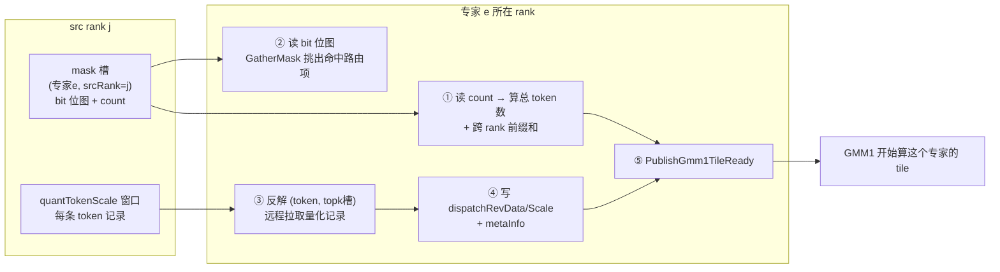


### 拉取流程总览

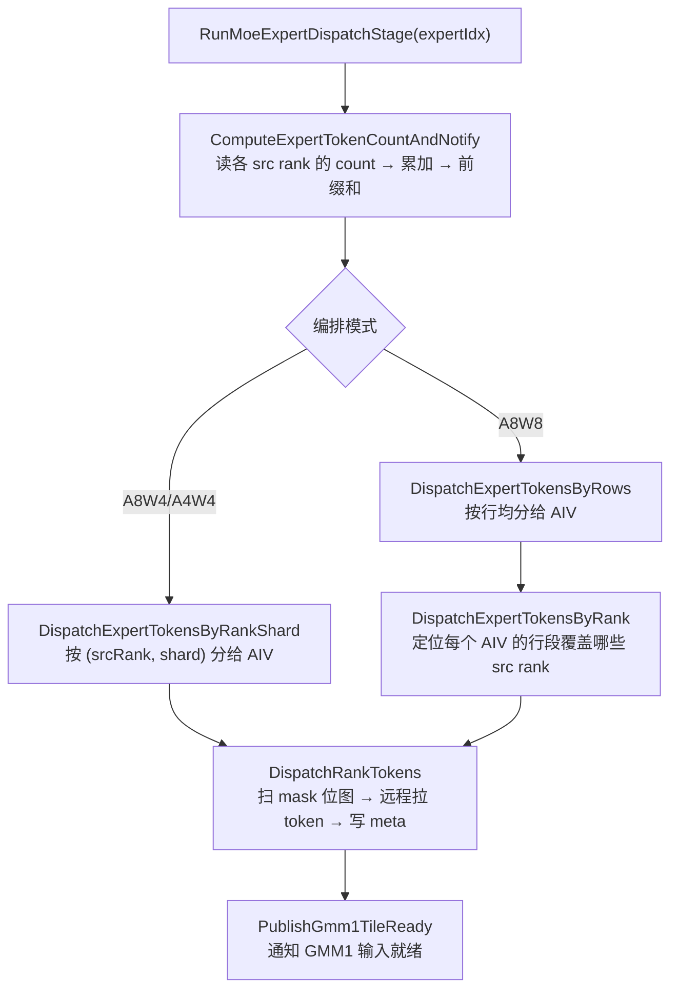

### 第 1 步：根据「专家 e 收到多少 token」+ 前缀和, 计算出出专家 e 在「本地紧凑接收序列」里的起始行

每个 src rank 在阶段②已经把「发给专家 e 的 token 数」写进了 `(localExpertId, srcRank)` 槽末尾的 count 区。这里一次用 strided copy把 **worldSize 个 count** 都读进来，累加所有源 rank 的 count，得到专家 e 的总 token 数，并维护**跨 rank 前缀和**：

有了这个前缀和，`GetExpertGlobalRowBegin` 就能算出专家 e 在「本地紧凑接收序列」里的**起始行**：

```text
紧凑接收序列（dispatchRevData 的布局）：
[ 专家0 的所有 token ][ 专家1 的所有 token ][ 专家2 的所有 token ]...
 ↑                     ↑                     ↑
 rowBegin(0)=0         rowBegin(1)=专家0总数   rowBegin(2)=专家0+专家1总数
```

### 第 2 步：把专家 e 的行分给多个 AIV

#### A8W8：`DispatchExpertTokensByRows`（按行均分）
**专家 e 的 `N_e` 行，均分给所有参与核**，每个核处理 `[coreBegin, coreEnd)` 这一段行。

然后 `FindDispatchExpertRankRange` 用 `cumsumInfoTensor` 定位：这一段行区间落在哪些 src rank 的段里（因为专家 e 的 token 是按 src rank 顺序拼接的）。

#### A8W4/A4W4：`DispatchExpertTokensByRankShard`（按 (源 rank, 分片) 分）
把「(src rank, 分片)」这个二维任务摊给所有核，更细粒度，适配 A8W4/A4W4 动态 Wave 的负载平衡。

### 第 3 步：扫 mask → 拉 token → 写 meta（核心）

它对一个「源 rank」的 mask 位图分批扫描,从路由项索引反解出 token 行和 topk 槽,远程拉取 token 数据,写入本地紧凑区 + meta（`StoreDispatchTokenAndMetaInfo`）,这条 meta 就是后面 Combine 阶段「把专家结果送回原 token」的通行证。

 ring buffer 软流水

`CopyTokensAndMetaForDispatch` 用 `bufferCount` 个 copy 槽 + 事件做软流水（`EVENT_ID0..EVENT_ID5`）：

```text
copyTmp 槽 0..bufferCount-1：
   槽 = 量化 token 记录（远端拉取后暂存 UB）
   meta 槽一一对应
用 MTE3/MTE2/S 事件把「拉取→写 GM→写 meta」流水起来
```
这样「远端 DMA 拉 token」和「写本地 GM」可以重叠。

### 第 4 步：通知 GMM1 输入就绪
它按 `gmm1TileRowCount`（=GMM1_TILE_M=256）把「已就绪的行」拆成 tile，用 `AtomicAdd` 累加到 `flagDispatchToGmm1Ptr` 的对应计数,
GMM1 侧（AIC）在 `WaitForGmm1InputReady` 里轮询这个计数，达到目标值才开始算该 tile.
这就是「**Dispatch 与 GMM1 的流水握手**」：Dispatch 搬够一个 256 行 tile，GMM1 就能先算这一块，不用等整个专家搬完。


# 第八章 Wave 与 tile (核心)

以MegaMoeA4W4Wave为例说明。

### MegaMoeA4W4Wave 的整体过程

A4W4Wave 继承自 `MegaMoe` 基类，复用 `ProcessWave` 的阶段骨架，只重写 `ProcessMoeExpertStages`（MoE 专家部分）。

 `ProcessWave` 是**所有 Wave 共用的五阶段边界**：

```text
阶段1  ProcessInputPreparationStage   本卡量化 + mask 广播 + 清同步区 (+ 共享专家输入准备)
阶段2  ProcessSharedExpertGmm1        可选：共享专家 GMM1 + SwiGLU
阶段3  derived.ProcessMoeExpertStages A4W4Wave 自己的 Dispatch/GMM1/GMM2/Combine 编排
阶段4  ProcessSharedExpertGmm2        可选：共享专家 GMM2
阶段5  UnpermuteTokens                本卡加权求和还原输出
```

而 `MegaMoeA4W4Wave` 的核心就在 `ProcessMoeExpertStages`（`mega_moe_wave_a4w4.h:126-236`）。

### A4W4 的「动态 Wave」是什么

思想如下：

1. 按专家顺序将 token 划分为连续 Wave。
2. 每个 Wave 有 mGroupsPerWave 个M group，也就是说每个Wave最多装 `mGroupsPerWave × 256` 行 token。
3. 同一 Wave 的 GMM1 和 GMM2 始终处理相同的 token 范围。
4. 每个M group由多个tile组成。
5. 根据 GMM1 的 N tile 数控制总负载；空间不足时可在专家内部切分，但
6. 启动阶段先 Dispatch 第一个完整 Wave；稳态阶段， Dispatch 预取用于提前准备下一 Wave 的 GMM1 输入。由 AIV1 准备下一 Wave，同时 AIC/AIV0 执行当前 Wave 的 GMM1/Activation。当前 Wave 完成后执行其 GMM2/Combine，再切换到已经准备好的下一 Wave。

回忆一下上面看到过的表，这里体现了每个block内的分工：
A5 上每个 block 是「1 个 Cube（AIC）+ 2 个 Vector（AIV0 / AIV1）」：

| 核 | 职责 |
|---|---|
| **AIC（Cube）** | GMM1 / GMM2 的矩阵乘（MMAD） |
| **AIV0** | GMM1 权重 prologue（FP4→FP8 解包）+ 非 prefetch 时消费 AIC tile 做 SwiGLU/量化 |
| **AIV1** | Dispatch 计数/搬运、Combine 发送、部分 epilogue、Unpermute |

总体wave流程：
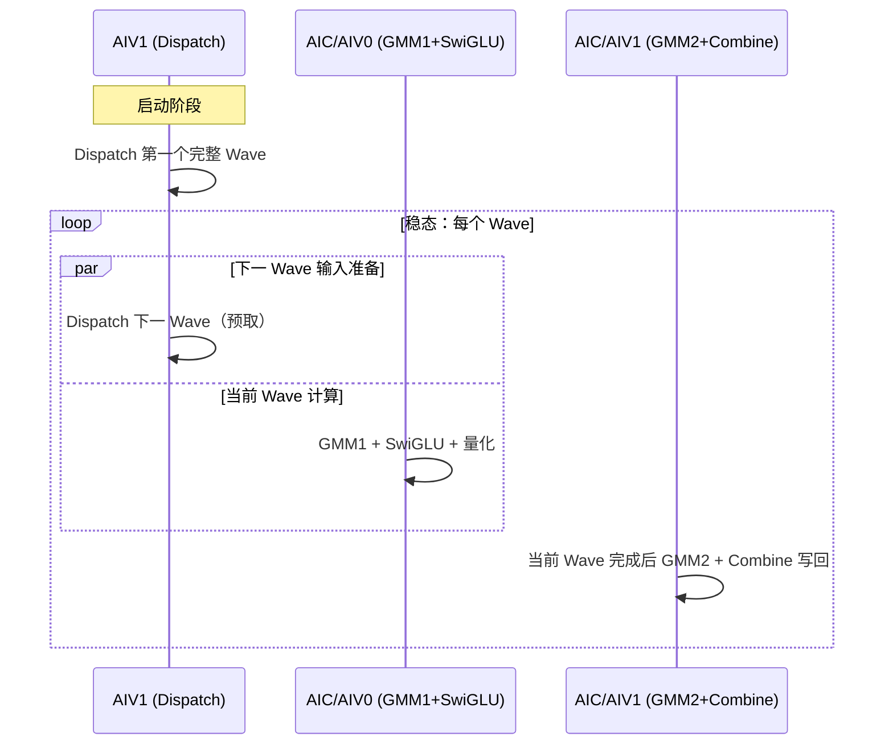

**核心思想**：不让 GMM 等 Dispatch，也不让 GMM2 等所有 GMM1 完成。`AIV1` 一边给「下一 Wave」准备输入，`AIC/AIV0` 一边算「当前 Wave」的 GMM1，两者交错推进。

#### `ProcessMoeExpertStages` 三个部分

**① 启动阶段（`mega_moe_wave_a4w4.h:148-162`）**

AIV1 先把**第一个完整 Wave** 的输入 Dispatch 好。

**② 稳态：交错推进 Dispatch 与 GMM1（`mega_moe_wave_a4w4.h:164-211`）**

外层 `while (gmm1Position.expertIdx < moeExpertPerRank)` 按 Wave 迭代；内层 `while (currentWaveNeedsGmm1 || nextWaveNeedsDispatch)` 里：

- **AIV1**：如果下一 Wave 还需要输入，就继续 `DispatchMoeExpert` 推进 `dispatchPosition`；
- **AIC/AIV0**：推进当前 Wave 的 `gmm1Position`，每推进一个 slice 就调 `RunGmm1ActivationForExpert` 算 GMM1+SwiGLU。

**③ 当前 Wave 完成后立刻 GMM2/Combine（`mega_moe_wave_a4w4.h:213-230`）**

对当前 Wave 覆盖的专家区间 `[waveBegin, waveEnd)`，逐专家执行。
注意， **Wave 在专家内部结束时，这个专家要完整包含进 GMM2 区间，保证 GMM1 和 GMM2 处理的是同一段 token 范围。


### tile划分依据是什么

#### 切 tile 的根本目的

流水要「细粒度重叠」，就必须把大 GEMM 切成小块：

1. **填充所有核**：一个大 GEMM 切成很多 tile，才能让所有 block/核都有活干；
2. **通信计算重叠**：Dispatch 搬够一个 tile 的输入，GMM1 就能先算这个 tile，不用等整个专家搬完；
3. **UB 容量限制**：一个 tile 的数据要能装进 UB，才能算；
4. **Wave 负载均衡**：把「M 方向（token 行）」按固定粒度切成 group，才能量化地控制每个 Wave 做多少。

#### 三层「tile」概念

A4W4 里其实有三层粒度：

| 层级 | 粒度 | 谁定 | 代码 |
|---|---|---|---|
| **M group（Wave 划分单位）** | 256 行 token | `GMM1_TILE_M = L1_TILE_M_256 = 256` | `mega_moe_constants.h:76` |
| **GMM tile（调度单位）** | 256×256（M×N） | `L1_TILE_N = 256` | `block_scheduler_swizzle.h` |
| **MMAD L1/L0 tile** | 更小，由硬件 MMAD 决定 | `L0_TILE_K = 128`，L1 params 自适应 | `mega_moe_gmm_common.h` |

#### 第一层 tile概念：M group（Wave 划分单位）

Wave 大小 = `mGroupsPerWave` 个 M group，每个 group 256 行 token。


- 每个 Wave 最多装 `mGroupsPerWave × 256` 行 token；
- **专家边界不跨 group 共享**：不同专家权重不同，所以专家不足 256 行的尾块也单独占一个 group（`GetMGroupCountForRows` 的注释）。
- 一个专家 token 很多时，会在专家内部被切成多个 slice。

单wave布局， 以GMM1为例：
```text
GMM1 输出 [M × 2N]（M 方向每 256 行为一个 group）

   N 方向:  | tile0 | tile1 | ... | tile{2N/256−1} |
            | 256列  | 256列 |     |      256列     |
   ────────┼───────┼───────┼─────┼───────────────┤
   group0  │  ◻    │  ◻    │ ... │       ◻       │  ← 这 2N/256 个 ◻ 就是
   (256行) │       │       │     │               │    gmm1LogicalTilesPerMGroup
   ────────┼───────┼───────┼─────┼───────────────┤
   group1  │  ◻    │  ◻    │ ... │       ◻       │
   (256行) │       │       │     │               │
```

#### `mGroupsPerWave` 如何确定

`mGroupsPerWave` 是 host tiling 根据「每个核至少要处理多少个 N tile(GMM tile（调度单位）,就是下面要说的第二层tile概念)」反推出来的，让核（AIC)都打满。

总体思路：
tile 按「M 方向 256 行、N 方向 256 列」切；
Wave 按「M 方向 256 行的 group」聚合，
mGroupsPerWave = max(GMM1 需求, GMM2 需求)
再反推一个 Wave 的 group 数。

host 侧 `CalcMGroupsPerWave`（`mega_moe_tiling.cpp:78-96`）：

```cpp
uint64_t gmm1LogicalTilesPerMGroup = CeilDiv(hiddenDim, GMM_TILE_N);      // 一个 M group 里的 N tile 数
uint64_t gmm2TilesPerMGroup        = CeilDiv(h, GMM_TILE_N);             // GMM2 的 N tile 数
uint64_t gmm1RequiredMGroups = CeilDiv(aicNum * GMM1_MIN_LOGICAL_TILES_PER_CORE,
                                       gmm1LogicalTilesPerMGroup);
uint64_t gmm2RequiredMGroups = CeilDiv(aicNum, gmm2TilesPerMGroup);
return max(gmm1RequiredMGroups, gmm2RequiredMGroups);
```
其中 `GMM1_MIN_LOGICAL_TILES_PER_CORE = 4`


```text
aicNum 就是 AIC（Cube）数量， 假如是32.
算子认为， 每个 AIC 有 4 个独立 N tile 就可以打满了，而GMM1 含 gate/up 两路的**完整**输出宽度（= 2 × intermediate），直接除以 `L1_TILE_N=256` 即得每个 M group 的 N tile 数。此处gmm1LogicalTilesPerMGroup = 8 。
mGroupsPerWave = max(GMM1 需求, GMM2 需求)， 这个设计目标是把AIC打满。这个计算逻辑里面可以发现，因为hiddenDim = 2 * h, 所以会把GMM2阶段打满的。
这样就可以反推出一个 Wave 至少需要多少个 M group了。
```

#### 第二层 tile概念：N tile（调度单位）

##### 1. 专家串行，空间并行

**空间并行（tile 级）**：一个专家的N tile，轮流摊给所有 AIC 核。**所有核同时服务同一个专家**，与「一个专家占一个核」完全不同。
为什么不用专家级并行？因为 MoE 各专家 token 数极不均衡（热点专家几百 token、冷门专家 0 token）。按专家分核会让热点专家所在核成瓶颈、冷门核空转；tile 级并行让**每个专家都用满全部核**，AIC负载（注意不是多卡的级别）天然均衡。

带数字例子（Qwen3.5-397B，某专家 512 token = 2 M group，`hiddenDim=2048`）：

```text
gmm1TilesPerMGroup = 8，该专家 GMM1 总 tile 数 = 2 × 8 = 16
→ 16 个 256×256 tile 摊给 28~36 个 AIC 并行算
→ 算完 advance 到下一个专家，同样摊 tile
同时：AIV1 Dispatch 下一个专家输入，AIC/AIV1 做上一 Wave 的 GMM2+Combine
```

##### 2. swizzle 调度的原理、作用、使用位置与 SwizzleOffset=3


```cpp
int64_t blockSpan = SwizzleOffset * loopSecond_;                 // 一组 = 3 个 M-tile × 全部 N-tile
int64_t blockIdx  = tileIdx / blockSpan;                         // 第几组（M 方向）
int64_t inBlockIdx = tileIdx % blockSpan;                        // 组内偏移
int64_t firstValid = Min(loopFirst_ - blockIdx * SwizzleOffset, SwizzleOffset); // 本组实际 M-tile 数（尾组可能不足）
int64_t firstIdx  = blockIdx * SwizzleOffset + inBlockIdx % firstValid;  // M 索引
int64_t secondIdx = inBlockIdx / firstValid;                              // N 索引
if (blockIdx & 1) secondIdx = loopSecond_ - secondIdx - 1;               // 奇数组反转 N（锯齿）
return {firstIdx * tileM, secondIdx * tileN, 0};                          // (mLoc, nLoc)
```

关键：① M 方向每 3 个 M-tile 分一组；② 组内「M 最快」的列优先遍历（`inBlockIdx` 每 +1 先让 M 索引 +1，走满 3 个才让 N 索引 +1）；③ 奇数组反扫 N 形成锯齿。

一个具体 trace（loopM=6, loopN=4, offset=3）

```text
无 swizzle（row-major，offset=1）：flat = m*4 + n
 0:(m0,n0)  1:(m0,n1)  2:(m0,n2)  3:(m0,n3)  4:(m1,n0) ...
   ↑ 相邻编号 = 同一 M 行、相邻 N 列 = 不同权重

有 swizzle（offset=3）：
组0:  0:(m0,n0)  1:(m1,n0)  2:(m2,n0)  3:(m0,n1)  4:(m1,n1)  5:(m2,n1)
      6:(m0,n2)  7:(m1,n2)  8:(m2,n2)  9:(m0,n3) 10:(m1,n3) 11:(m2,n3)
组1: 12:(m3,n3) 13:(m4,n3) 14:(m5,n3) 15:(m3,n2) 16:(m4,n2) 17:(m5,n2)
     18:(m3,n1) 19:(m4,n1) 20:(m5,n1) 21:(m3,n0) 22:(m4,n0) 23:(m5,n0)
   ↑ 相邻编号 = 同一 N 列（同一份权重）、相邻 M 行
```

作用 1（核心）：访存局部性 / L2 权重复用

一个专家所有 token 共用同一个 `W1/W2`，权重按 N 列切片、同一 N 列是同一份数据。

- 无 swizzle：相邻 flat 编号 = 同一 M 行、不同 N 列 → 不同权重，并发核各拉各的权重 → L2 每份权重只服务 1 个核。
- 有 swizzle（offset=3）：相邻 flat 编号 = 同一 N 列、不同 M 行 → 同一份权重，并发 3 个核共享一次 L2 载入，权重读取流量降为 ~1/3。

这与 `SetWaveWeightL2CacheHint`（`mega_moe_gmm_common.h`）是同一套目标——swizzle 创造复用机会，cache hint 旁路不复用的权重。

 作用 2：负载均衡

① 尾 tile（M/N 非 256 整数倍的残缺 tile）被锯齿分散，不扎堆；② 奇数 offset 打破对称，避免所有核在固定相位反复撞同一组权重。

SwizzleOffset=3 如何确定

代码里**没有「为什么是 3」的显式推导**，它是模板参数（默认 1），mega_moe 显式选 3，属**经验调优值**。含义：M 方向每 3 个 M-tile 归一组，每份权重被 3 个 M-tile 复用一次。

| offset | 效果 |
|---|---|
| 1 | row-major，零复用（最差） |
| 3 | 每份权重服务 3 个核，权重流量 ~1/3 |
| 更大（8/16…） | 复用更多，但对 MoE「小 M」场景组填不满，锯齿粒度变粗、边缘负载不均 |

落在 3 的三个现实因素：① MoE 的 M 往往很小（decode 一个专家可能只有 1 个 token = 1 个 M-tile），小 offset 更稳健；② 3 倍复用已显著降权重带宽，再大边际递减；③ CUTLASS identity swizzle 偏爱奇数尺寸（2/3/4/8 中的奇数）打破对称、配合锯齿分散尾 tile。

# 第九章 阶段④ GMM1 + SwiGLU + 再量化

### 总览

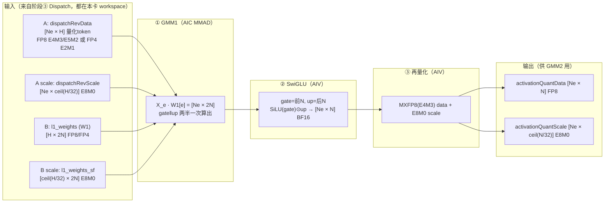

`Ne` 是该专家收到的 token 数，`H` 是 hidden 维，`N` 是专家中间维（Qwen3.5-397B 里 N=1024，2N=2048）。

### 第1步 GMM1
#### 三种量化场景，GMM1 走三条不同实现

| 场景 | 激活 A | 权重 W1 | GMM1 实现 | 入口 |
|---|---|---|---|---|
| **A8W8-FP** | FP8 E4M3/E5M2 | FP8 E4M3/E5M2 | `RunGmm1Generic`（`GroupedMatmulWithScaleMx`，FP8×FP8） | `mega_moe_wave_a8w8.h:283` |
| **A8W4-FP** | FP8 E4M3 | FP4 E2M1 | `RunGmm1A8W4`（`MatmulMxFp8Fp4DynamicKL1TailResplit`，prologue 先把 W4→W8） | `mega_moe_wave_a8w4.h:108` |
| **A4W4-FP** | FP4 E2M1 | FP4 E2M1 | `RunGmm1Generic`（generic A4W4，FP4×FP4） | `mega_moe_wave_a4w4.h:109` |


#### A8W4 的 prologue：W4 → W8 反量化

A8W4 场景权重是 FP4（E2M1），但 **AIC 的 MMAD 不能直接算 FP4×FP8**（`block_mmad_mx_fp8fp4.h:61` 注释明确写了 "AIC does not support direct FP4E2M1 -> FP8E4M3 conversion"）。所以 AIV0 要先把 FP4 权重**反量化成 FP8 E4M3**，再交给 Cube。

`block_prologue_mx_fp8fp4.h` 做的是一个三段流水：

```
GM(FP4) ──MTE2──> UB(FP4,4缓冲) ──Vector: ShiftW4ToW8──> UB(FP8,4缓冲) ──MTE3──> L1(FP8,双缓冲)
```

关键函数 `WeightAntiQuantComputeNzNk`（`block_prologue_mx_fp8fp4.h:398-410`）核心就一行：

```cpp
Blaze::Gemm::Tile::ShiftW4ToW8<OutType, InType>(weight4BitTensor, weight8BitTensor);
// InType=__fp4e2m1x2 (打包FP4)，OutType=__fp8e4m3
```

它把每 2 个 FP4 元素（1 字节）解包成 2 个 FP8（E4M3）元素。prologue 的调用点在 `Gmm1Aiv0PrologueA8W4`（`mega_moe_gmm1_activation.h:373-387`），它和 AIC 的 MMAD 通过 `CrossCoreSetFlag/WaitFlag` 握手。

> 对比：A8W8 / A4W4 走 generic 路径，**不需要**这个 prologue（A8W8 权重本来就是 FP8；A4W4 是 FP4×FP4，但那是 generic QGMM 内部自己处理，不靠这个 prologue）。

#### AIC / AIV 的分工，以及三组同步

阶段④在「1C2V」的 block 里是这样分工的（由 `Gmm1ExecGeneric` / `Gmm1ExecA8W4` 按 `g_coreType` 和 `GetSubBlockIdx()` 分派）：

| 路径 | AIC(Cube) | AIV0 | AIV1 |
|---|---|---|---|
| **A8W8**（generic，非 prefetch） | MMAD，结果写 **UB** ping-pong | 消费 UB tile 做 SwiGLU+量化 | **提前退出**（去忙下一 Wave 的 Dispatch） |
| **A8W4** | MMAD，结果写 **GM** | prologue：W4→W8 | 从 GM 读回 tile 做 SwiGLU+量化 |
| **A4W4** | MMAD（FP4×FP4） | —（generic 无 prologue） | 从 GM 读回 tile 做 SwiGLU+量化 |

### 第 2 步：SwiGLU

#### 公式

GMM1 输出的 `[Ne × 2N]` 被从中间劈成两半，前半是 `gate`，后半是 `up`：

$$
\mathrm{SwiGLU}(gate, up) = \mathrm{SiLU}(gate) \odot up = \Big( gate \cdot \sigma(gate) \Big) \odot up
$$

其中 `σ` 是 sigmoid。

### 第 3 步：再量化（MXFP 逐组量化）

#### 为什么要再量化

SwiGLU 出来的是 BF16 的 `[Ne × N]`，但下一阶段的 GMM2 输入要求是 MXFP8（E4M3）。所以要把这批中间激活**再量化成 FP8 + E8M0 scale**。这就是文档里「SwiGLU 输出再次 MX 量化」的含义。

MX（Microscaling）格式按 **group = 32** 个元素共享一个 8-bit 的共享指数 scale（E8M0），量化公式：

$$
x_{fp8} = \mathrm{cast}_{E4M3}\!\Big( x_{bf16} \cdot 2^{\,shared\_exp} \Big), \qquad
shared\_exp = -\!\max_{32\text{ 组内}} \lfloor \log_2|x| \rfloor
$$

### 一个带数字的完整例子

以 Qwen3.5-397B-A17B 的一个路由专家为例（H 用符号表示，N=1024，2N=2048），假设该专家收到 `Ne=256` 个 token，A8W8-FP 场景：

```text
输入 A   : dispatchRevData     [256 × H]    FP8 E4M3  +  scale [256 × ceil(H/32)] E8M0
权重 W1  : l1_weights          [H × 2048]   FP8 E4M3  +  l1_weights_sf
────────────────────────────────────────────────────────────
① GMM1   : AIC 把 [256×H]·[H×2048] 切成 tile 算，L1 tile = 256×256
           输出 C = [256 × 2048] BF16
           ├─ 前 1024 列 = gate
           └─ 后 1024 列 = up

② SwiGLU : AIV 逐行读 gate/up → FP32 寄存器
           SiLU(gate) = gate/(1+e^{-gate})
           out = SiLU(gate) ⊙ up        → [256 × 1024] BF16

③ 再量化 : 每 32 个元素一组求 max exp
           scale = E8M0(shared_exp)      → 1024/32 = 32 个 scale/行 → 共 256×32
           data  = cast_bf16→E4M3(out · 2^{-shared_exp})  → [256 × 1024] FP8(1B)
────────────────────────────────────────────────────────────
输出     : activationQuantData  [256 × 1024] FP8 E4M3
           activationQuantScale [256 × 32]    E8M0
           → 交给阶段⑤ GMM2 = activationQuantData · W2[1024 × H]
```

一个 tile 层面的流水示意（256 行 = 1 个 M group）：

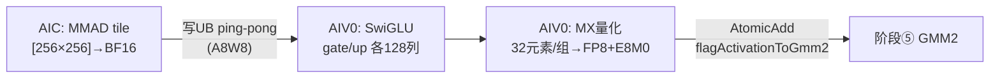

# 第十章 阶段⑤ GMM2 + Combine

### 总览

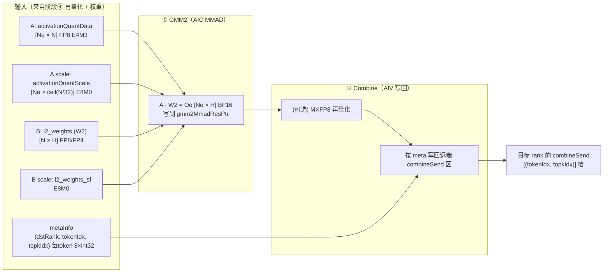

对比阶段④：**GMM1 的输入是「Dispatch 拉来的量化 token」，GMM2 的输入是「GMM1 自己再量化出来的激活」**；GMM1 输出宽 `2N`，GMM2 输出宽 `H`（回到 hidden 维）。所以 GMM2 的 K 维 = N（= GMM1 输出宽的一半），N 维 = H。

### 第 1 步：GMM2 = A·W2

#### 数学与三种场景

$$
O_e = \mathrm{DQ}_{\mathrm{MX}}(\hat{A}_e, S_{A,e}) \cdot \mathrm{DQ}_{\mathrm{MX}}(W_{2,e}, S_{2,e}), \qquad [N_e \times N] \cdot [N \times H] \to [N_e \times H]
$$

| 场景 | 激活 A | 权重 W2 | GMM2 实现 |
|---|---|---|---|
| **A8W8-FP** | FP8 E4M3/E5M2 | FP8 E4M3/E5M2 | `RunGmm2Generic`（FP8×FP8） |
| **A8W4-FP** | FP8 E4M3 | FP4 E2M1 | `RunGmm2A8W4`（prologue W4→W8） |
| **A4W4-FP** | FP8 E4M3 | FP4 E2M1 | `RunGmm2A8W4`（**复用 A8W4**，因阶段④已把激活提升成 FP8） |

关键点：**A4W4 场景下 GMM1 是 A4W4，但 GMM2 一定是 A8W4**——因为阶段④的再量化把激活输出从 FP4 提升成了 FP8 E4M3（`mega_moe_arch35.h:160` 的 `ActivationQuantOutType`）。所以 `RunGmm2CombineForExpert` 里统一调 `RunGmm2A8W4`（`mega_moe_arch35.h:653-656`）：

#### GMM2 的 tile 并行 + prologue（与 GMM1 对称）

GMM2 用和 GMM1 完全一样的 tile 并行模型：

- **AIC 算 MMAD**：`Gmm2AicMmadA8W4`（`:659-716`）/ `Gmm2AicMmadGeneric`（`:548-614`），循环 `loopIdx += config.blockNum` 把 256×256 tile 轮流摊给所有 AIC。
- **AIV0 做 W4→W8 prologue**：`Gmm2Aiv0PrologueA8W4`（`:719-731`），A8W4/A4W4 场景把 FP4 权重反量化成 FP8 再喂给 Cube。
- **AIV1 做 Combine**（见下一节）。

唯一的区别是「等谁」：GMM2 等的是**阶段④ 的激活量化结果**，由 `WaitForGmm2InputReady`（`mega_moe_gmm2_combine.h:492-516`）轮询 `flagActivationToGmm2` 计数：

```cpp
WaitUntilGmFlagEquals(flagValueAddr, static_cast<int32_t>(targetLoops));
```

这个 flag 正是阶段④ epilogue 末尾 `NotifyGmm2InputReady`（`mega_moe_gmm1_activation.h:60-69`）用 `AtomicAdd` 累加的——**阶段④ 的「再量化」和阶段⑤ 的「GMM2」以 256 行粒度握手**。

### 第 2 步：Combine = 把专家结果按「来历」送回原 token 所在 rank

#### 数据依据：Dispatch 时写下的 meta 三元组

Combine 能「原路送回」，全靠阶段③ Dispatch 时每搬一个 token 就写的一条 meta（8×int32），前三个字段就是返回地址：

```cpp
struct CombineTokenRoute {   // mega_moe_gmm2_combine.h:44-48
    uint32_t dstRankId;      // 这个 token 原来在哪张卡
    uint32_t tokenIdx;       // 原来是该卡的第几个 token
    uint32_t topkIdx;        // 是它 topK 选择里的第几个槽
};
```

`GetCombineDstRowIndex`（`:60-63`）把三元组映射成目标 rank 的紧凑行号：

```cpp
return tokenIdx * params.tilingData->topK + topkIdx;
```

即目标 rank 的 `combineSend` 区按 `(token, topk槽)` 展开：

```text
combineSend 区:
  [ token0 的 k=0 | token0 的 k=1 | ... | token0 的 k=topK-1 ]
  [ token1 的 k=0 | ... ]
  ...
行号 = tokenIdx * topK + topkIdx
```

#### 写到哪里：远端 rank 的 peermem 窗口

目标地址 = `winRankAddr[dstRankId] + combineSendPtr`（相对偏移 `combineSendPtr - rankSyncInWorldPtr`）：

```cpp
uint64_t gmRemoteBaseOffset = params.peermemInfo.combineSendPtr - params.peermemInfo.rankSyncInWorldPtr;
gmRemoteD.SetGlobalBuffer(GetRankWinAddrWithOffset(route.dstRankId, gmRemoteBaseOffset));
uint64_t gmDstOffset = GetCombineDstRowIndex(route, params) * n + nLoc;
DataCopyPad(gmRemoteD[gmDstOffset], l0cOutUbGMM2[tileIdx * ubTileN], ub2GmParams);   // 直写远端
```

**没有显式 alltoall/send**：本卡 AIC 算出 `O_e` 后，AIV 直接 `DataCopyPad` 写到目标卡窗口的对应槽位，配合 GM flag 同步。这就是文档说的「通过 RDMA peermem 将结果按目标 Rank 的专家偏移地址写入远端」。

#### 两种 Combine 模式

**非量化 Combine（`combine_quant_mode = 0`）**：直接发 BF16。用 **AIC↔AIV1 的 tile 级一对一同步** `Gmm2CombineSync`（`mega_moe_gmm_epilogue_sync.h:293-325`）：

```cpp
WaitForCombine()/NotifyCombine()  (AIC 侧，带 pendingTiles_ 额度=16)
WaitForGmm2()/NotifyGmm2()        (AIV1 侧)
```

AIV1 侧 `CombineTokenRange`（`mega_moe_gmm2_combine.h:620-656`）**重放 AIC 同一个 scheduler**，逐 tile：

```cpp
gmmAddrInfo.gmm2CombineSync->WaitForGmm2();        // 等这个 tile 算完
copy(GM→UB, tensorBlockGm);                        // 把 [256×256] tile 拉进 UB
DataCopy(metaInfoTensor, metaInfoGm[mLoc*8]);      // 读本 tile 各行对应的 meta
CombineImpl::CombineTokens<...>(nLoc, n, metaInfoTensor, tileUb, ...);  // 逐行写回远端
gmmAddrInfo.gmm2CombineSync->NotifyGmm2();         // 归还额度
```

`CombineTokens`（`:67-86`）内层对 tile 的每一行：`LoadCombineTokenRoute` 读 meta → 算远端地址 → `DataCopyPad` 把这一行 `[nLoc, nLoc+256)` 片段写到远端对应行。**GMM2 的 N 维是 H，可能跨多个 N tile，所以 Combine 按 (tile, 行) 分片直写，逐列补齐一行。**

**量化 Combine（`combine_quant_mode = 3/4`）**：先把 `O_e` 再量化成 MXFP8（E5M2/E4M3）再发送，接收端（阶段⑥ Unpermute）反量化。

量化 Combine 的同步不走 tile 级一对一，而是 **「等所有 AIC 算完这个专家」再集中发**：AIC 用 `NotifyWaveGmm2Ready` 写完成标记，AIV 用 `WaitWaveGmm2Ready`（`:1091-1122`）`ReduceSum` 轮询所有核就绪，然后才消费。

### 带数字的完整例子（Qwen3.5-397B）

沿用阶段④ 的例子：某专家收到 `Ne=256` token，`N=1024`，`H`（hidden）用符号表示，`topK=10`，非量化 Combine：

```text
输入 A  : activationQuantData   [256 × 1024]  FP8 E4M3 + scale E8M0   ← 阶段④ 再量化产物
权重 W2 : l2_weights            [1024 × H]    FP4 E2M1 (A8W4) 或 FP8
────────────────────────────────────────────────────────────
① GMM2  : AIC 把 [256×1024]·[1024×H] 切成 256×256 tile，摊给所有 AIC 并行算
          输出 Oe = [256 × H] BF16，写到 gmm2MmadResPtr
          AIV0 同时把 W2 的 FP4 反量化成 FP8（A8W4 场景）

② Combine: AIV1 逐 tile 读回 Oe，对每个 token 行 i：
          meta[i] = (dstRank, tokenIdx, topkIdx)     ← Dispatch 时记的来历
          dst 行 = tokenIdx * 10 + topkIdx           ← 目标卡 combineSend 的槽
          DataCopyPad( winRankAddr[dstRank] + combineSendPtr + dst行*H, Oe[i,:] )
────────────────────────────────────────────────────────────
结果    : 目标卡的 combineSend[(tokenIdx, topkIdx)] 槽里放好了这 256 行专家输出
          → 阶段⑥ Unpermute 读回，算 Σ w_k * O[π(i,k)] 加权求和
```

几个值得记住的设计点：

1. **meta 是 Combine 的「通行证」**：阶段③ Dispatch 顺手写的 `(dstRank, tokenIdx, topkIdx)` 三元组，让 Combine 不需要再算一次路由，直接定位「这行结果送回哪」。
2. **Combine 只搬数据、不做算术**：写回的是原始专家输出行，加权求和留到阶段⑥ Unpermute（若开了 `TopkWeightsPrefetch`，权重已在阶段④ SwiGLU 里预先乘进激活，Combine 更是纯搬运）。
3. **同步方式随 Combine 是否量化而不同**：非量化走 `Gmm2CombineSync` 的 AIC↔AIV1 tile 级一对一（额度 16 反压）；量化走「等全部 AIC 完成」的 `WaitWaveGmm2Ready` 集中消费。
4. **A4W4 的 GMM2 是 A8W4**：阶段④ 已把激活提升为 FP8 E4M3，所以第二层矩阵乘天然是 FP8×FP4，避免两段都用 FP4 精度损失过大。


### 补充：为什么量化 Combine 走专家级屏障、非量化走 tile 级一对一

**一句话结论**：根本原因是「输出单位」不同——非量化 Combine 的输出单位是「tile 的一列片段」（BF16 原始数据，可碎片化直写）；量化 Combine 的输出单位是「一条完整的 token 记录 = 整行 FP8 数据 + 整行 E8M0 scale」（连续一块），必须先凑齐整行 H 个元素才能量化、才能作为一个自包含记录发出，而 GMM2 把这一行切成跨多个 N-tile 的碎片、又被 swizzle 调度摊给所有 AIC，所以凑齐任意一行就等价于「等所有核算完」。

#### 两种 Combine 的「输出单位」根本不同

非量化远端 `combineSend[row]` 是纯 BF16，同一行由不同 N-tile 片段「列补齐」，谁算完谁写、互不依赖，所以能做成 GMM2 tile 循环里的一对一消费。

量化 `SendWaveCombineToken`（`:417-452`）先读**整行**再量化：

```cpp
DataCopyPad(rowUb, gmm2OutGm[tokenLocal * common.tokenHiddenDim], {1, bufferConfig.rowBytes}, ...); // 搬整行 H
Mxfp8::QuantMxFp8<CombineMode, bfloat16_t>(quantUb, rowUb, ..., common.tokenHiddenDim);             // 整行 MX 量化
CombineImpl::SendCombineTokenRow<Fp8Type>(bufferConfig.quantRowElements, ..., quantSendUb, params); // 发整块记录
```

而记录是连续、按 token 对齐的一块（`CreateQuantTokenBufferConfig`，`:352-360`）：

```cpp
uint32_t tokenStorageBytes = CeilAlign(tokenHiddenDim, ALIGN_256);   // 整行 FP8 数据
uint32_t storedScaleBytes  = CeilAlign(nScale, 2U);                    // 整行 E8M0 scale
uint32_t quantTokenSizeBytes = CeilAlign(tokenStorageBytes + storedScaleBytes, ALIGN_32); // 拼成一条记录
```

`QuantMxFp8`（`mega_moe_mxfp8_utils.h:30-50`）把 `processLen = H` 一起 `ComputeMaxExp → ComputeScale → ComputeFp8Data`，产出「数据+scale」连续一块，没法按 256 列拆开发。

#### 为什么「整行」就等价于「等所有 AIC」

三个事实叠加：

1. **GMM2 的 N 维就是 H，H 远大于 256**：`L1_TILE_N=256`（`mega_moe_constants.h:101`），H 下限 `MIN_H=1024`（`mega_moe_tiling.cpp:62`），所以每行 = `ceil(H/256) ≥ 4` 个 N-tile。
2. **swizzle 调度把 tile 交错摊给所有 AIC**（`BlockSchedulerSwizzle` 的 `SwizzleOffset=3`），同一行的相邻 N-tile 几乎必然落在不同核上。
3. 于是凑齐任意一行，就潜在地依赖所有 AIC 的产出。

代码里：AIC 用 `NotifyWaveGmm2Ready`（`:1078-1088`）各写一个独占 cacheline 标记，AIV 用 `WaitWaveGmm2Ready`（`:1091-1122`）`ReduceSum` 轮询 `sum >= totalJobs`。`slotIdx = state.expertIdx`，即屏障按专家。


| | 非量化 | 量化 |
|---|---|---|
| 同步粒度 | tile 级一对一（`Gmm2CombineSync`） | 专家级屏障（`WaitWaveGmm2Ready`） |
| 反压 | `pendingTiles_` 额度 16，限制在途 tile | 整专家输出先落 GM，算完统一读回 |
| 为什么能这样 | 碎片可独立发送 | 必须凑整行，只能等整专家就绪 |

#### 一张图对比两种同步模型

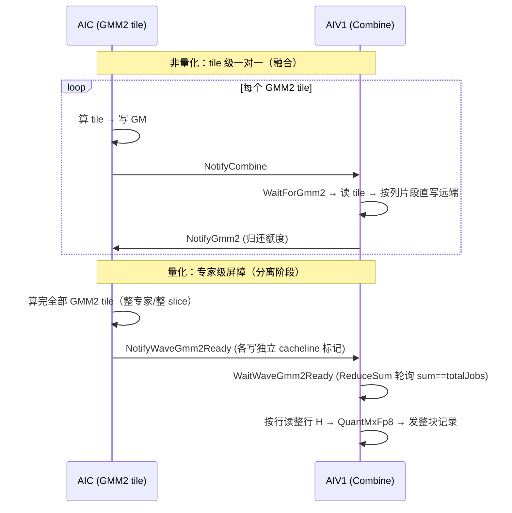

# 第十一章 阶段⑥ Unpermute

### 总览

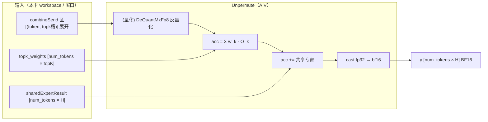

### 执行结构：token 分片 + 逐 token 累加

先按 AIV 均分 token,累加中间态全程用 **FP32**（`dataResFp32Tensor`），最后才 cast 成 BF16，保证求和精度。

topK 专家加权累加

`mega_moe_unpermute.h:95-134`：

```cpp
for (expertIdx in 0..topK-1) {
    expertInputIndex = tokenIdx * topK + expertIdx;   // ← 该 token 第 k 个专家结果在 combineSend 的行号
    LoadMoeExpertInput<CombineMode>(...);             // 搬入 UB + 反量化 → FP32

    if (expertIdx == 0) {
        float expertScale = topKWeightsTensor[localIdx * topK + expertIdx];
        Muls(dataResFp32Tensor, dataInFp32, expertScale, H);   // 乘权重初始化累加器
    } else {
        float expertScale = topKWeightsTensor[localIdx * topK + expertIdx];
        Muls(dataInFp32, dataInFp32, expertScale, H);          // 乘权重
        Add(dataResFp32Tensor, dataResFp32Tensor, dataInFp32, H);  // 累加
    }
}
```

关键：**行号 `tokenIdx * topK + expertIdx` 与阶段⑤ Combine 的 `GetCombineDstRowIndex`（`tokenIdx * topK + topkIdx`）完全一致**——Combine 怎么放、Unpermute 就怎么取。加权（`Muls` 乘 `topk_weights[i,k]`）就在这里做。

反量化在 `LoadMoeExpertInput`（`:70-92`）：非量化 Combine 直接 `DataCopy` BF16 → `Cast` FP32；量化 Combine 用 `DeQuantMxFp8`（`mega_moe_mxfp8_utils.h:115-144`）三步反量化——E8M0 scale → BF16 → FP32，再 `FP8 token × scale → FP32`。

### 共享专家累加：`AccumulateSharedExpertForToken`

`mega_moe_unpermute.h:137-176`。共享专家是本卡本地算的（不走 Dispatch/Combine），所以：

```cpp
WaitUntilGmFlagEquals(counterAddr, gmm2NTilesPerGroup);   // 等共享专家 GMM2 算完
DataCopy(dataInBf16, sharedResult[(sharedExpertIdx * tokenNum + tokenIdx) * H], H);
Cast(dataInFp32, dataInBf16, CAST_NONE, H);
Add(dataResFp32Tensor, dataResFp32Tensor, dataInFp32, H);   // acc += O_s^shared
```

**共享专家无权重、无条件相加**。

### `TopkWeightsPrefetch` 的差异

| 模式 | 加权发生在哪 | Unpermute 做什么 |
|---|---|---|
| 非 Prefetch（默认） | Unpermute：`Muls` 乘 `topk_weights[i,k]` | 读权重、乘、累加 |
| Prefetch（`topk_weights_type=1`） | 阶段④ SwiGLU 里已预乘进激活（`swiglu_activation.h` 的 `Reg::Mul`） | 直接累加，不再乘权重 |

Prefetch 把「乘 topk 权重」提前到阶段④，减少 Unpermute 读权重开销、并让 combine 少传一次权重。

### Unpermute 数据流

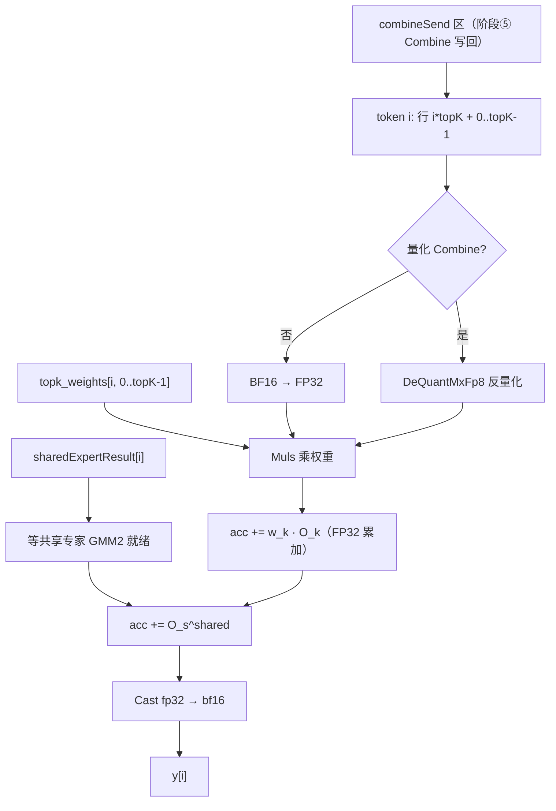

### 带数字的例子（Qwen3.5-397B）

某 token `t`（`topK=10`，1 个共享专家，量化 Combine）：

```text
combineSend 区里 token t 占了 10 行（行号 = t*10 + 0..9），
每行是某个专家 e_k 对 t 的量化结果（FP8 数据 + E8M0 scale）

① 对 k = 0..9:
    读 combineSend[t*10 + k] 的量化记录
    DeQuantMxFp8 反量化 → FP32 向量 O_k [1×H]
    acc += topk_weights[t,k] * O_k        ← 乘门控权重累加

② 读共享专家结果 sharedResult[sharedIdx * num_tokens + t]（BF16）
    Cast 到 FP32，acc += O_shared          ← 无条件相加

③ y[t] = Cast_bf16(acc)                   ← FP32 累加器 → BF16 输出
```

最终 `y[t] = Σ_{k=0}^{9} w[t,k]·O_{e_k}(t) + O_shared(t)`，与文档公式完全一致。


至此六个阶段（① 本卡量化 → ② mask 广播 → ③ Dispatch → ④ GMM1+SwiGLU+再量化 → ⑤ GMM2+Combine → ⑥ Unpermute）全部串完——一个 token 从 BF16 输入，绕一圈 Dispatch/Combine，最终以 BF16 输出回到原地，中间所有结果都不出 kernel、不落回 Python。
